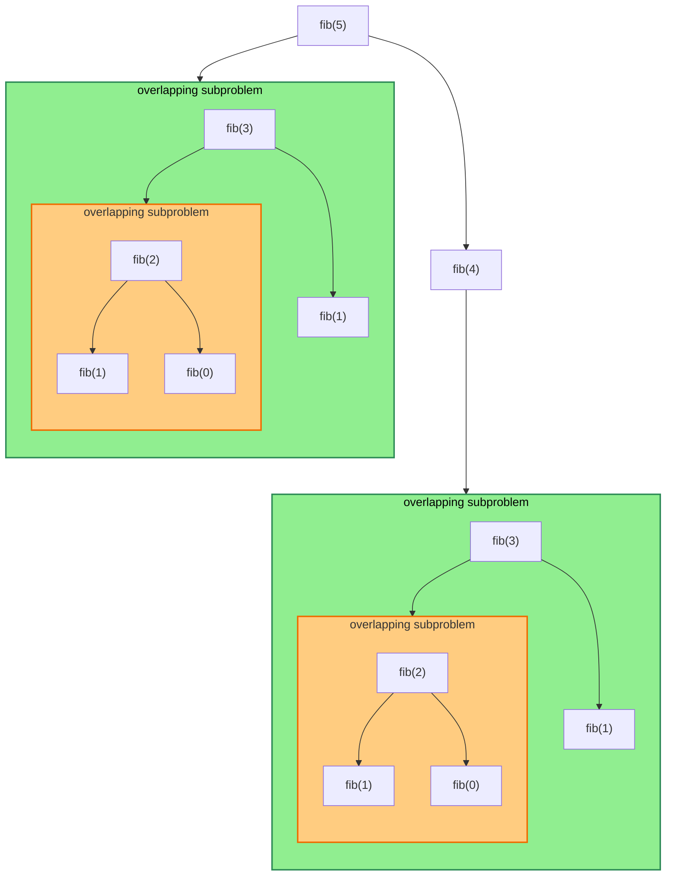

Given a positive integer ****n****, find the ****nth**** Fibonacci number.

The [Fibonacci series](https://www.geeksforgeeks.org/dsa/fibonacci-series/) is a sequence where a term is the sum of the previous two terms. The first two terms of the Fibonacci sequence are 0, followed by 1. The Fibonacci sequence: 0, 1, 1, 2, 3, 5, 8, 13, 21.

## Recursive Solution
```java
static int nthFibonacci(int n){
    // base case
	if (n <= 1) {
		return n;
	}
	// sum of the two preceding
	// Fibonacci numbers
	return nthFibonacci(n - 1) + nthFibonacci(n - 2);   
```

### Problem with recursion
****Time Complexity:**** $O(2^n)$, because each state requires answers from the previous two states, and thus calls the function for both of those states recursively.  
****Auxiliary Space:**** $O(n)$, due to the recursion stack

## Using Dynamic Programming
The idea is to optimize the recursive solution by storing the results of already solved subproblems in a memoization table. Whenever the same subproblem appears again, we reuse the stored result instead of recomputing it. This avoids repeated calculations and improves the overall efficiency, reducing the time complexity from exponential to linear.


[[Dynamic Programming]] involves remembering the previous results for faster computation time

```java
public int fibonacci(int n) {  
    if (n <= 1) {  
       return n;  
    }  
    int prev1 = 0, prev2 = 1, curr = 0;  
    for (int i = 2; i <= n; i++) {  
       curr = prev1 + prev2;  
       prev1 = prev2;  
       prev2 = curr;  
    }  
    return curr;  
}
```
