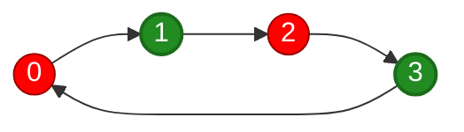
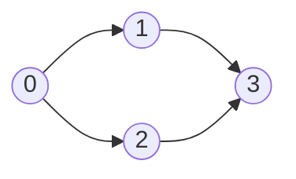
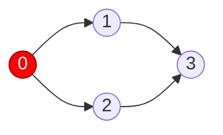
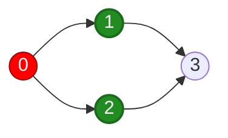
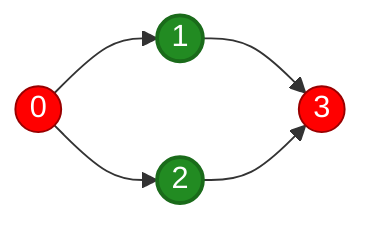

A **bipartite graph** is a graph whose vertices can be divided into **two groups** such that every edge connects vertices belonging to different groups. In competitive programming, don't overcomplicate the definition. Think:
> **Can I color every node using two colors so that no adjacent nodes have the same color?**

# 1. Basic Idea

Consider:


We can color:

```
0 → RED
1 → GREEN
2 → RED
3 → GREEN
```

Every edge connects $RED ↔ BLUE$. So the graph is bipartite. More simply, the groups are:
```
A = {0, 2}
B = {1, 3}
```

# 2. A Graph That Isn't Bipartite

Consider a triangle:
```
    0
   / \
  1 ─ 2
```

Try coloring it. Start:
```
0 = RED
```

Its neighbors must be:
```
1 = BLUE
2 = BLUE
```

But there's also $1 ─── 2$, which gives $BLUE ─── BLUE$. Therefore, this graph is **not bipartite**.

# 3. Important Property: Odd Cycles

There's a very useful theorem:
> An undirected graph is bipartite **iff it contains no odd-length cycle**.

Triangle:
```
0 → 1 → 2 → 0

3 edges
```

Odd cycle → not bipartite. But:
```
0 ─── 1
│     │
3 ─── 2
```

has:
```
0 → 1 → 2 → 3 → 0

4 edges
```

An even cycle → can still be bipartite. So:
```
Odd cycle
    ↓
Not bipartite
```

This becomes a useful problem-recognition shortcut.

# 4. Representing Colors

Use:
```java
int[] color = new int[n];
```

We'll represent:
```
-1 = not colored
 0 = color A
 1 = color B
```

Initialize `Arrays.fill(color, -1)`. Suppose `color[node] = 0`, then every neighbor should be `1`, and vice versa. A convenient trick is `color[neighbor] = 1 - color[node]`. Because:
```
node = 0
1 - 0 = 1
```

and:
```
node = 1
1 - 1 = 0
```

So it toggles between the two colors.

# 5. [[Breadth-First Search|BFS]] Approach

BFS works very naturally for bipartite checking because we color nodes level-by-level. Consider

We start at `0` and assign `RED`



Then, we check the neighbors, which are `1` and `2`, so we assign opposite colors to them


Now, we process `1` and find the neighbor `3`. We give `3` the opposite color of `1`


## Java BFS Implementation
```java
static boolean bfs(
        int start,
        List<List<Integer>> graph,
        int[] color
) {
    Queue<Integer> queue = new ArrayDeque<>();
    queue.offer(start);
    color[start] = 0;
    while (!queue.isEmpty()) {
        int node = queue.poll();
        for (int neighbor : graph.get(node)) {
            if (color[neighbor] == -1) {
                color[neighbor] = 1 - color[node];
                queue.offer(neighbor);
            } else if (color[neighbor] == color[node]) {
                return false;
            }
        }
    }
    return true;
}
```

There are only two cases worth noticing.
### Neighbor hasn't been colored

```java
if (color[neighbor] == -1)
```

Give it the opposite color:
```java
color[neighbor] = 1 - color[node];
```

### Neighbor already has a color

Then verify:
```java
color[neighbor] != color[node]
```

If:
```java
color[neighbor] == color[node]
```
We have a conflict. Return `false`

# 6. Disconnected Graphs

Just like regular graph traversal, the graph may be disconnected:
```
0 ─── 1       3 ─── 4

              │
              5
```

Running BFS from `0` won't visit `3,4,5`.

So the complete solution needs:
```java
static boolean isBipartite(List<List<Integer>> graph) {
    int n = graph.size();
    int[] color = new int[n];
    Arrays.fill(color, -1);
    for (int node = 0; node < n; node++) {
        if (color[node] == -1) {
            if (!bfs(node, graph, color)) {
                return false;
            }
        }
    }
    return true;
}
```

Notice that `color == -1` already means unvisited, so we don't need `boolean[] visited`. Same trick as the [[Breadth-First Search#Distance Array|BFS distance array]].

# 7. LeetCode's `Is Graph Bipartite?`

LeetCode 785 gives you:
```java
int[][] graph
```

But there's a subtle detail. This is **not an adjacency matrix**.

For example:
```java
graph = new int[][]{
    {1, 3},
    {0, 2},
    {1, 3},
    {0, 2}
};
```

means:
```
graph[0] → neighbors [1,3]
graph[1] → neighbors [0,2]
graph[2] → neighbors [1,3]
graph[3] → neighbors [0,2]
```

So LeetCode has already given you the adjacency list. You don't need `List<List<Integer>>` at all. You can directly do:
```java
for (int neighbor : graph[node]) {
    // ...
}
```

## Complete LeetCode Solution
```java
class Solution {
    public boolean isBipartite(int[][] graph) {
        int n = graph.length;
        int[] color = new int[n];
        Arrays.fill(color, -1);
        for (int node = 0; node < n; node++) {
            if (color[node] == -1) {
                if (!bfs(node, graph, color)) {
                    return false;
                }
            }
        }
        return true;
    }

    private boolean bfs(
            int start,
            int[][] graph,
            int[] color
    ) {

        Queue<Integer> queue = new ArrayDeque<>();

        queue.offer(start);
        color[start] = 0;

        while (!queue.isEmpty()) {

            int node = queue.poll();

            for (int neighbor : graph[node]) {

                if (color[neighbor] == -1) {

                    color[neighbor] =
                            1 - color[node];

                    queue.offer(neighbor);

                } else if (
                    color[neighbor] == color[node]
                ) {

                    return false;
                }
            }
        }

        return true;
    }
}
```

This is a good implementation to remember.

---

# 10. DFS Approach

You can solve exactly the same problem using DFS.

The idea doesn't change:

```
Visit node
    ↓
For each neighbor
    ↓
Uncolored?
    ↓
Give opposite color
    ↓
DFS(neighbor)
```

Implementation:

```
static boolean dfs(
        int node,
        int[][] graph,
        int[] color
) {

    for (int neighbor : graph[node]) {

        if (color[neighbor] == -1) {

            color[neighbor] = 1 - color[node];

            if (!dfs(neighbor, graph, color)) {
                return false;
            }

        } else if (color[neighbor] == color[node]) {

            return false;
        }
    }

    return true;
}
```

Before calling it:

```
color[node] = 0;

if (!dfs(node, graph, color)) {
    return false;
}
```

---

# 11. BFS vs DFS for Bipartite

Both work.

Both have:

O(V+E)O(V+E)

time.

Personally, I'd lean toward **BFS** when first seeing a bipartite problem because the coloring feels intuitive:

```
Level 0 → Color A

Level 1 → Color B

Level 2 → Color A

Level 3 → Color B
```

But once you're comfortable, use whichever is easier for the problem.

---

# 12. Why BFS Levels Relate to Coloring

Consider:

```
        0          Level 0
       / \
      1   2        Level 1
     /     \
    3       4      Level 2
```

Color by BFS level:

```
Even distance → Color A
Odd distance  → Color B
```

So:

```
distance 0 → A
distance 1 → B
distance 2 → A
distance 3 → B
```

If an edge ever connects two vertices with the same parity/color:

```
A ─── A
```

we have a contradiction.

That's another way to understand bipartite graphs.

---

# 13. Where Does Bipartite Show Up in Problems?

Problems won't always say:

> "Determine whether this graph is bipartite."

You may instead see something like:

> Divide people into two groups such that enemies aren't in the same group.

Immediately think:

```
Person = vertex

Enemy relationship = edge

Two groups = two colors
```

Therefore:

```
Bipartite checking
```

Other common wording:

```
"Divide into two teams"

"Two incompatible groups"

"Assign one of two types"

"Enemies must be separated"

"Can these constraints be satisfied
using two categories?"
```

These are often disguised bipartite problems.

---

# 14. Bipartite vs Cycle Detection

Don't accidentally think:

```
Cycle → not bipartite
```

That's incorrect.

This:

```
0 ─── 1
│     │
3 ─── 2
```

has a cycle but **is bipartite**.

Specifically:

```
Even cycle → okay

Odd cycle → not bipartite
```

So:

```
Cycle Detection
     ↓
"Is there ANY cycle?"


Bipartite
     ↓
"Can I consistently assign
two colors?"
```

Different problems.

---

## 2.2 Mental Template

The whole algorithm can be compressed to:

```
color[] = -1

for every uncolored node:

    color[node] = 0

    BFS / DFS

        for every neighbor:

            uncolored?
                ↓
            assign opposite color

            already colored?
                ↓
            same color as current?
                ↓
              NOT BIPARTITE
```

And the core Java trick worth remembering is:

```
color[neighbor] = 1 - color[node];
```