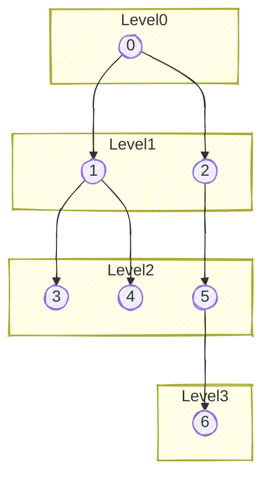
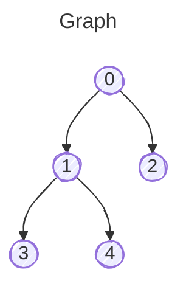
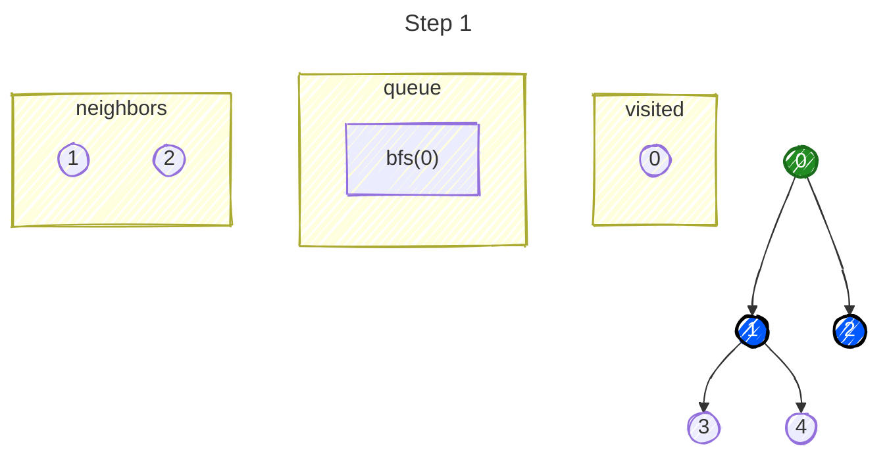
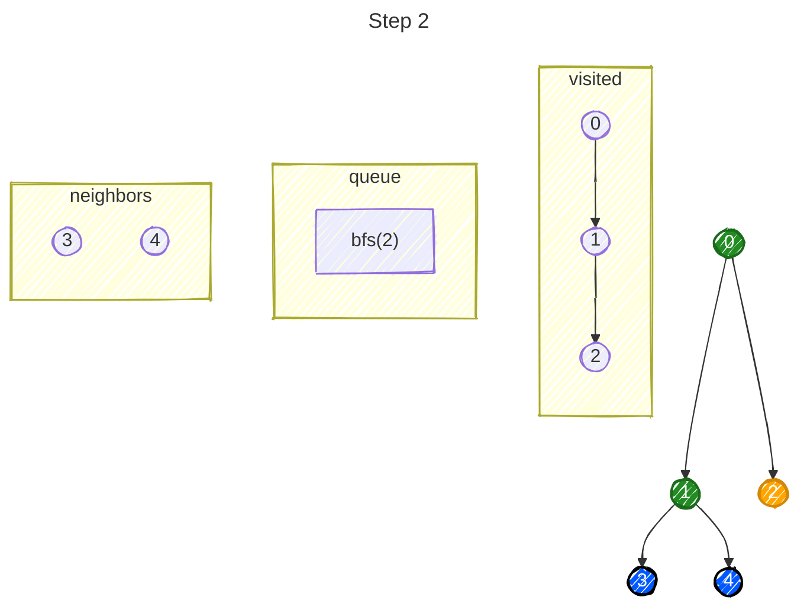
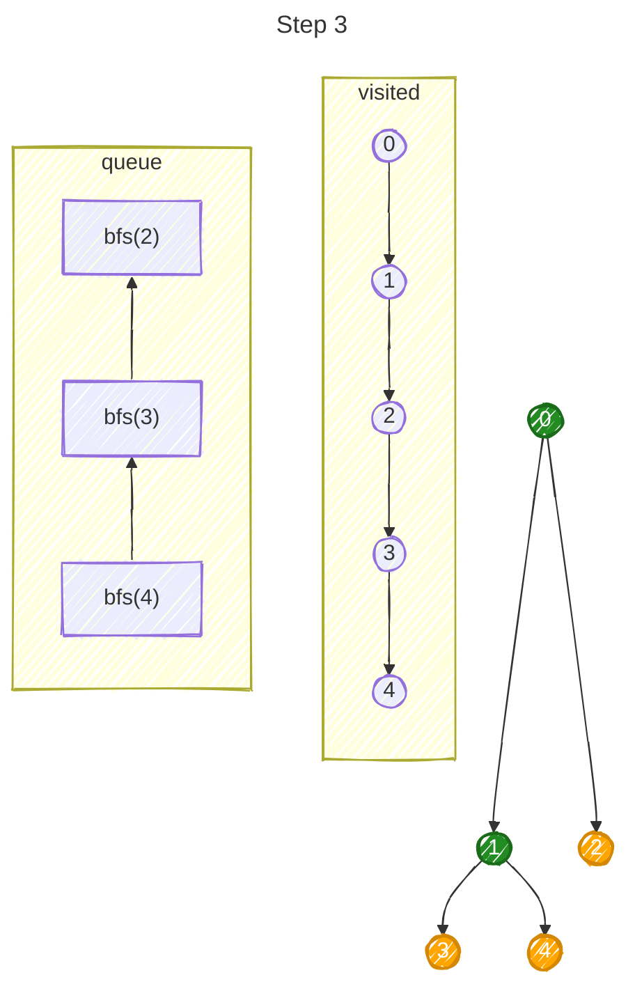
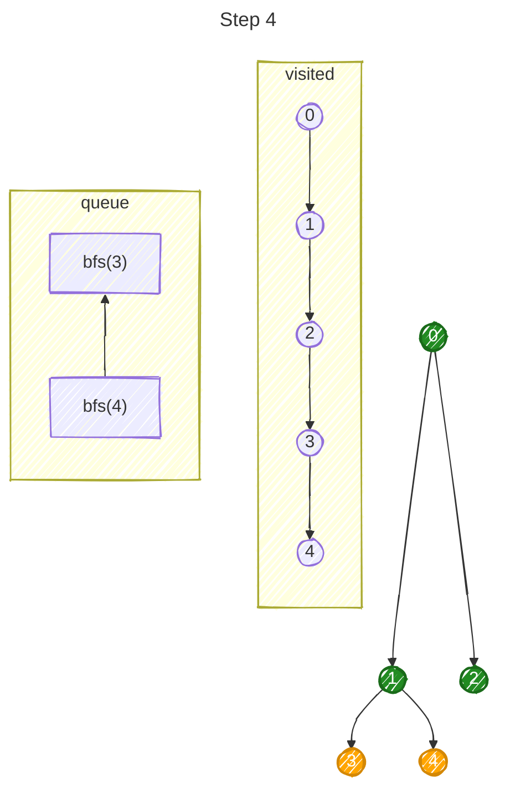
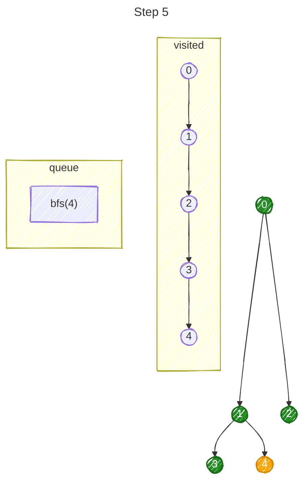
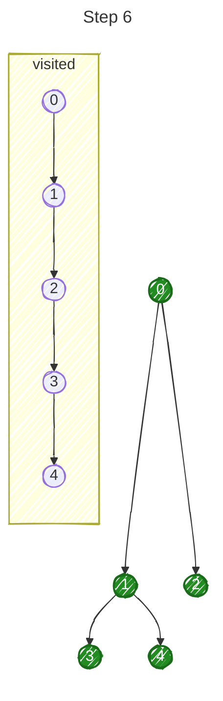
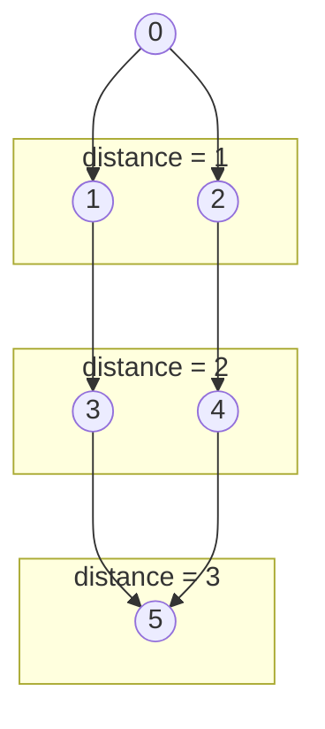

DFS goes deep along one path. **BFS explores the graph level by level.** This seemingly small difference gives BFS one major capability:
> **BFS finds the shortest path in an unweighted graph.**

# 1. How BFS Works

Consider:


Traversal:
```
0 → 1 → 2 → 3 → 4 → 5 → 6
```

DFS might instead do:
```
0 → 1 → 3 → 4 → 2 → 5 → 6
```

The key difference is the data structure:
```
DFS → Stack / recursion → LIFO

BFS → Queue             → FIFO
```

---

# 2. Standard BFS in Java
```java
static void bfs(int start, List<List<Integer>> graph) {

    boolean[] visited = new boolean[graph.size()];
    Queue<Integer> queue = new ArrayDeque<>();

    queue.offer(start);
    visited[start] = true;

    while (!queue.isEmpty()) {

        int node = queue.poll();

        System.out.println(node);

        for (int neighbor : graph.get(node)) {

            if (!visited[neighbor]) {
                visited[neighbor] = true;
                queue.offer(neighbor);
            }
        }
    }
}
```

The important operations are:
```java
queue.offer(node); // enqueue
queue.poll();      // dequeue
```

For competitive programming in Java, [[ArrayDeque]] is generally the queue implementation you want.

## Trace the Queue

Take:


Initially:
```
queue = [0]
visited = {0}
```



Remove `0`:
```
queue = []
neighbors = 1,2
```

Add them:
```
queue = [1,2]
visited = {0,1,2}
```



Remove `1`:
```
queue = [2]
```

Add `3,4`:
```
queue = [2,3,4]
visited = {0,1,2,3,4}
```



Now notice something important. Before BFS explores `3`, it must process `2`. That's why BFS explores:
```
0

1 2

3 4
```

level-by-level.







## Mark `visited` When Adding to the queue

Notice that we do:
```java
if (!visited[neighbor]) {
    visited[neighbor] = true;
    queue.offer(neighbor);
}
```
Rather than waiting until `poll()`. Why? Consider:
```
    0
   / \
  1   2
   \ /
    3
```

After processing `0`:
```
queue = [1,2]
```

Process `1`:
```
discover 3
queue = [2,3]
```

If `3` hasn't been marked visited yet, processing `2` could also do:
```
discover 3
queue = [3,3]
```

We unnecessarily enqueue it twice. Instead:
```
discover node
    ↓
mark visited immediately
    ↓
put into queue
```

Think of `visited` as meaning **this node has already been discovered**, not necessarily "completely processed."

# 3. BFS and Shortest Path

This is the biggest reason BFS matters. Consider:
```
        0
       / \
      1   2
      |   |
      3   4
       \ /
        5
```

Suppose we want the shortest distance $0 \rightarrow 5$. BFS explores:


The **first time BFS discovers a node**, it has found a shortest path to that node in an unweighted graph.

Why? Because BFS processes all paths of length 0 before 1, before 2, and before 3, and so on. DFS doesn't guarantee this.

## Distance Array

Instead of just:
```java
boolean[] visited;
```

we can maintain:
```java
int[] distance;
```

Initialize:
```
Arrays.fill(distance, -1);
```

Here, -1 = not visited. Then:
```java
static int[] bfs(int start, List<List<Integer>> graph) {
    int[] distance = new int[graph.size()];
    Arrays.fill(distance, -1);
    Queue<Integer> queue = new ArrayDeque<>();
    queue.offer(start);
    distance[start] = 0;
    while (!queue.isEmpty()) {
        int node = queue.poll();
        for (int neighbor : graph.get(node)) {
            if (distance[neighbor] == -1) {
                distance[neighbor] = distance[node] + 1;
                queue.offer(neighbor);
            }
        }
    }
    return distance;
}
```

Notice something neat:
```
distance[neighbor] == -1
```

already tells us whether the node has been visited. So we don't need both:
```java
boolean[] visited;
int[] distance;
```

## Why `distance[node] + 1`?

Suppose:
```
0 ----- 1 ----- 3
 \
  \
   2
```

Start at `0`.

```
distance[0] = 0
```

When discovering `1`:

```
distance[1] = distance[0] + 1;
```

therefore:

```
distance[1] = 1
```

When `1` discovers `3`:

```
distance[3]
= distance[1] + 1
= 2
```

So:

```
Node       Distance from 0

0              0
1              1
2              1
3              2
```

Each edge has an implicit cost of **1**.

That's exactly why ordinary BFS works for **unweighted graphs**.

---

## BFS Doesn't Work for General Weighted Shortest Paths

Suppose:
```
       100
0 ------------ 1
 \             /
  \ 1       1 /
   \         /
    2 -------
```

BFS sees:
```
0 → 1
```

as one edge. But `cost = 100`. Meanwhile, `0 → 2 → 1` uses two edges but costs 2. BFS minimizes **the number of edges** and not arbitrary edge weights.

# 4. Finding the Actual Shortest Path

Sometimes you need more than the distance. Suppose BFS determines:
```
0 → 2 → 4 → 5
```

We can maintain:
```java
int[] parent = new int[n];
Arrays.fill(parent, -1);
```

When discovering a neighbor:
```java
parent[neighbor] = node;
```

Full idea:
```java
if (!visited[neighbor]) {
    visited[neighbor] = true;
    parent[neighbor] = node;
    queue.offer(neighbor);
}
```

Eventually:
```java
parent[5] = 4
parent[4] = 2
parent[2] = 0
```

Work backwards:
```
5 → 4 → 2 → 0
```

Reverse it:
```
0 → 2 → 4 → 5
```

This parent-array pattern appears frequently in path reconstruction problems.

# 5. BFS vs [[Depth-First Search|DFS]]

| Problem                       | BFS | DFS         |
| ----------------------------- | --- | ----------- |
| Traversal                     | ✅   | ✅           |
| Connected Components          | ✅   | ✅           |
| Reachability                  | ✅   | ✅           |
| Cycle Detection               | ❌   | ✅           |
| Shortest Unweighted Graph     | ✅   | ❌           |
| Level-by-level Processing     | ✅   | ❌           |
| Recursive Structural problems | ❌   | ✅           |
| Deep graph in Java            | ✅   | Iterative ✅ |
