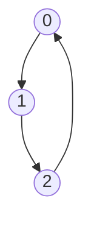
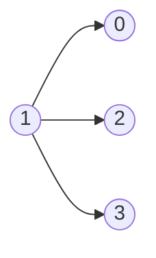
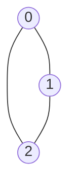
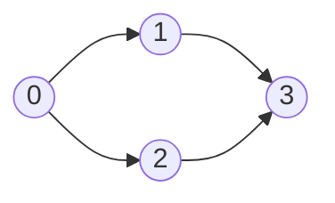
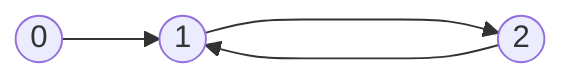

Cycle detection is one of the first places where DFS becomes more than simply "`visited` + recurse." The key thing is that **cycle detection works differently for undirected and directed graphs**.

# 1. What is a Cycle?

A cycle means we can start at some vertex, follow edges, and eventually return to the starting point.


We have:
```
0 → 1 → 2 → 3 → 0
```

So there's a cycle. Compare that with:



No cycle exists.

# 2. Undirected Cycle Detection

Here's where things get interesting. Consider the graph without a cycle:
```
0 ─── 1 ─── 2
```

Adjacency list:
```
0 → [1]
1 → [0, 2]
2 → [1]
```

Start [[Depth-First Search|DFS]]:
```
dfs(0)
   ↓
dfs(1)
```

At node `1`, we examine its neighbors: `0`, `2`. But,
```java
visited[0] == true
```

Does that mean there's a cycle? **No.** We literally came from `0`. Because this is an undirected graph. Therefore, `visited` alone isn't enough.

## Track the Parent

We need to remember:
> Which node did I use to reach the current node?

Instead of `dfs(node)`, we use `dfs(node, parent)`. Initially, we do `dfs(0, -1)` because the starting node has no parent. Then:
```
dfs(0, -1)
     ↓
dfs(1, 0)
     ↓
dfs(2, 1)
```

Now suppose node `1` sees neighbor `0`. We know:
```
neighbor = 0
parent   = 0
```

So that's fine.

## Where Does a Cycle Appear?

Now consider:


Adjacency:

```
0 → [1,2]
1 → [0,2]
2 → [0,1]
```

Suppose DFS follows:

```
0 → 1 → 2
```

At node `2`, `parent = 1` and the neighbors are `[0, 1]`, but `1` is visited, and it's our parent. Ignore it. For `0`
- `0` is not a parent
- `0` is visited
That means we've reached a previously visited node through **another edge**. It's a Cycle. So the rule is:
```
For every neighbor:

    if NOT visited:
        DFS(neighbor, current)

    else if neighbor != parent:
        CYCLE
```

That's the core of undirected cycle detection.

## Java Implementation

```java
static boolean hasCycle(int node, int parent, List<List<Integer>> graph, boolean[] visited) {  
    visited[node] = true;  
    for (int neighbor : graph.get(node)) {  
       if (!visited[neighbor]) {  
          if (hasCycle(neighbor, node, graph, visited)) {  
             return true;  
          }  
       } else if (neighbor != parent) {  
  
          return true;  
       }  
    }  
    return false;  
}
```

But because the graph might be disconnected, we need a wrapper to check nodes that might not be connected to the given `node`
```java
static boolean containsCycle(List<List<Integer>> graph) {
	boolean[] visited = new boolean[graph.size()];
	for (int node = 0; node < graph.size(); node++) {
		if (!visited[node]) {
			if (hasCycle(node, -1, graph, visited)) {
				return true;
			}
		}
	}
	return false;
}
```

## Undirected Cycle Detection with [[Breadth-First Search|BFS]]

You can do the exact same thing using BFS. But the queue needs to store:
```
(node, parent)
```

For example:
```java
Queue<int[]> queue = new ArrayDeque<>();
queue.offer(new int[]{start, -1});
```

Then:
```java
static boolean hasCycleBFS(
        int start,
        List<List<Integer>> graph,
        boolean[] visited
) {
    Queue<int[]> queue = new ArrayDeque<>();

    queue.offer(new int[]{start, -1});
    visited[start] = true;

    while (!queue.isEmpty()) {

        int[] current = queue.poll();

        int node = current[0];
        int parent = current[1];

        for (int neighbor : graph.get(node)) {

            if (!visited[neighbor]) {

                visited[neighbor] = true;

                queue.offer(
                    new int[]{neighbor, node}
                );

            } else if (neighbor != parent) {

                return true;
            }
        }
    }

    return false;
}
```

Same rule:

```
visited neighbor
      +
neighbor != parent
      ↓
    cycle
```

> For cycle detection, the DFS version is easier to reason about.

# 3. Directed Graphs

Now consider:
```
0 ──→ 1 ──→ 2
```

DFS gives $0 \rightarrow 1 \rightarrow 2$. Not a problem, yet! But suppose:
```
0 ──→ 1 ──→ 2
      ↑       │
      └───────┘
```

Now $1 \rightarrow 2 \rightarrow 1$ is a cycle.

## Why `visited[]` Alone Fails for Directed Graphs

Consider this perfectly valid DAG[^1]:


Edges:
```
0 → 1
0 → 2
1 → 3
2 → 3
```

Suppose DFS does $0 \rightarrow 1 \rightarrow 3$.

```
0 → 1 → 3
```

Now `visited[3] = true`. Eventually we return and explore $0 \rightarrow 2 \rightarrow 3$, but Node `3` is already visited. But there's **no cycle**. Why? Because directed edges do not imply a bidirectional nature. So, using `visited[node] == 1` does not necessarily mean that a cycle is present. What matters is:
> Have I reached a node that's currently part of my active DFS path?

## The Three-State Technique

Instead of just `visited / unvisited`, we use three states:
- 0 = unvisited
- 1 = currently visiting (in current DFS recursion path)
- 2 = completely processed

Suppose:
```
0 → 1 → 2 → 3
```

while we're inside `dfs(3)`:

```
0 = 1
1 = 1
2 = 1
3 = 1
```

All four are currently in the recursion path.

When `3` finishes, `state[3] = 2`, then the call stack returns back to `2`, and `state[2]` becomes `2`, and so on.

## Detecting the Cycle

Consider:


At `dfs(2)`, we have states:
```
0 = 1
1 = 1
2 = 1
```

Node `2` has an edge $2 \rightarrow 1$ and `state[1] == 1`, meaning **`1` is already in my current DFS path.** We've gone back to 1[^2] while processing the **same** DFS tree. We have reached a cycle, as $1 \rightarrow 2 \rightarrow 1$.

## Java Implementation — Directed Graph
```java
static boolean hasCycle(
        int node,
        List<List<Integer>> graph,
        int[] state
) {
    state[node] = 1;

    for (int neighbor : graph.get(node)) {

        if (state[neighbor] == 1) {
            return true;
        }

        if (state[neighbor] == 0) {

            if (hasCycle(
                    neighbor,
                    graph,
                    state
            )) {
                return true;
            }
        }
    }

    state[node] = 2;

    return false;
}
```

Then:

```
static boolean containsCycle(List<List<Integer>> graph) {

    int[] state = new int[graph.size()];

    for (int node = 0; node < graph.size(); node++) {

        if (state[node] == 0) {

            if (hasCycle(node, graph, state)) {
                return true;
            }
        }
    }

    return false;
}
```

---

# 13. Why Change State to `2`?

This line matters:

```
state[node] = 2;
```

Consider:

```
    0
   / \
  ↓   ↓
  1   2
   \ /
    ↓
    3
```

Suppose we traverse:

```
0 → 1 → 3
```

When `dfs(3)` finishes:

```
state[3] = 2
```

Later:

```
0 → 2 → 3
```

We see:

```
state[3] == 2
```

Meaning:

> We've seen `3` before, but it is **not part of the current DFS path**.

Therefore no cycle.

That's the crucial difference between:

```
state = 1
```

and:

```
state = 2
```

---

# 14. Another Common Implementation

You'll also see people use two boolean arrays:

```
boolean[] visited;
boolean[] pathVisited;
```

where:

```
visited[node]
    =
Have I ever visited this node?


pathVisited[node]
    =
Is this node currently in my DFS path?
```

Example:

```
static boolean dfs(
        int node,
        List<List<Integer>> graph,
        boolean[] visited,
        boolean[] pathVisited
) {
    visited[node] = true;
    pathVisited[node] = true;

    for (int neighbor : graph.get(node)) {

        if (!visited[neighbor]) {

            if (dfs(
                    neighbor,
                    graph,
                    visited,
                    pathVisited
            )) {
                return true;
            }

        } else if (pathVisited[neighbor]) {

            return true;
        }
    }

    pathVisited[node] = false;

    return false;
}
```

This is equivalent to the three-state approach.

I prefer:

```
int[] state;
```

because it combines both concepts cleanly:

```
0 → never visited

1 → visited + currently in path

2 → visited + finished
```

---
[^1]: Directed Acyclic Graph

[^2]: This type of edge is commonly called a **back edge**
