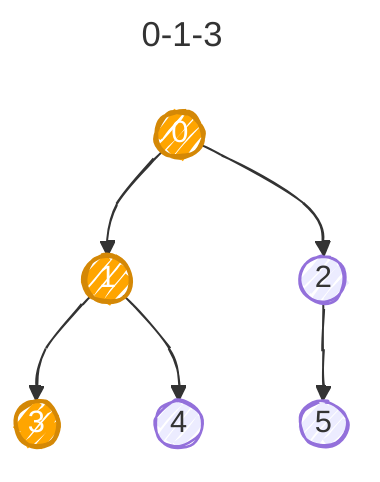
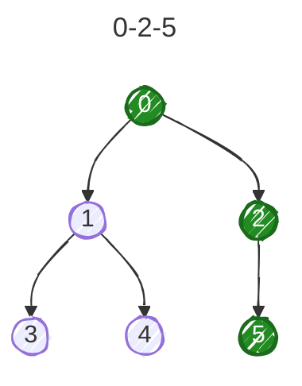
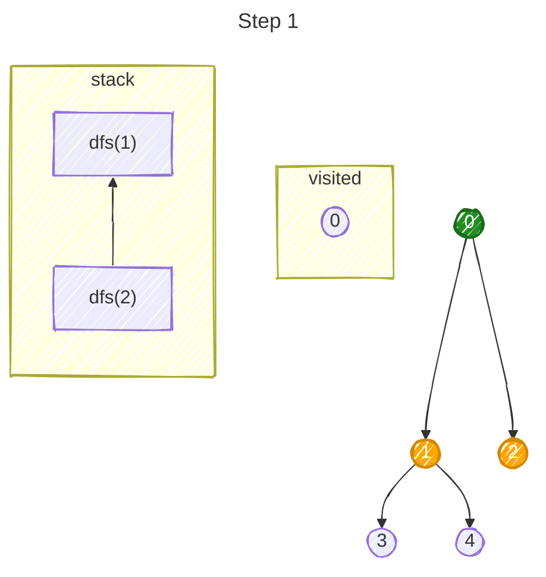
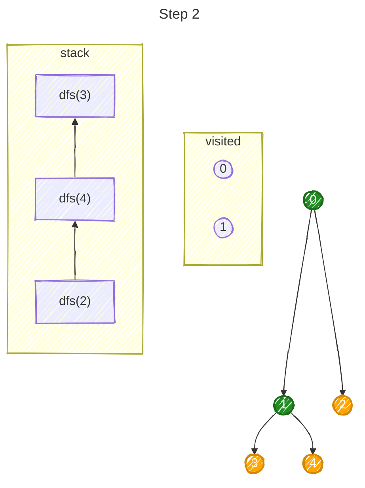
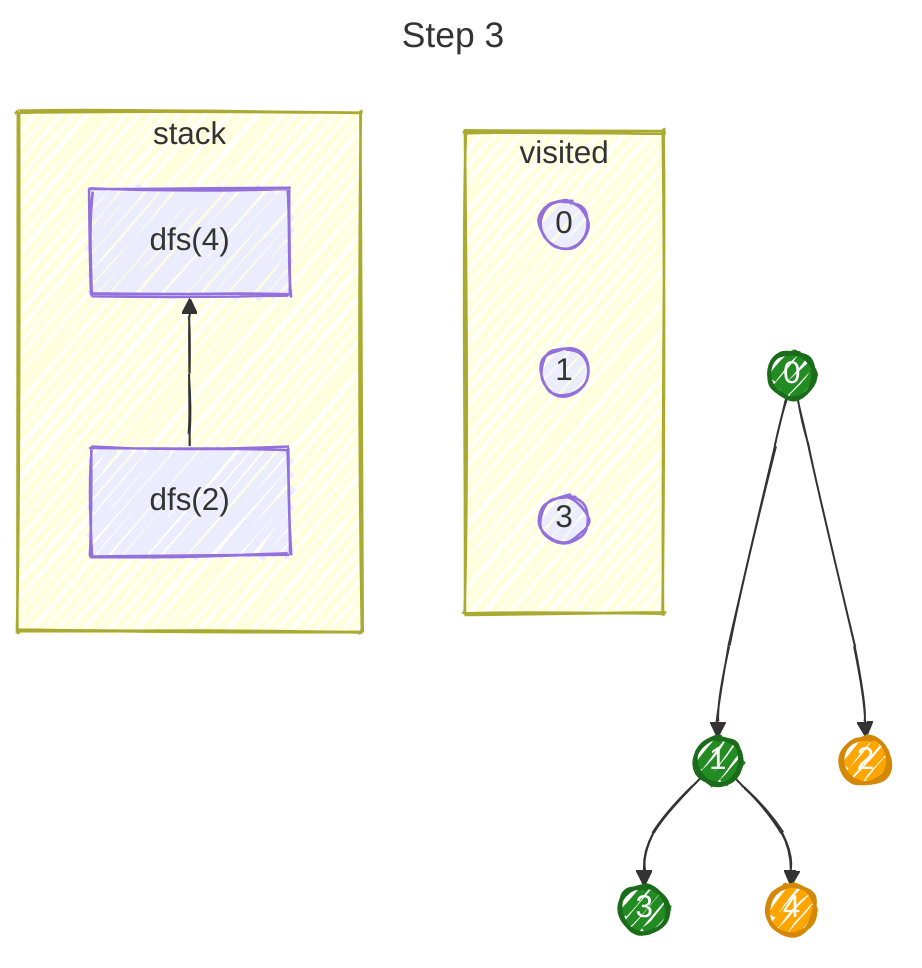
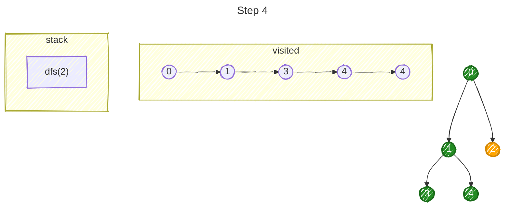
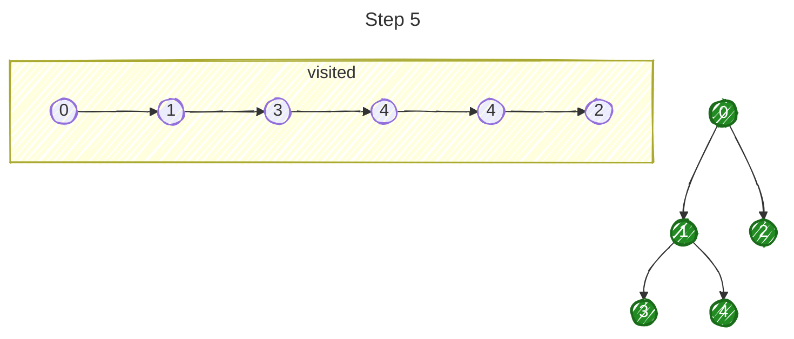

# 1. What DFS Actually Does

Consider
```
        0
       / \
      1   2
     / \   \
    3   4---5
```

Adjacency list:
```
0 → [1, 2]
1 → [0, 3, 4]
2 → [0, 5]
3 → [1]
4 → [1, 5]
5 → [2, 4]
```

Start:
```java
dfs(0);
```

DFS chooses one neighbor and keeps going **as deep as possible** before returning. Two possible traversals:


The exact order depends on the order of neighbors in the adjacency list.

# 2. Basic Recursive DFS

The standard implementation:
```java
static void dfs(
        int node,
        List<List<Integer>> graph,
        boolean[] visited
) {
    visited[node] = true;

    for (int neighbor : graph.get(node)) {
        if (!visited[neighbor]) {
            dfs(neighbor, graph, visited);
        }
    }
}
```

That's essentially the entire algorithm. Conceptually:
```
dfs(node)
    mark node visited
    for every neighbor:
        if neighbor isn't visited:
            dfs(neighbor)
```

# 3. Trace the Recursion

Let's use a smaller graph:
```
    0
   / \
  1   2
 / \
3   4
```

Adjacency list:
```
0 → [1,2]
1 → [0,3,4]
2 → [0]
3 → [1]
4 → [1]
```

Call:
```
dfs(0);
```

### Step 1

```
dfs(0)
```

Mark:
```
visited[0] = true
```

First neighbor is `1`.
```
dfs(0)
   ↓
dfs(1)
```


### Step 2

At `1`:
```
neighbors = [0,3,4]
```
`0` is already visited, so skip it.

Next:
```
dfs(0)
   ↓
dfs(1)
   ↓
dfs(3)
```



At `3`:
```
neighbors = [1]
```

But `1` is visited. So `dfs(3)` finishes. The call stack unwinds:
```
dfs(0)
   ↓
dfs(1)    ← resume here
```



Now `1`'s next neighbor is `4`.
```
dfs(0)
   ↓
dfs(1)
   ↓
dfs(4)
```



`4` finishes. Then `1` finishes. We're back inside:
```
dfs(0)
```

Its next neighbor is `2`. So:
```
dfs(0)
   ↓
dfs(2)
```



Final traversal:
```
0 → 1 → 3 → 4 → 2
```
This is why understanding recursion already gives you a big head start with DFS.

## Why Do We Need `visited`?

This is crucial. Consider:
```
0 ----- 1
```

In an undirected adjacency list, we have $0 \rightarrow [1], 1 \rightarrow [0]$. Without `if (!visited[neighbor])`, we get:
```
dfs(0)
   ↓
dfs(1)
   ↓
dfs(0)
   ↓
dfs(1)
   ↓
...
```

Infinite recursion. It becomes even more important with cycles:
```
0 ----- 1
 \     /
  \   /
    2
```

You could endlessly do:

```
0 → 1 → 2 → 0 → 1 → 2 → ...
```

`visited` prevents revisiting nodes we've already explored.

### Mark Visited Before Recursing

Notice the order:
```java
visited[node] = true;
for (int neighbor : graph.get(node)) {
    if (!visited[neighbor]) {
        dfs(neighbor, graph, visited);
    }
}
```

We mark the node **immediately**. Think:
```
Enter node
    ↓
CLAIM IT as visited
    ↓
Explore neighbors
```
This prevents another traversal path from treating the node as unexplored. You'll see the same principle in BFS.

# 4. DFS on a Disconnected Graph

Suppose:
```
0 --- 1 --- 2

3 --- 4

5
```

Running:
```java
dfs(0, graph, visited);
```

DFS only visits 0, 1, and 2. DFS can't magically jump to `3`. So if the problem asks you to traverse **the entire graph**, use:
```java
boolean[] visited = new boolean[n];

for (int node = 0; node < n; node++) {
    if (!visited[node]) {
        dfs(node, graph, visited);
    }
}
```
This starts DFS once for every connected component.

# 5. Counting Connected Components

Now we can modify the above slightly:
```java
int components = 0;

for (int node = 0; node < n; node++) {

    if (!visited[node]) {
        components++;
        dfs(node, graph, visited);
    }
}
```

For:
```
0 --- 1 --- 2

3 --- 4

5
```

the execution looks like:
```
node = 0

visited? No

components = 1
dfs(0)

visits:
0,1,2
```

Continue loop:
```
node = 1 → visited
node = 2 → visited
```

Then:
```
node = 3

visited? No

components = 2
dfs(3)

visits:
3,4
```

Finally:
```
node = 5

visited? No

components = 3
dfs(5)
```

Result: `components = 3`

This is a **very important competitive programming pattern**:
> Every DFS invocation from the outer loop discovers one connected component.

# 6. DFS for Reachability

Suppose a problem asks:
> Is there a path from `source` to `destination`?

We don't necessarily need to traverse the entire graph.
```java
static boolean dfs(
        int node,
        int destination,
        List<List<Integer>> graph,
        boolean[] visited
) {

    if (node == destination) {
        return true;
    }

    visited[node] = true;

    for (int neighbor : graph.get(node)) {
        if (!visited[neighbor]) {
            if (dfs(neighbor, destination, graph, visited)) {
                return true;
            }
        }
    }

    return false;
}
```

Now:
```java
boolean exists = dfs(source, destination, graph, visited);
```

The DFS can terminate as soon as it finds the destination. This is the pattern behind problems like **Find if Path Exists in Graph**.

# 7. DFS Doesn't Have to Return `void`

This is important when solving problems. DFS isn't some fixed function that always looks like:

```java
void dfs(...)
```

You modify it depending on what information you're collecting.
### Just traverse
```java
void dfs(...)
```

### Check whether something exists
```java
boolean dfs(...)
```

### Count something
```
int dfs(...)
```

For example, let's calculate the size of a connected component:
```java
static int dfs(
        int node,
        List<List<Integer>> graph,
        boolean[] visited
) {
    visited[node] = true;

    int size = 1;

    for (int neighbor : graph.get(node)) {
        if (!visited[neighbor]) {
            size += dfs(neighbor, graph, visited);
        }
    }

    return size;
}
```

For:
```
0 --- 1
|
2 --- 3
```

calling `dfs(0, graph, visited)` returns 4. This is where DFS starts becoming less of an algorithm you memorize and more of a **recursive problem-solving template**.

# 8. DFS with Node Objects

```java
class Node {
    int val;
    List<Node> neighbors;
}
```

DFS becomes:
```java
static void dfs(Node node, Set<Node> visited) {

    visited.add(node);

    for (Node neighbor : node.neighbors) {
        if (!visited.contains(neighbor)) {
            dfs(neighbor, visited);
        }
    }
}
```

Same algorithm. Compare:
```
Integer graph                 Object graph

int node                      Node node

graph.get(node)               node.neighbors

boolean[] visited             Set<Node> visited

visited[node]                 visited.contains(node)
```

# 9. Iterative DFS

DFS doesn't actually require recursion. The recursive version implicitly uses the **call stack**. We can explicitly use our own stack:
```java
static void dfs(
        int start,
        List<List<Integer>> graph
) {
    boolean[] visited = new boolean[graph.size()];

    Deque<Integer> stack = new ArrayDeque<>();

    stack.push(start);

    while (!stack.isEmpty()) {

        int node = stack.pop();

        if (visited[node]) {
            continue;
        }

        visited[node] = true;

        for (int neighbor : graph.get(node)) {
            if (!visited[neighbor]) {
                stack.push(neighbor);
            }
        }
    }
}
```

Conceptually:
```
Recursive DFS
     ↓
Java call stack


Iterative DFS
     ↓
Our ArrayDeque
```

The underlying idea is the same:
> **LIFO — Last In, First Out**

# 10. Recursive vs Iterative DFS in Java

In competitive programming, this distinction matters more in Java than you might initially expect. Recursive DFS is:
```java
dfs(neighbor);
```

Clean and easy to reason about. But consider:
```
0 → 1 → 2 → 3 → ... → 99,999
```

The recursion depth could approach 100,000. Java's call stack may not handle that. So for very deep graphs, iterative DFS can be safer. For LeetCode problems with moderate constraints, recursive DFS is often perfectly convenient. For contests, always check:
> How large can V be?
> Could the graph essentially be one giant chain?

# 11. DFS Time Complexity

This one is worth understanding rather than memorizing. DFS visits every vertex at most once $O(V)$. Then it processes adjacency lists. Across the entire graph, the total number of adjacency-list entries is proportional to $O(E)$. Therefore $$\boxed{O(V+E)}$$

For an undirected graph technically every edge appears twice $2E$, so $O(V+2E)$, which simplifies to $$\boxed{O(V+E)}$$
# 12. Space Complexity

We have:
```
boolean[] visited
```

which requires $O(V)$, which requires $O(V)$ calls on the stack.

Therefore auxiliary space is $$\boxed{O(V)}$$

The adjacency list itself takes: $$O(V+E)$$

but whether you count input storage depends on how the problem asks for space complexity.

# 13. The Most Important DFS Pattern

Most DFS problems eventually look something like:

```java
static void dfs(int node) {

    // 1. Process current node
    visited[node] = true;

    // 2. Explore neighbors
    for (int neighbor : graph.get(node)) {

        // 3. Decide whether to explore neighbor
        if (!visited[neighbor]) {

            // 4. Recurse
            dfs(neighbor);
        }
    }
}
```

What changes between problems is mostly:
 - What do I do when entering a node?
 - What information do I maintain?
 - When should I recurse?
 - What should DFS return?

That's where the actual problem-solving happens.

## DFS Recognition Guide

When you encounter language such as:
```
"Can X reach Y?"
        ↓
      DFS

"How many connected groups?"
        ↓
      DFS

"Visit everything connected to X"
        ↓
      DFS

"How large is this connected region?"
        ↓
      DFS

"Explore this island/region"
        ↓
      DFS

"Does this graph contain a cycle?"
        ↓
      DFS + additional state
```

DFS should immediately be somewhere on your shortlist.