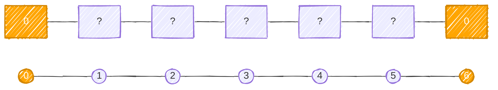
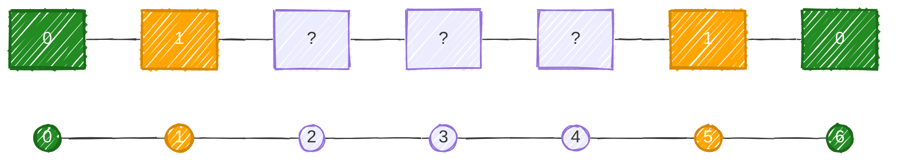
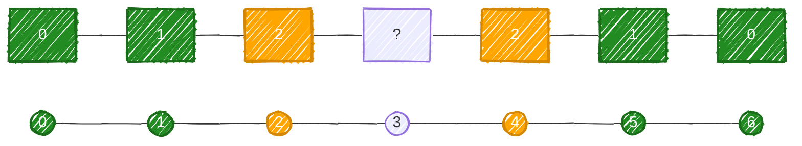
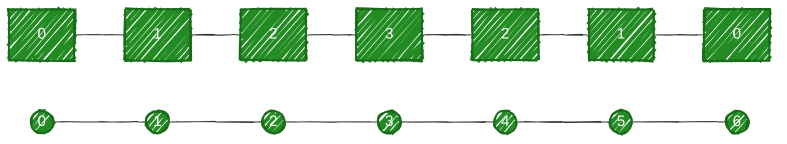
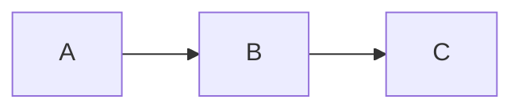
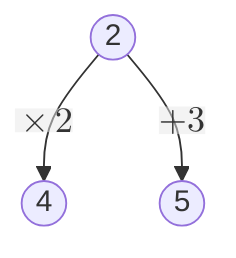

You already know normal [[Breadth-First Search]]:
```
One source
    ↓
  Queue
    ↓
   BFS
```

Multi-source BFS makes one simple change:
```
Source A ─┐
Source B ─┼──→ Queue → BFS
Source C ─┘
```

All sources enter the queue **before BFS starts**. This solves an important class of problems:
> Find the shortest distance/time from **any** of several starting points.

# 1. Why Multi-Source BFS?

Suppose:
```
. . . . .
. S . . .
. . . S .
. . . . .
```

You want every cell's distance from the **nearest `S`**. One approach would be:
- BFS from S1
- BFS from S2
- take minimum

With $K$ sources and $V + E$ graph size, we have $O(K(V+E))$. Instead, put both sources into the same queue `[S1, S2]` and run BFS once $$O(V+E)$$

Both BFS waves effectively expand simultaneously.

# 2. Regular BFS vs Multi-Source BFS

Regular BFS:
```java
Queue<Integer> queue = new ArrayDeque<>();

queue.offer(source);
distance[source] = 0;
```

Multi-source:
```java
Queue<Integer> queue = new ArrayDeque<>();

for (int source : sources) {
    queue.offer(source);
    distance[source] = 0;
}
```

After initialization, **it's just a normal BFS.** That's the most important thing to understand.

# 3. Example

Consider this line graph:


Sources:
```
0 and 6
```

The initial queue would be `[0, 6]`, and the distances would be

Distance:


We process Level 0 where
- $0 \rightarrow 1$, and
- $6 \rightarrow 5$

Now:


Queue becomes `[1, 5]`. Next:
- $1 \rightarrow 2$, and
- $5 \rightarrow 4$

Giving:


Finally, $2 \rightarrow 3$

Result:


Each vertex now contains its shortest distance to **either source**.

# 4. Generic Multi-Source BFS
```java
static int[] bfs(
        List<List<Integer>> graph,
        List<Integer> sources
) {
    int n = graph.size();
    int[] distance = new int[n];
    Arrays.fill(distance, -1);
    Queue<Integer> queue = new ArrayDeque<>();
    for (int source : sources) {
        queue.offer(source);
        distance[source] = 0;
    }
    while (!queue.isEmpty()) {
        int node = queue.poll();
        for (int neighbor : graph.get(node)) {
            if (distance[neighbor] == -1) {
                distance[neighbor] =
                        distance[node] + 1;

                queue.offer(neighbor);
            }
        }
    }
    return distance;
}
```

Again, `distance == -1` doubles as our visited check.

# 5. Multi-Source BFS on Grids

This is where you'll encounter the pattern most frequently. Suppose:
```
0 0 0
0 1 0
1 0 0
```

and we want every `0`'s distance from the nearest `1`. Put **every `1` into the queue** initially:
```
Source cells:
(1,1)
(2,0)
```

Both receive `distance = 0`. Then BFS outward.

## The Grid Template

This is worth becoming comfortable with:
```java
int rows = grid.length;
int cols = grid[0].length;

int[][] distance = new int[rows][cols];

for (int[] row : distance) {
    Arrays.fill(row, -1);
}

Queue<int[]> queue = new ArrayDeque<>();

for (int r = 0; r < rows; r++) {
    for (int c = 0; c < cols; c++) {

        if (grid[r][c] == 1) {
            queue.offer(new int[]{r, c});
            distance[r][c] = 0;
        }
    }
}
```

Then ordinary BFS:
```java
int[][] directions = {
    {-1, 0},
    {1, 0},
    {0, -1},
    {0, 1}
};

while (!queue.isEmpty()) {
    int[] cell = queue.poll();
    int row = cell[0];
    int col = cell[1];
    for (int[] direction : directions) {
        int newRow = row + direction[0];
        int newCol = col + direction[1];
        if (
            newRow >= 0 &&
            newRow < rows &&
            newCol >= 0 &&
            newCol < cols &&
            distance[newRow][newCol] == -1
        ) {
            distance[newRow][newCol] =
                    distance[row][col] + 1;
            queue.offer(
                new int[]{newRow, newCol}
            );
        }
    }
}
```

## Classic Example — 01 Matrix

LeetCode's **01 Matrix** asks:
> For every cell containing `1`, find its distance to the nearest `0`.

Example:
```
0 0 0
0 1 0
1 1 1
```

The key question is:
> What should our BFS sources be?

We're looking for the distance **to the nearest zero**. So:
```
Every 0 = source
```

Initial queue:
```
(0,0)
(0,1)
(0,2)
(1,0)
(1,2)
```

All get `distance = 0`. Then they simultaneously spread into the `1`s.

Result:
```
0 0 0
0 1 0
1 2 1
```

## Why Not BFS From Every `1`?

You technically could, for every `1`, run BFS until finding a 0. But suppose the grid is $M \times N$ there could be roughly $M \times N$ `1`s. Each BFS could itself cost $O(MN)$ giving worst case $$O((MN)^2)$$
Multi-source BFS instead processes each cell essentially once, hence giving $$O(MN)$$

This reversal is an important CP trick:
> Instead of searching **from every target toward a source**, start BFS simultaneously **from all sources**.

# 6. Rotting Oranges

Now consider:
```
2 1 1
1 1 0
0 1 2
```

where:
```
0 = empty
1 = fresh
2 = rotten
```

Every minute, a rotten orange makes an adjacent fresh one rotten. There are two rotten oranges initially. So if we started BFS only from the first $(0,0)$ we'd incorrectly simulate the problem because $(2,2)$ is also spreading rot at the same time. Therefore:
```
ALL initially rotten oranges
           ↓
       queue initially
```

## Rotting Oranges — Initialization
```java
Queue<int[]> queue = new ArrayDeque<>();
int fresh = 0;
for (int r = 0; r < rows; r++) {
    for (int c = 0; c < cols; c++) {
        if (grid[r][c] == 2) {
            queue.offer(new int[]{r, c});
        }
        if (grid[r][c] == 1) {
            fresh++;
        }
    }
}
```

Why count fresh oranges? Because at the end we need to know whether some fresh oranges were unreachable.

## Tracking Time With BFS Levels

Now we need another BFS pattern:
```java
int minutes = 0;
while (!queue.isEmpty() && fresh > 0) {
    int size = queue.size();
    for (int i = 0; i < size; i++) {
        int[] cell = queue.poll();
        // infect adjacent oranges
    }
    minutes++;
}
```

### IMPORTANT: Calculate `queue.size()` outside the loop

Suppose the queue currently contains $[A, B]$. Those are oranges rotten at minute `0`. While processing them, we add $[A, B, C, D, E]$. Those oranges rot at minute `1`. Calculating the queue size in the loop will calculate the size every time we get a process neighbor. We don't want to immediately process them during minute `0`. So, to make the current queue level = one unit of time, we calculate the queue outside the loop.

## Full Rotting Oranges Solution
```java
class Solution {

    public int orangesRotting(int[][] grid) {
        int rows = grid.length;
        int cols = grid[0].length;
        Queue<int[]> queue = new ArrayDeque<>();
        int fresh = 0;
        for (int r = 0; r < rows; r++) {
            for (int c = 0; c < cols; c++) {
                if (grid[r][c] == 2) {
                    queue.offer(new int[]{r, c});
                }
                if (grid[r][c] == 1) {
                    fresh++;
                }
            }
        }
        int[][] directions = {
            {-1, 0},
            {1, 0},
            {0, -1},
            {0, 1}
        };
        int minutes = 0;
        while (!queue.isEmpty() && fresh > 0) {
            int size = queue.size();
            for (int i = 0; i < size; i++) {
                int[] cell = queue.poll();
                int row = cell[0];
                int col = cell[1];
                for (int[] direction : directions) {
                    int newRow =
                            row + direction[0];
                    int newCol =
                            col + direction[1];
                    if (
                        newRow >= 0 &&
                        newRow < rows &&
                        newCol >= 0 &&
                        newCol < cols &&
                        grid[newRow][newCol] == 1
                    ) {
                        grid[newRow][newCol] = 2;
                        fresh--;
                        queue.offer(
                            new int[]{newRow, newCol}
                        );
                    }
                }
            }
            minutes++;
        }
        return fresh == 0 ? minutes : -1;
    }
}
```

There are three separate ideas here:
```
All rotten cells
      ↓
Multi-source BFS


Queue level
      ↓
One minute


fresh counter
      ↓
Detect unreachable cells
```

That's why Rotting Oranges is such a useful BFS problem.

# 7. Two Ways to Track BFS Distance/Time

You'll encounter both.
### Approach A — Store distance

```java
distance[neighbor] = distance[node] + 1;
```

Useful when you want distance for every node. For example, the [[#Classic Example — 01 Matrix|01 Matrix]]
### Approach B — Process by levels
```java
while (!queue.isEmpty()) {
    int size = queue.size();
    for (int i = 0; i < size; i++) {
        ...
    }
    time++;
}
```

Useful when the problem asks:
- How many rounds?
- How many minutes?
- How many transformations?
They're fundamentally expressing the same BFS property.

# 8. Another Common BFS Pattern — Shortest Transformation

Suppose you can transform $A \rightarrow B \rightarrow C$, and each operation costs `1`. The states themselves can be considered vertices:



and each valid transformation is an edge. Then:
```
minimum number of operations
          ↓
shortest unweighted path
          ↓
         BFS
```

This is the underlying idea behind problems such as **Word Ladder**. The graph might never explicitly exist. You generate neighboring states as BFS runs. That's another example of an **implicit graph**.

# 9. BFS on States

This is an important step beyond obvious graph problems. Suppose a problem says:
> Starting at number `1`, you may multiply by 2 or add 3. Find the minimum operations required to reach `17`.

You can think:
- Current number = vertex
- Operation = edge
So:

Since every operation costs exactly one, that implies the minimum number of operations $\rightarrow$ BFS. This recognition is extremely useful in CP.

# 10. Multi-Source BFS Recognition

When you see:
> Find distance to nearest hospital.

If there are many hospitals:
```
All hospitals → initial queue
```

When you see:
> Fire starts at several locations and spreads every minute.
```
All fires → initial queue
```

When you see:
> Find nearest `0` for every `1`.
```
All zeros → initial queue
```

When you see:
> Infection starts from several infected people.
```
All infected → initial queue
```

The general structure is:
```
Multiple equivalent starting points
              +
All expand under the same rules
              +
Need shortest distance/time
              ↓
       MULTI-SOURCE BFS
```

# 11. Complexity

For a normal graph $$\boxed{O(V+E)}$$

Even though we have many sources, each vertex still enters the queue at most once. For a grid $$V = M\times N$$

Each cell has at most four edges, so $$\boxed{O(MN)}$$

time and $$\boxed{O(MN)}$$

worst-case space.

Multi-source BFS does **not** mean number of sources $\times$ BFS because we're running **one BFS with multiple initial queue entries**.