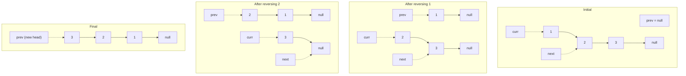

### Reversing a Linked List


```java
ListNode curr = head, prev = null, next;  
  
while (curr != null) {  
    // Save the next node  
    next = curr.next;  
    // Reverse the current node  
    curr.next = prev;  
    // Move nodes one step ahead  
    prev = curr;  
    curr = next;  
}  
  
return prev;
```