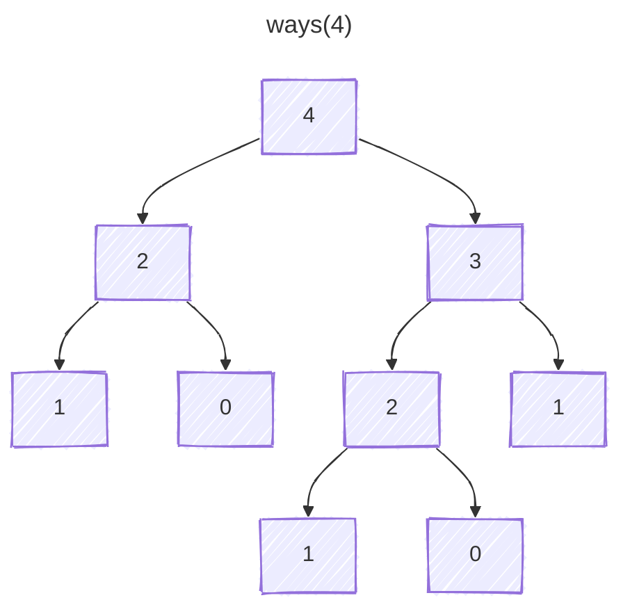

Recursion in competitive programming is less about “a function calling itself” and more about learning to recognize **problems whose solution can be expressed in terms of smaller versions of the same problem**.

Since you already code in Java, this focuses on the competitive-coding way of thinking about recursion, not basic programming syntax.

## 1. What Recursion Actually Is

A recursive function usually has two parts:

```java
return solve(smallerProblem);
```

and a stopping condition:

```java
if (baseCase) {
    return answer;
}
```

For example, factorial:

```java
int factorial(int n) {
    if (n == 0) {
        return 1;
    }

    return n * factorial(n - 1);
}
```

Mathematically:

```text
factorial(n) = n × factorial(n - 1)
factorial(0) = 1
```

The interesting part is not that Java lets you call `factorial()` from inside itself.

The important idea is:

> If I already knew the answer for `n - 1`, how would I use it to calculate the answer for `n`?

That question is at the heart of recursion.

## 2. The Recursive Leap of Faith

This is one of the most useful mental models.

Suppose you're solving:

```text
sum of numbers from 1 to n
```

You can write:

```java
int sum(int n) {
    if (n == 0) {
        return 0;
    }

    return n + sum(n - 1);
}
```

Instead of mentally expanding everything:

```text
sum(5)
= 5 + sum(4)
= 5 + 4 + sum(3)
= ...
```

think:

> Assume `sum(n - 1)` correctly gives me the sum from 1 to `n - 1`.

Then all your current function has to do is:

```text
current answer = n + answer of smaller problem
```

This is called the **recursive leap of faith**.

In competitive programming, constantly tracing every recursive call becomes painful once the recursion becomes complicated.

You instead reason about correctness inductively.

## 3. The Three Questions You Should Ask

Whenever you're designing a recursive solution, answer these three questions.

### 1. What does my function mean?

For example:

```java
solve(i)
```

might mean:

> Returns the maximum score achievable starting from index `i`.

Or:

```java
dfs(node)
```

might mean:

> Processes the entire subtree rooted at `node`.

This definition needs to be extremely precise.

### 2. What is the base case?

At what point does the problem become trivial?

Example:

```java
if (i == nums.length) {
    return 0;
}
```

### 3. How does the current state depend on smaller states?

Example:

```java
return nums[i] + solve(i + 1);
```

or:

```java
return Math.max(
    takeCurrent + solve(i + 2),
    solve(i + 1)
);
```

If these three things are clear, the recursion is usually straightforward.

## 4. How the Call Stack Works

Consider:

```java
void print(int n) {
    if (n == 0) {
        return;
    }

    System.out.println(n);
    print(n - 1);
}
```

Calling:

```java
print(3);
```

creates something like this:

```text
print(3)
    print(2)
        print(1)
            print(0)
            return
        return
    return
return
```

Each function invocation gets its own stack frame containing things like:

```text
parameters
local variables
return address
```

So `print(3)` and `print(2)` are separate function calls with separate values of `n`.

## 5. Recursion Has Two Phases

Consider:

```java
void print(int n) {
    if (n == 0) return;

    System.out.println(n);
    print(n - 1);
}
```

Output:

```text
3
2
1
```

You're doing work **before** the recursive call.

Now:

```java
void print(int n) {
    if (n == 0) return;

    print(n - 1);
    System.out.println(n);
}
```

Output:

```text
1
2
3
```

You're doing work during the **unwinding phase**.

Visualize:

```text
Going down:
3 → 2 → 1 → 0

Coming back:
0 → 1 → 2 → 3
```

This distinction is huge for trees, linked lists, DFS, backtracking, etc.

## 6. Recursion on Arrays

A very common competitive programming pattern is recursion using an index.

Instead of repeatedly creating smaller arrays, pass an index into the original array.

Example: sum an array.

```java
int sum(int[] nums, int i) {
    if (i == nums.length) {
        return 0;
    }

    return nums[i] + sum(nums, i + 1);
}
```

Function meaning:

```text
sum(nums, i)
= sum of elements from index i to the end
```

For:

```text
[4, 7, 2, 8]
```

You get:

```text
sum(0)
= 4 + sum(1)

sum(1)
= 7 + sum(2)

sum(2)
= 2 + sum(3)

sum(3)
= 8 + sum(4)

sum(4)
= 0
```

## 7. Avoid Modifying the Input Unnecessarily

Beginners sometimes write recursive array problems by repeatedly creating smaller arrays.

Like:

```java
Arrays.copyOfRange(nums, 1, nums.length);
```

Don't do that unless you need to.

Use an index:

```java
solve(nums, i + 1);
```

Because creating new subarrays adds unnecessary time and memory.

Competitive programming loves index-based recursion for this reason.

## 8. Multiple Recursive Branches

Now recursion gets more interesting.

Suppose you're climbing stairs and can move either one or two steps. How many ways can you reach step `n`?

```java
int ways(int n) {
    if (n == 0) {
        return 1;
    }

    if (n < 0) {
        return 0;
    }

    return ways(n - 1) + ways(n - 2);
}
```

Why?

To reach step `n`, your previous step must have been `n - 1` or `n - 2`.

So:

```text
ways(n)
=
ways(n - 1)
+
ways(n - 2)
```

This creates a recursion tree.



Whenever a problem has multiple choices, you often get multiple recursive branches.

## 9. Decision Recursion

This pattern appears everywhere.

At each element, you make one or more decisions.

For example:

```text
take it
don't take it
```

Suppose you want to generate all subsets of `[1, 2, 3]`.

At every index:

```text
include nums[i]
exclude nums[i]
```

Code:

```java
void subsets(
    int[] nums,
    int i,
    List<Integer> current
) {
    if (i == nums.length) {
        System.out.println(current);
        return;
    }

    // Don't take
    subsets(nums, i + 1, current);

    // Take
    current.add(nums[i]);
    subsets(nums, i + 1, current);
    current.remove(current.size() - 1);
}
```

This pattern gives you $2^n$ subsets.

## 10. This Is Where Recursion Becomes Backtracking

Backtracking is basically:

> recursion + make a choice + undo the choice.

Notice:

```java
current.add(nums[i]);
subsets(nums, i + 1, current);
current.remove(current.size() - 1);
```

You modify state, explore, then restore the previous state.

Think of it as:

```text
choose
explore
unchoose
```

You'll see this constantly in:

```text
permutations
combinations
N-Queens
Sudoku
word search
maze paths
subset sum
```

## 11. A More Important Example: Permutations

Given `[1, 2, 3]`, generate all permutations.

At each recursive level:

> Which unused number should I place next?

```java
void permute(
    int[] nums,
    boolean[] used,
    List<Integer> current
) {
    if (current.size() == nums.length) {
        System.out.println(current);
        return;
    }

    for (int i = 0; i < nums.length; i++) {
        if (used[i]) {
            continue;
        }

        used[i] = true;
        current.add(nums[i]);

        permute(nums, used, current);

        current.remove(current.size() - 1);
        used[i] = false;
    }
}
```

Pattern:

```text
for every available choice:
    choose
    recurse
    undo
```

This is the canonical backtracking structure.

## 12. Recursion vs Iteration

A lot of recursive problems can technically be written iteratively.

Example:

```java
int factorial(int n) {
    int result = 1;

    for (int i = 1; i <= n; i++) {
        result *= i;
    }

    return result;
}
```

This is better than recursion for factorial because recursion adds call-stack overhead and doesn't help readability much.

Recursion is most useful when the problem itself naturally has recursive structure:

```text
trees
graphs
divide and conquer
combinations
permutations
subsets
nested structures
DFS
```

So don't force recursion everywhere.

## 13. Tree Recursion

Trees are the most natural example.

A binary tree node is structurally:

```text
node
├── left subtree
└── right subtree
```

But each subtree is itself another binary tree.

That means recursive definitions fit perfectly.

Example: count nodes.

```java
int count(TreeNode root) {
    if (root == null) {
        return 0;
    }

    return 1
        + count(root.left)
        + count(root.right);
}
```

Function meaning:

```text
count(root)
= number of nodes in the tree rooted at root
```

The decomposition is:

```text
current node
+
left subtree
+
right subtree
```

## 14. Tree Height

Define:

```text
height(node)
= maximum depth of tree rooted at node
```

Then:

```java
int height(TreeNode root) {
    if (root == null) {
        return 0;
    }

    return 1 + Math.max(
        height(root.left),
        height(root.right)
    );
}
```

Again:

```text
answer for tree
=
1
+
best answer among smaller trees
```

This is exactly recursive thinking.

## 15. Preorder, Inorder, Postorder

The location of work relative to recursive calls matters.

### Preorder

```java
void dfs(TreeNode node) {
    if (node == null) return;

    process(node);
    dfs(node.left);
    dfs(node.right);
}
```

```text
Node → Left → Right
```

### Inorder

```java
dfs(node.left);
process(node);
dfs(node.right);
```

```text
Left → Node → Right
```

### Postorder

```java
dfs(node.left);
dfs(node.right);
process(node);
```

```text
Left → Right → Node
```

Competitive programming insight:

If your answer depends on information from children, you're often doing **postorder-style recursion**.

For example:

```java
int left = solve(node.left);
int right = solve(node.right);

return combine(left, right);
```

## 16. Graph DFS Is Recursion Too

For graphs:

```java
void dfs(int node) {
    visited[node] = true;

    for (int neighbor : graph[node]) {
        if (!visited[neighbor]) {
            dfs(neighbor);
        }
    }
}
```

Conceptually:

```text
dfs(node)
=
visit node
+
recursively visit every unvisited neighboring region
```

The `visited` array prevents infinite recursion through cycles.

Without it:

```text
A → B → C → A → B → C ...
```

and eventually Java throws `StackOverflowError`.

## 17. Divide and Conquer Recursion

Another major category.

Instead of reducing `n → n - 1`, you reduce `n → n / 2`.

Classic binary search:

```java
int binarySearch(
    int[] nums,
    int target,
    int left,
    int right
) {
    if (left > right) {
        return -1;
    }

    int mid = left + (right - left) / 2;

    if (nums[mid] == target) {
        return mid;
    }

    if (target < nums[mid]) {
        return binarySearch(nums, target, left, mid - 1);
    }

    return binarySearch(nums, target, mid + 1, right);
}
```

Each recursive call cuts the problem roughly in half.

So:

```text
T(n) = T(n/2) + O(1)
```

which gives:

```text
O(log n)
```

## 18. Merge Sort Recursion

Merge sort uses:

```text
solve left half
solve right half
combine
```

Conceptually:

```java
void mergeSort(int[] nums, int left, int right) {
    if (left >= right) {
        return;
    }

    int mid = left + (right - left) / 2;

    mergeSort(nums, left, mid);
    mergeSort(nums, mid + 1, right);

    merge(nums, left, mid, right);
}
```

Time recurrence:

```text
T(n)
=
2T(n/2)
+
O(n)
```

leading to $O(n \log n)$

You'll eventually want to get comfortable looking at a recursive function and deriving its complexity from the recursion tree.

## 19. Recursion Time Complexity

Consider:

```java
void f(int n) {
    if (n == 0) return;
    f(n - 1);
}
```

Number of calls:

```text
n
```

Complexity:

```text
O(n)
```

Now:

```java
void f(int n) {
    if (n == 0) return;
    f(n - 1);
    f(n - 1);
}
```

Each call makes two more calls.

Roughly:

```text
1
2
4
8
16
...
```

So:

```text
O(2^n)
```

## 20. Branching Factor × Depth

A very useful rough estimate for backtracking:

```text
O(branches^depth)
```

If every level has two choices and there are `n` levels:

```text
O(2^n)
```

Subsets have two choices at each level:

```text
take / skip
```

So there are `2^n` possibilities.

For permutations:

```text
n choices
n - 1 choices
n - 2 choices
...
```

giving:

```text
n!
```

## 21. Space Complexity of Recursion

Recursive functions consume call-stack space.

For:

```java
solve(n - 1);
```

depth is `n`, so stack space is `O(n)`.

For binary search:

```text
n
→ n/2
→ n/4
→ ...
```

depth is `O(log n)`.

Therefore recursive binary search uses `O(log n)` stack space.

## 22. Java and StackOverflowError

This matters more in Java than in some competitive programming languages.

If you recurse extremely deeply, Java may crash with:

```text
java.lang.StackOverflowError
```

For example, a path-like tree with `100,000` nodes can be dangerous because DFS recursion depth becomes about `100,000`.

In competitive programming, if `n` is very large, consider iterative DFS:

```java
Deque<Integer> stack = new ArrayDeque<>();
stack.push(start);

while (!stack.isEmpty()) {
    int node = stack.pop();

    // process node
}
```

Java has no guaranteed tail-call optimization.

## 23. The Most Common Recursion Bug: Bad Base Case

Example:

```java
int f(int n) {
    if (n == 0) {
        return 0;
    }

    return f(n - 2);
}
```

What happens when you call `f(5)`?

```text
5
3
1
-1
-3
-5
...
```

You'll never hit `n == 0`.

Better:

```java
if (n <= 0) {
    return 0;
}
```

Your base condition should cover all terminal states reachable from your transitions.

## 24. Another Bug: State Not Progressing

This is obviously bad:

```java
int solve(int n) {
    if (n == 0) return 0;

    return solve(n);
}
```

But subtler cases happen in binary search if the interval does not shrink correctly.

Every recursive transition must move toward termination.

## 25. Another Bug: Forgetting to Undo State

Suppose:

```java
current.add(nums[i]);
backtrack();
```

but you forget:

```java
current.remove(current.size() - 1);
```

Then your state leaks into sibling branches.

Whenever you mutate shared state during recursion, ask:

> Do I need to restore it?

## 26. Another Bug: Passing Copied State Unnecessarily

You could write:

```java
List<Integer> next = new ArrayList<>(current);
next.add(nums[i]);

backtrack(next);
```

This avoids undoing, but it allocates a new list on every recursive call.

Often, competitive-programming backtracking prefers:

```java
current.add(nums[i]);
backtrack(current);
current.remove(current.size() - 1);
```

because it's cheaper.

## 27. Return Recursion vs Global-State Recursion

There are two common styles.

### Return an answer

```java
int solve(int n) {
    if (n == 0) return 0;

    int left = solve(n - 1);
    int right = solve(n - 2);

    return Math.max(left, right);
}
```

Use this when each state has a clean result.

### Mutate an external result

```java
void solve(List<Integer> current) {
    if (isComplete(current)) {
        answer.add(new ArrayList<>(current));
        return;
    }

    // explore choices
}
```

Common for generating subsets, permutations, paths, and combinations.

## 28. Recursion and Dynamic Programming

This is one of the biggest connections.

Take Fibonacci:

```java
int fib(int n) {
    if (n <= 1) {
        return n;
    }

    return fib(n - 1) + fib(n - 2);
}
```

The recursion tree repeats work.

This is where memoization comes in.

```java
int[] memo;

int fib(int n) {
    if (n <= 1) {
        return n;
    }

    if (memo[n] != -1) {
        return memo[n];
    }

    memo[n] = fib(n - 1) + fib(n - 2);

    return memo[n];
}
```

You've now turned exponential recursion into roughly `O(n)`.

This approach is usually called **top-down dynamic programming**.

## 29. Recursion State Is the Bridge to DP

When solving DP recursively, ask:

> What variables uniquely determine the current subproblem?

For example:

```java
solve(i);
```

State:

```text
i
```

Or:

```java
solve(i, remaining);
```

State:

```text
index
remaining target
```

Or:

```java
solve(row, col);
```

State:

```text
grid coordinates
```

Memoize on those state variables.

This is why becoming good at recursion makes DP dramatically easier.

## 30. A Classic Take/Skip Problem

Suppose:

```text
nums = [3, 4, 5]
target = 8
```

Question:

> Is there a subset whose sum equals 8?

Recursive definition:

```java
boolean solve(int[] nums, int i, int target) {
    if (target == 0) {
        return true;
    }

    if (i == nums.length || target < 0) {
        return false;
    }

    boolean skip = solve(nums, i + 1, target);

    boolean take = solve(
        nums,
        i + 1,
        target - nums[i]
    );

    return take || skip;
}
```

At each item:

```text
take
or
skip
```

This is one of the most important recursion templates in competitive programming.

It later becomes:

```text
0/1 Knapsack
Subset Sum
Partition Equal Subset Sum
Target Sum
```
## 31. Recursion on Strings

Strings often use the same index pattern.

Check palindrome:

```java
boolean palindrome(String s, int left, int right) {
    if (left >= right) {
        return true;
    }

    if (s.charAt(left) != s.charAt(right)) {
        return false;
    }

    return palindrome(
        s,
        left + 1,
        right - 1
    );
}
```

Function meaning:

```text
palindrome(left, right)
=
whether substring s[left...right] is a palindrome
```

Notice how the state shrinks from both sides.

## 32. Recursive Linked-List Thinking

Linked lists are naturally recursive too.

A linked list is:

```text
node + rest of list
```

Reverse linked list recursively:

```java
ListNode reverse(ListNode head) {
    if (head == null || head.next == null) {
        return head;
    }

    ListNode newHead = reverse(head.next);

    head.next.next = head;
    head.next = null;

    return newHead;
}
```

Suppose:

```text
1 → 2 → 3 → null
```

The recursive call `reverse(2 → 3)` returns:

```text
3 → 2
```

Then current `1` attaches itself to the back:

```text
3 → 2 → 1
```

This is a perfect example of trusting that the smaller recursive problem has already been solved.

## 33. Backtracking Template to Memorize

You should eventually recognize this instantly:

```java
void backtrack(State state) {
    if (isComplete(state)) {
        saveAnswer(state);
        return;
    }

    for (Choice choice : choices(state)) {
        makeChoice(choice);

        backtrack(state);

        undoChoice(choice);
    }
}
```

This covers a shocking number of problems:

```text
Permutations
Combination Sum
N Queens
Sudoku
Palindrome Partitioning
Generate Parentheses
Word Search
```

## 34. Generate Parentheses

This is a great recursive problem.

Generate all valid strings for `n = 3`.

You track:

```text
open used
close used
```

You may add `(` when `open < n`.

You may add `)` when `close < open`.

Code:

```java
void generate(
    int n,
    int open,
    int close,
    StringBuilder current,
    List<String> result
) {
    if (current.length() == 2 * n) {
        result.add(current.toString());
        return;
    }

    if (open < n) {
        current.append('(');

        generate(
            n,
            open + 1,
            close,
            current,
            result
        );

        current.deleteCharAt(current.length() - 1);
    }

    if (close < open) {
        current.append(')');

        generate(
            n,
            open,
            close + 1,
            current,
            result
        );

        current.deleteCharAt(current.length() - 1);
    }
}
```

This also introduces an important idea:

> Prune invalid branches before exploring them.

That's what makes good backtracking solutions efficient.

## 35. Pruning

Suppose you're searching a giant recursion tree.

If you already know some branch can never produce a valid answer, stop immediately.

Example:

```java
if (target < 0) {
    return;
}
```

Or in a parentheses problem:

```java
if (close > open) {
    return;
}
```

Or in N-Queens:

```text
queen conflicts with existing queen
→ don't recurse
```

Good competitive programmers don't just generate possibilities.

They eliminate impossible branches as early as possible.

## 36. How to Draw a Recursion Tree

When stuck, draw the first few levels.

For `solve(i)` with choices `take` and `skip`, draw:

```text
                 i=0
              /       \
          take         skip
          i=1           i=1
         /  \           /  \
```

Write the state next to each node.

Example:

```text
(i, remaining)
```

Then ask:

```text
Do states repeat?
```

If yes, that's a DP clue.

## 37. A Useful Debugging Technique

When recursion behaves strangely, log the state:

```java
System.out.println(
    "i=" + i +
    ", target=" + target
);
```

Or use indentation:

```java
void solve(int n, int depth) {
    System.out.println(
        "  ".repeat(depth) + "solve(" + n + ")"
    );

    // recursive logic
}
```

This visually exposes the recursion tree.

Don't leave this in a competitive submission.

## 38. Recursion Pattern Recognition

When you see a problem, certain words should trigger certain patterns.

| Problem shape | Common recursion |
|---|---|
| All subsets | take / skip |
| All permutations | choose unused item |
| Tree traversal | recurse into children |
| Graph traversal | recurse into neighbors |
| String segmentation | choose next split |
| Grid exploration | recurse into adjacent cells |
| Divide sorted range | binary recursion |
| Search all configurations | backtracking |
| Optimal choice among possibilities | recursion + memoization |
| Repeated recursive states | DP |

This pattern recognition is much more valuable than memorizing individual solutions.

## 39. Four Types of Recursion You Should Master

### Linear recursion

One recursive call:

```java
solve(n - 1);
```

Examples:

```text
array traversal
linked list traversal
simple string recursion
```

### Divide-and-conquer recursion

Problem is divided:

```java
solveLeft();
solveRight();
```

Examples:

```text
merge sort
binary search
quick sort
```

### Tree/graph recursion

Explore children or neighbors:

```java
for (int child : children) {
    dfs(child);
}
```

Examples:

```text
tree DFS
graph DFS
islands
connected components
```

### Backtracking/decision recursion

Explore choices:

```java
for (Choice choice : choices) {
    choose(choice);
    recurse();
    undo(choice);
}
```

Examples:

```text
subsets
permutations
combinations
N-Queens
Sudoku
```

## 40. A Problem-Solving Recipe

When you think a problem needs recursion, try this sequence:

1. **Define the recursive function in English.**

   Example:

   ```text
   solve(i, target)
   returns whether we can form target using elements i onward
   ```

2. **Identify the base case.**

   ```java
   if (target == 0) return true;
   if (i == nums.length) return false;
   ```

3. **Enumerate choices.**

   ```text
   take current
   skip current
   ```

4. **Move to smaller states.**

   ```java
   solve(i + 1, target);
   solve(i + 1, target - nums[i]);
   ```

5. **Combine results.**

   ```java
   return take || skip;
   ```

6. **Estimate recursion-tree complexity.**

7. **Check if states repeat.**

   If yes, think memoization.

8. **Check recursion depth.**

   Especially important in Java.

That's a workflow you can use in actual contests.

## 41. One Final Comparison: Brute Force vs Recursion

People sometimes confuse recursion with brute force.

They're not the same.

Recursion is a **control-flow technique**.

You can use recursion for:

```text
O(log n) binary search
O(n) tree traversal
O(n log n) merge sort
O(2^n) subset generation
```

Backtracking is often exponential because you're enumerating possibilities, but recursion itself does not imply inefficiency.

## 42. What You Should Learn Next

For competitive programming, learn recursion in this order:

1. Linear recursion on arrays and strings
2. Tree DFS recursion
3. Take/skip recursion
4. Subset generation
5. Permutations and combinations
6. Grid DFS
7. Backtracking with pruning
8. Recursion + memoization
9. Convert recursive DP into iterative DP

The biggest milestone is when you stop thinking:

> “How do I write recursion?”

and start thinking:

> “What exactly is the state of my smaller subproblem?”

Once that clicks, **recursion, backtracking, DFS, and dynamic programming start feeling like different versions of the same idea**.
