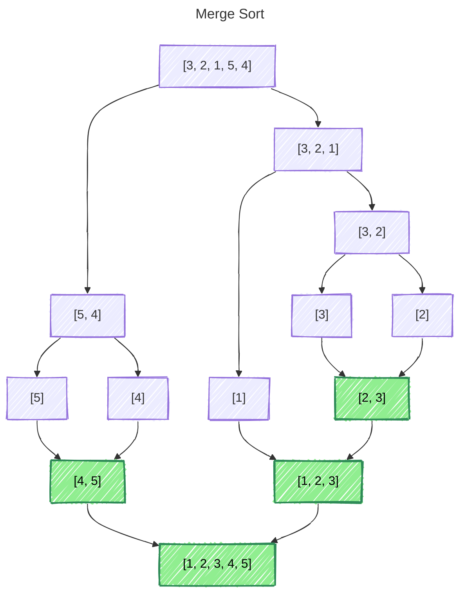
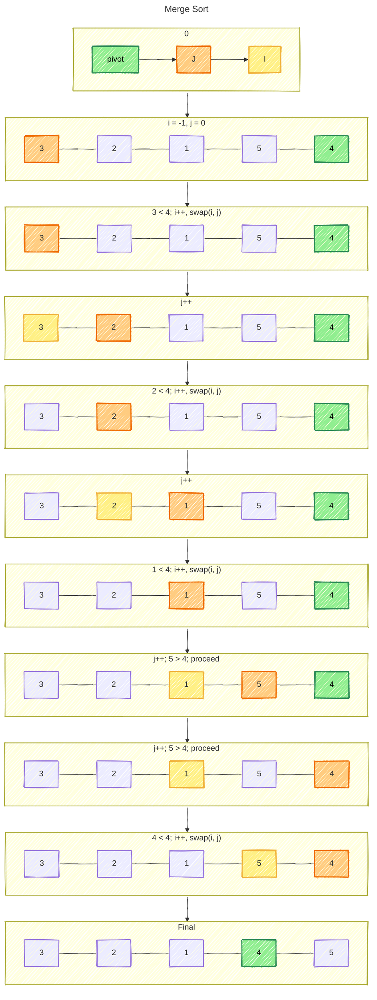

## MergeSort
```java
void mergeSort(int[] arr) {  
    mergeSort(arr, 0, arr.length - 1);  
}  
  
void mergeSort(int[] arr, int left, int right) {  
    if (left < right) {  
       int mid = left + (right - left) / 2;  
       mergeSort(arr, left, mid);  
       mergeSort(arr, mid + 1, right);  
       merge(arr, left, mid, right);  
    }  
}  
  
void merge(int[] arr, int left, int mid, int right) {  
    int n1 = mid - left + 1;  
    int n2 = right - mid;  
  
    // Create temp arrays  
    int[] leftArr = new int[n1];  
    int[] rightArr = new int[n2];  
  
    for (int i = 0; i < n1; i++) {  
       leftArr[i] = arr[left+i];  
    }  
    for (int i = 0; i < n2; i++) {  
       rightArr[i] = arr[mid+i+1];  
    }  
  
    int l = 0, r = 0;  
    int k = left;  
    while (l < n1 && r < n2) {  
       if (leftArr[l] <= rightArr[r]) {  
          arr[k] = leftArr[l];  
          l++;  
       } else {  
          arr[k] = rightArr[r];  
          r++;  
       }  
       k++;  
    }  
  
    while (l < n1) {  
       arr[k] = leftArr[l];  
       l++;  
       k++;  
    }  
  
    while (r < n2) {  
       arr[k] = rightArr[r];  
       r++;  
       k++;  
    }  
}
```

### Visualization




### Time Complexity

- Best Case: When array is already sorted - $O(n \log{n})$
- Average Case: When array is randomly ordered - $O(n \log{n})$
- Worst Case: When array is sorted in reverse - $O(n \log{n})$

#### Space complexity

Requires $O(n)$ additional space

---
## Quick Sort

### Visualization

