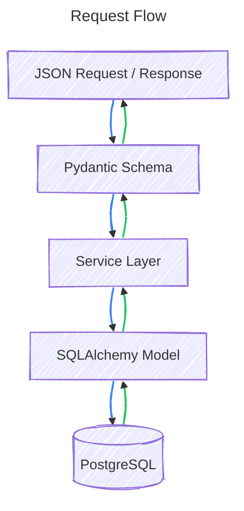

Pydantic and SQLAlchemy solve two different problems, and in FastAPI you usually use them together:
- **[[SQLAlchemy Models and Columns|SQLAlchemy Models]]** = how data is stored in the database.
- **[[Pydantic models]]** = how data enters/leaves your API.


Thus, Pydantic and SQLAlchemy work on totally different levels

## Conversions

### Converting Pydantic $\rightarrow$ SQLAlchemy

Consider the below Pydantic schema
```python
from pydantic import BaseModel, EmailStr


class UserCreate(BaseModel):
    name: str
    email: EmailStr


class UserResponse(BaseModel):
    id: int
    name: str
    email: EmailStr
```

To convert it to SQLAlchemy, we do
```python
db_user = User(
    name=user.name,
    email=user.email
)

# or..
db_user = User(**user.model_dump())
```

This constructor will check that all the required fields are present in the model. If some fields are missing, the constructor throws an error.

#### Exclusion
We can choose to exclude fields we do not want in the model from the schema. For eg, if a user inserts his password and instead of the literal string, we want to store a hash, we can do it as
```python
db_user = User(**user.model_dump(exclude='password'), password=hashed_password)
```

### SQLAlchemy $\rightarrow$ Pydantic

Unlike SQLAlchemy, Pydantic offers automatic conversion of models into response schemas via the use of `model_config = ConfigDict(from_attributes=True)`

```python {6}
class UserResponse(BaseModel):
    id: int
    name: str
    email: EmailStr
    
    model_config = ConfigDict(from_attributes=True)
```

When sending the response back, Pydantic will automatically convert any SQLAlchemy models into `UserResponse` models if they have the three properties present. However, only the listed properties will be sent back in the response.