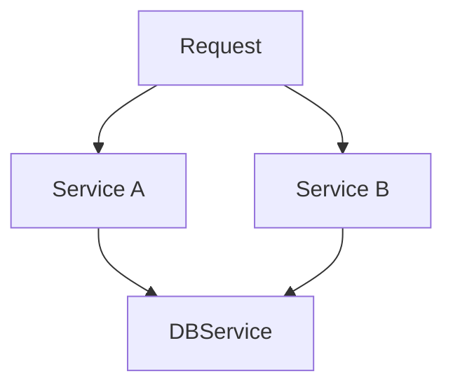

This is very familiar to Spring Boot's dependency injection. Instead of creating objects inside the server, we declare that our endpoint **depends** on it
```python nums {11, 20}
# services/application_service.py
class UserService:
	
	def get_all(self):
		...


# routers/application.py
from fastapi import Depends

UserServiceDependency = Annotated[UserService, Depends(get_user_service)]

@router.patch(
    "/update",
    response_model=User,
    status_code=status.HTTP_200_OK,
)
def update_user(
    user_update: UserUpdate,
    user_service: UserServiceDependency,
) -> User:
    return user_service.update_user(user_update)
```

## Nested Dependencies
Dependencies can have dependencies in them

```python nums
# routers/application_router.py
ApplicationServiceDependency = Annotated[ApplicationService, Depends(get_user_service)]

@router.get("/all")
def get_all(app_service: ApplicationServiceDependency):
	...


# services/application_service.py
DBServiceDependency = Annotated[DBService, Depends(get_user_service)]

def get_all(db_service: DBServiceDependency):
	...
```


## Dependencies with `yield`

Use `yield` when a dependency needs **setup before the endpoint runs** and **cleanup after it finishes**.
Classic example: database session.
```python nums
def get_db():
    db = SessionLocal()

    try:
        yield db
    finally:
        db.close()
```

Then:
```python nums
@router.get("/")
def get_applications(
    db: Session = Depends(get_db)
):
    ...
```

Conceptually, FastAPI does:

```python nums
db = SessionLocal()

try:
    result = endpoint(db)
    return result
finally:
    db.close()
```

## Router Level Injections

If **every endpoint** in a router needs the same dependency, then we create a router level dependency
```python nums
router = APIRouter(
    prefix="/applications",
    dependencies=[
        Depends(get_current_user)
    ]
)
```

Now all application routes require authentication.

One distinction: `dependencies=[Depends(...)]` is useful when you only care that the dependency **runs**.
If you need its return value: `user: CurrentUser` inject it into the endpoint instead.

## Difference between Spring and FastAPI
- Spring Boot services (beans) are singleton-scoped. Once an ApplicationContext is created, Spring typically uses the same beans across the entire lifetime.
- On the other hand, FastAPI creates a new object every time a request is called. However, during that request, FastAPI keeps the same instance of the object


- Spring services last the entire ApplicationContext time, while FastAPI dependencies only last as long as the request stays