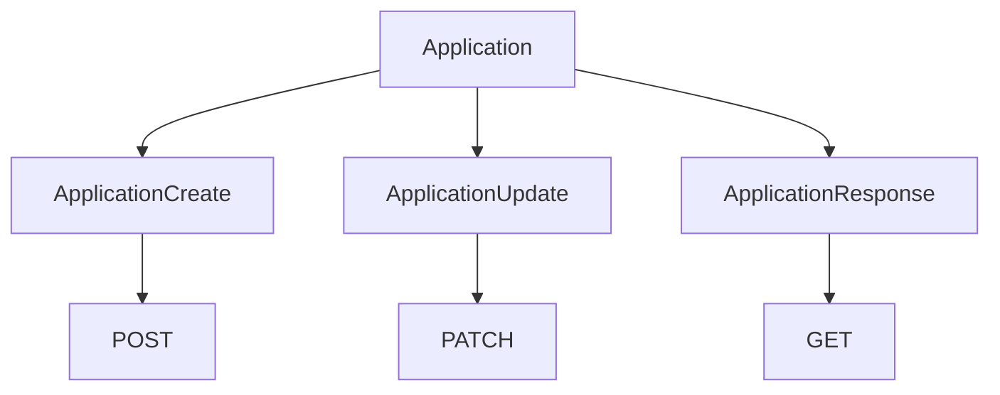

At its simplest, a [Pydantic](https://pydantic.dev/docs/validation/dev/concepts/models/) model describes the shape and rules of some data. Every model inherits the [BaseModel](https://pydantic.dev/docs/validation/dev/api/pydantic/base_model/#pydantic.BaseModel). BaseModel gives you Pydantic's functionality:
- validation
- serialization
- type conversion
- JSON schema generation
- model configuration
- validators
A normal Python class wouldn't automatically provide these.

Assuming a model class `Application`
```python
class Application(BaseModel):
    company: str # Required
    role: str | None # Optional
    remote: bool = False # Defaults to False, also optional
```

A JSON sent via the [[Path and Query Parameters#Request Bodies|request body]], it automatically serializes to the applied model. For the above model, the request body needs to have the company name to proceed without errors

### Additional Validation

Using the `Field` class, we can perform additional validation for the models we create
```python
from pydantic import BaseModel, Field

class ApplicationCreate(BaseModel):
    company: str = Field(min_length=1, max_length=100)
    role: str = Field(min_length=1, max_length=150)
    year: int = Field(ge=2000)
```

## Nested Models

Every Pydantic model can contain another Pydantic Model in itself

```python
class Company(BaseModel):
	...


class Application(BaseModel):
	...
	company: Company,
```

## Serialization

```python
application.model_dump() # returns a dict
application.model_dump_json() # returns a json
```


## Multiple Models for a Resource (Recommended)

 Consider the model
 ```python
 class Application(BaseModel):
    id: int
    company: str
    role: str
    status: str
 ```

Suppose we get a request to fetch a certain `Application` with `id = 42`, the correponding request JSON will look like
```json
{
    "id": 123
}
```

This will fail the serialization, since `company`, `role`, and `status` variables are missing. Hence, multiple models are created for the resource in order to apply it to a particular request

```python
class ApplicationCreate(BaseModel):
    company: str
    role: str
    location: str | None = None


class ApplicationUpdate(BaseModel):
    company: str | None = None
    role: str | None = None
    location: str | None = None


class ApplicationResponse(BaseModel):
    id: int
    company: str
    role: str
    location: str | None
    status: ApplicationStatus
```


