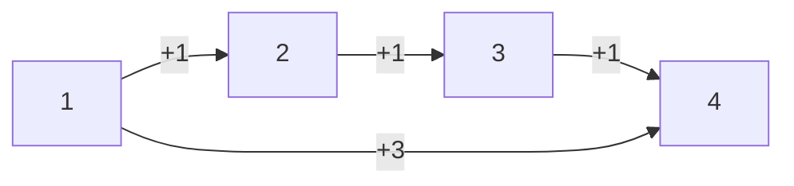

---
Category:
  - "[[Greedy Approach]]"
URL:
Difficulty: "[[Medium]]"
---
## Problem Statement
You are given an integer array `prices` where `prices[i]` is the price of a given stock on the `ith` day.

On each day, you may decide to buy and/or sell the stock. You can only hold **at most one** share of the stock at any time. However, you can sell and buy the stock multiple times on the **same day**, ensuring you never hold more than one share of the stock.

Find and return _the **maximum** profit you can achieve_.

**Example 1:**

**Input:** `prices = [7,1,5,3,6,4]`
**Output:** 7
**Explanation:** Buy on day 2 (price = 1) and sell on day 3 (price = 5), profit = 5-1 = 4.
Then buy on day 4 (price = 3) and sell on day 5 (price = 6), profit = 6-3 = 3.
Total profit is 4 + 3 = 7.

**Example 2:**

**Input:** `prices = [1,2,3,4,5]`
**Output:** 4
**Explanation:** Buy on day 1 (price = 1) and sell on day 5 (price = 5), profit = 5-1 = 4.
Total profit is 4.

**Example 3:**

**Input:** `prices = [7,6,4,3,1]`
**Output:** 0
**Explanation:** There is no way to make a positive profit, so we never buy the stock to achieve the maximum profit of 0.

## Solution
```java
public int maxProfit(int[] prices) {
	if (prices.length < 2) {
		return 0;
	}
	int maxProfit = Math.max(0, prices[1] - prices[0]);
	for (int i = 2; i < prices.length; i++) {
		maxProfit += Math.max(0, prices[i] - prices[i - 1]);
	}
	return maxProfit;
}
```

## DSA Info


## Explanation

The key to the answer is the line - _"you can sell and buy the stock multiple times on the **same day**"_
Instead of finding a running optimal, we can just use pairwise maximum to build a profit instead of counting one. Assuming the array `prices[] = [1, 2, 3, 4]`.



| Day 0 | Day 1  | Day 2  | Day 3  |     |
| ----- | ------ | ------ | ------ | --- |
| 1     | 2      | 3      | 4      |     |
| Buy 1 | Sell 1 |        |        |     |
|       | Buy 2  | Sell 2 |        |     |
|       |        | Buy 3  | Sell 3 |     |
| 0     | +1     | +1     | +1     | = 4 |


