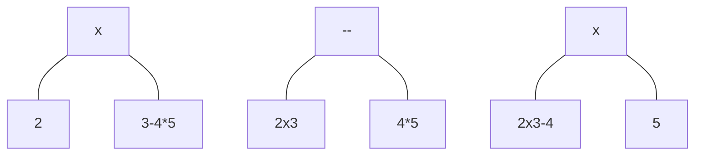

---
Category:
  - "[[Strings]]"
  - "[[Recursion]]"
  - "[[Dynamic Programming]]"
URL:
Difficulty: "[[Medium]]"
---
## Problem Statement
Given a string `expression` of numbers and operators, return _all possible results from computing all the different possible ways to group numbers and operators_. You may return the answer in **any order**.

The test cases are generated such that the output values fit in a 32-bit integer and the number of different results does not exceed `104`.

**Example 1:**

**Input:** expression = "2-1-1"
**Output:** `[0,2]`
**Explanation:**
((2-1)-1) = 0 
(2-(1-1)) = 2

**Example 2:**

**Input:** expression = "2*3-4*5"
**Output:** `[-34,-14,-10,-10,10]`
**Explanation:**
(2*(3-(4*5))) = -34 
((2*3)-(4*5)) = -14 
((2*(3-4))*5) = -10 
(2*((3-4)*5)) = -10 
(((2*3)-4)*5) = 10

## Solution
```java
private final Map<String, List<Integer>> memo = new HashMap<>();  
public List<Integer> diffWaysToCompute(String expression) {  
    if (memo.containsKey(expression)) {  
       return memo.get(expression);  
    }  
  
    List<Integer> results = new ArrayList<>();  
  
    // Constraint on numbers being from 0 to 99  
    if (expression.length() < 3) {  
       results.add(Integer.parseInt(expression));  
       return results;  
    }  
  
    for (int i = 0; i < expression.length(); i++) {  
       char c = expression.charAt(i);  
  
       if (c == '+' || c == '-' || c == '*') {  
          List<Integer> left = diffWaysToCompute(expression.substring(0, i));  
          List<Integer> right = diffWaysToCompute(expression.substring(i + 1));  
  
          for (int leftValues : left) {  
             for (int rightValues : right) {  
                if (c == '+') {  
                   results.add(leftValues + rightValues);  
                } else if (c == '-') {  
                   results.add(leftValues - rightValues);  
                } else {  
                   results.add(leftValues * rightValues);  
                }  
             }  
          }  
       }  
    }  
    memo.put(expression, results);  
    return results;  
}
```

## DSA Info


## Explanation

Anytime we come across an operator, we split the string into two halves and recursively compute those halves



This split means that the operator we currently focus on, will be executed last, implying that parentheses will be surrounded around the other operators
After splitting (dividing), we then combine the results (conquer)
Memoization is used here to prevent computing overlapping subproblems.
