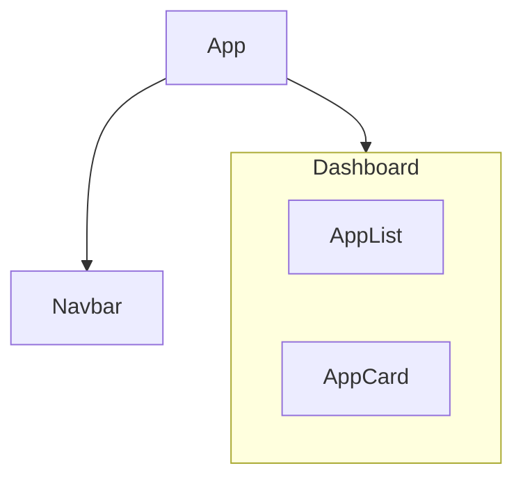

## History of React

React was created at Meta Platforms (then Facebook) to solve a growing problem: **keeping complex UIs synchronized with constantly changing data**.

A rough timeline:

- **2011** — Jordan Walke develops an early React prototype at Facebook.
- **2012** — Instagram begins using React.
- **2013** — React is open-sourced.
- **2015** — React Native is released.
- **2016–2017** — React moves toward the Fiber architecture, enabling more sophisticated rendering and scheduling.
- **2019** — React 16.8 introduces **Hooks**, dramatically changing how function components handle state and lifecycle behavior.
- **2022** — React 18 introduces automatic batching and the foundations of concurrent rendering.
- **2024** — React 19 introduces features such as Actions, `use()`, improved forms, and other improvements aimed at modern React applications.

One major philosophical shift React introduced was:

> **UI = function of state**

Instead of manually manipulating the DOM:
```javascript
document.querySelector("#username").innerText = user.name;
```

You describe what the UI should look like:
```html
<h1>{user.name}</h1>
```

When the `user` changes, React handles updating the appropriate DOM.

## Components

A **component** is a function that describes a part of the UI. React applications are basically a tree of components


```typescript nums {2-4,11}
// dashboard/application-card.tsx
function ApplicationCard() {
  return <div>Software Engineer - Google</div>;
}

// app.tsx
function App() {
  return (
    <main>
    %% Use the component %%
      <ApplicationCard />
    </main>
  );
}
```

> [!NOTE] Syntax
> All component names must begin with a capital letter

## JSX

**JSX** is a syntax extension for JavaScript. Conceptually, JSX like `<h2>Software Engineer</h2>` is transformed into instructions React can use to construct its element tree. Modern React uses the JSX runtime, so you generally don't need to write `import React from "react";` just to use JSX anymore.

Anything inside `{}` in a component is JavaScript
```jsx
function ApplicationCard() {
	const company: string = "Google"
	return (
		<div>
		  <h2>Software Engineer</h2>
		  <p>{company}</p>
		</div>
	);
}
```

JSX `{}` only accepts those that can output a value, i.e. expressions. Arbitrary statements do no work inside JSX
```JSX
<p>{application.role}</p>
<p>{firstName + " " + lastName}</p>
<p>{applications.length}</p>
<p>{salary * 12}</p>
<p>{formatDate(application.appliedOn)}</p>
```

```jsx
%% does not work %%
<div>
  {
    if (status === "APPLIED") {
      return "Applied";
    }
  }
</div>

%% works %%
<div>
  {status === "APPLIED" && <span>Applied</span>}
</div>
```

### JSX Rules

**Always return only one element**: Wrap multiple elements between `<></>`. This is called a Fragment[^2].
```jsx
%% wrong %%
return (
	<h1>Company</h1>
	<h2>Google</h2>
);

%% works %%
return (
	<>
		<h1>Company</h1>
		<h2>Google</h2>
	</>
);
```


**HTML attributes sometimes have different names**: The classic example `<div class="card">` becomes `<div className="card">`, and `<label for="email">` becomes `<label htmlFor="email">`. This is because JSX properties map closely to JavaScript/DOM property naming conventions.

## Props
Data is passed through components via Props. This makes the components reusable, which is one of the core founding principles of React

```jsx
type ApplicationCardProps = {
  company: string;
  role: string;
};

function ApplicationCard({
  company,
  role,
}: ApplicationCardProps) {
  return (
    <div>
      <h2>{company}</h2>
      <p>{role}</p>
    </div>
  );
}

/* Some other class */
<ApplicationCard company="Google" role="SDE" />
```

> [!NOTE] Props are supposed to be read-only
> The component should treat data from Props only to display or work on it, but **should never** mutate the prop data

#### Using objects as props
In our above example, we can simply create an object to be passed down
```jsx
function ApplicationCard({
  application,
}: {
  application: Application;
}) {
  return (
    <div>
      <h2>{application.company}</h2>
      <p>{application.role}</p>
      <p>{application.location}</p>
    </div>
  );
}
```

### Passing down Children as Props
React also allows passing down other components as props. This enables extremely powerful composition[^1] patterns. 
Components in React are essentially functions, but React controls their execution by associating them with various [[State and Data Flow|state management]] features.


## TSX

**TSX = TypeScript + JSX Syntax.** A `.tsx` file allows you to combine TypeScript with React JSX and type checking for props

```tsx
function ApplicationCard() {
	const company: string = "Google"
	return (
		<div>
		  <h2>Software Engineer</h2>
		  <p>{company}</p>
		</div>
	);
}

export default ApplicationCard;
```

---
[^1]: Composition is wrapping up one or multiple components inside another. This helps build a larger UI from smaller elements and facilitates easy data flow between them.

[^2]: Fragments do not add additional DOM elements.
