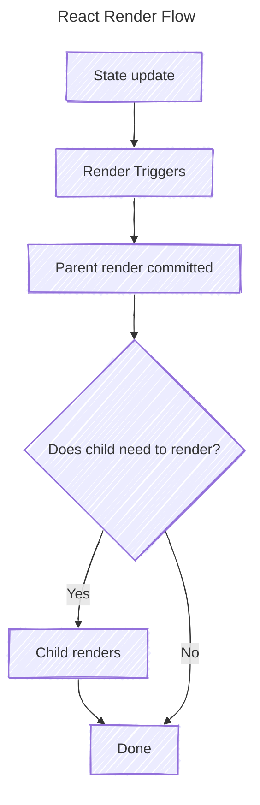
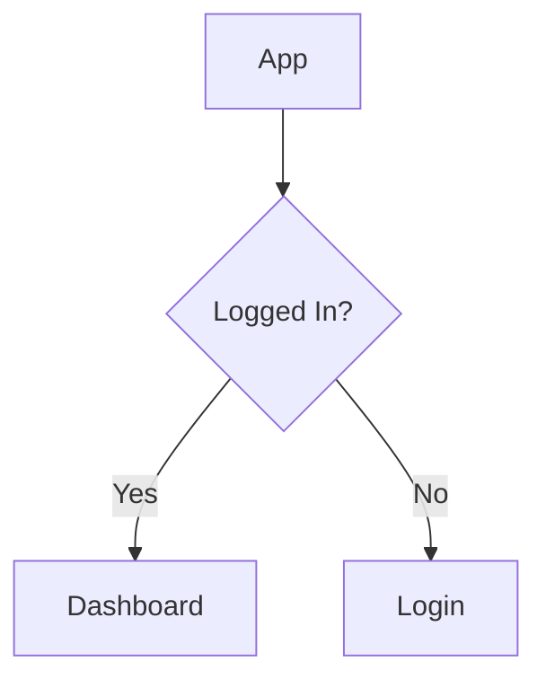

## Rendering

 A React render means **React calls your component functions to calculate what the UI should look like.** It does not mean React rebuilds the entire DOM.


> [!NOTE] Rendering $\ne$ DOM Update
> React renders do not necessarily update the DOM. When a render is committed, a new React tree is created. React, then, compares the new tree and the old tree and only commits those changes to the DOM that are different

## [[Components, JSX, and TSX#Props|Props]] and [[State and Data Flow|States]] during Render

- Updating a Prop in a Parent component calls for a render in the Child component. Since props flow data unidirectionally, from Parent to Child, an update to the prop in the Parent component does change the Child component
- States owned by the Parent do cause renders to both Child and Parent.
	- A State owned and changed by the parent may cause the Child to re-render. However, in some cases, if the Child component happens to remain unchanged, it stays the same
	- States owned by the Child component do not cause the Parent to re-render, until the Parent displays the said state in some way

## States when Rendering

### State tied to the Component Position

Consider the code below
```tsx
function App() {
  return (
    <>
      <Counter />
      <Counter />
    </>
  );
```

Both `Counters` each have `[count, useCount()]`, but the states of each of them are independent. Suppose the `App` component renders; React will associate the state of each `Counter` with its position in the tree

### Preserving State

If the above code were to be modified such that the `Counter` is affected
```tsx
function App() {
  const [darkMode, setDarkMode] = useState(false);

  return (
    <div className={darkMode ? "dark" : "light"}>
      <Counter />

      <button onClick={() => setDarkMode(d => !d)}>
        Toggle theme
      </button>
    </div>
  );
}
```

When the mode changes to `dark`, React will re-render the Child component, but the State of the `Counter` will not be reset. Why?
Because, for React, the position of `Counter` does not change in the tree; hence, it does not reset the State of `Counter`

### When are States reset?

States are only reset when a component disappears from the tree
```tsx
function App() {
	const [loggedIn, setLoggedIn] = useState<boolean>(false);
	
	return (
		{loggedIn ? <Dashboard /> ? <Login />}
	)
}
```


Since the Child Components, `Login` and `Dashboard`, appear and disappear on state change, React will reset their state when it re-renders each of them.

#### However ....

```tsx
function App() {
	const [isAdmin, setIsAdmin] = useState<boolean>(false);
	
	return (
		{isAdmin ? <Profile user={admin} /> : <Profile user={normalUser} />}
	)
}
```

The state of the `Profile` component is not reset in this case. Because in React, the Profile is still in the same position in the tree as it was before the state change.

## Component Identity Matters when Rendering

Consider the code below:
```tsx
function App() {
	const [user, setUser] = useState({
		id: 1,
		name: "John"
	});
	
	const otherUser = {
		id: 2,
		name: "Alice"
	}
	
	return (
		<UserProfile 
			user={user} 
		/>
		<Button onClick={() => setUser(otherUser)}>
			Click Me!!
		</Button>
	)
}
```

Clicking the `Button` will update the `user` state, but the `UserProfile` component will still be in the same position as before; hence, its state will not be reset.

But if we were to tie a `key` to the component
```tsx {14}
function App() {
	const [user, setUser] = useState({
		id: 1,
		name: "John"
	});
	
	const otherUser = {
		id: 2,
		name: "Alice"
	}
	
	return (
		<UserProfile
			key={user.id} 
			user={user} 
		/>
		<Button onClick={() => setUser(otherUser)}>
			Click Me!!
		</Button>
	)
}
```

Now, changing the `user` state will update the `key` too. Even though the `UserProfile` component still has the same position in the tree, React will see that the component is now different. Hence, it will reset the states owned by `UserProfile` when re-rendering.