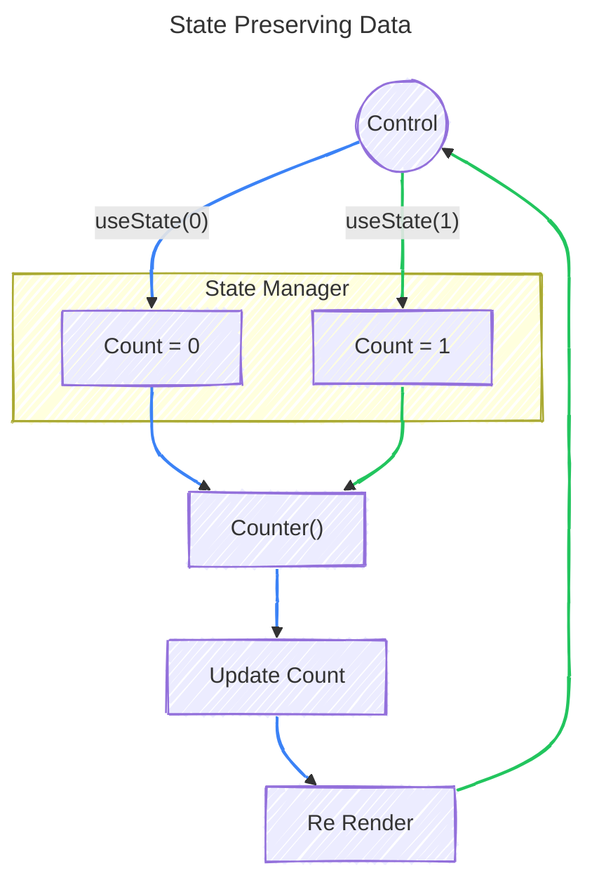
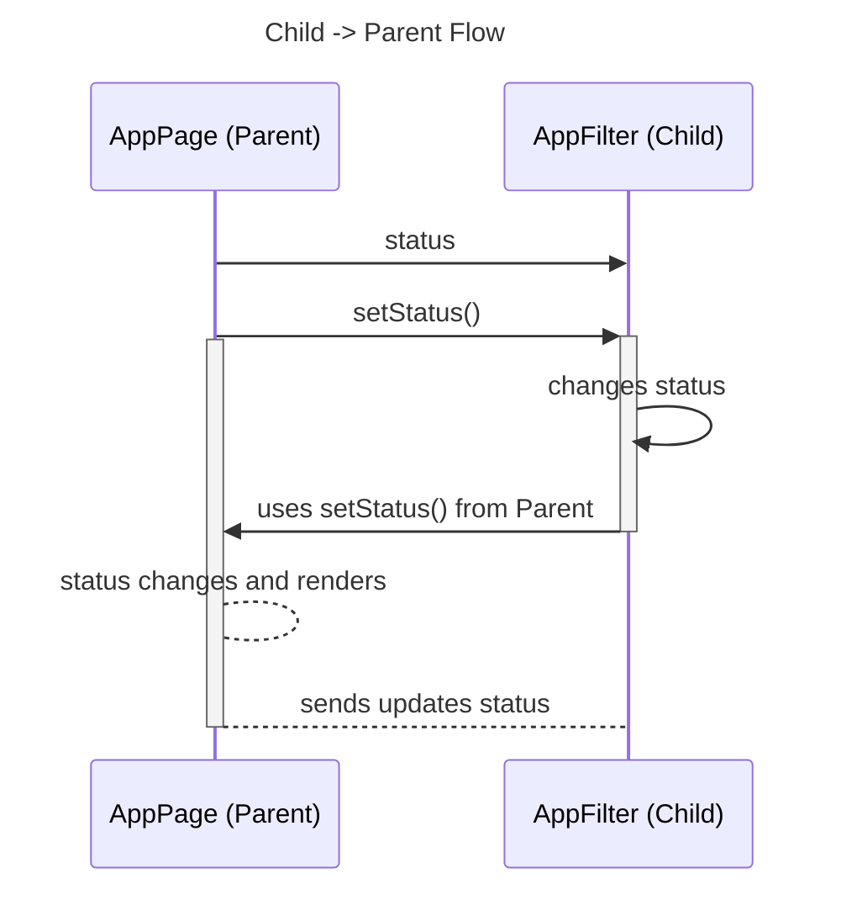

States are essentially snapshots of variables that solve two problems - 
1. It tells React that the UI needs to be rendered again, and
2. It preserves the data between two renders

In React, we utilize state management with the `useState` function. A simple use gives us two things: `[currentValue, requestUpdate()]`.
```tsx
import { useState } from "react";

function Counter() {
  const [count, setCount] = useState<number>(0);

  return (
    <button onClick={() => setCount(count + 1)}>
      Count: {count}
    </button>
  );
}
```

## State preserves your data
Consider the following React component
```tsx nums {3,7,8}
import { useState } from "react";

function Counter() {
  const [count, setCount] = useState<number>(0);

  return (
    <button onClick={() => setCount(count + 1)}>
      Count: {count}
    </button>
  );
}
```
The flow
- The `Counter()` function is implemented, and React initiates a render, displaying `Count: 0`
- When the button is clicked, React receives a request to initiate a re-render of `Counter()`, and it executes it again, but this time `Count: 1`. How?
- It is because React stores state in a memory pool outside the component. Thus, during re-renders, the state preserves its original value


## State is a *Snapshot*
This gives rise to one of the most common React misunderstandings: that State is not a variable. It is a snapshot. 
```tsx {5}
const [count, setCount] = useState(0);

function handleClick() {
  setCount(count + 1);
  console.log(count); /* 0 */
}
```
We see `0` being logged in the console because, for that particular render, the value of `count` was `0`

```tsx
function incrementThreeTimes() {
  setCount(count + 1);
  setCount(count + 1);
  setCount(count + 1);
}
```
Here, even though we are scheduling the render three times, for React, the value of `count` used to set all three renders is still `0`, so all three renders basically do `setCount(0 + 1)`

### Functional State Updates
In cases where the next state depends on the previous state, we can use functional state updates like `setCount(count => count + 1)`

## States must be treated as immutable
```tsx
type Application = {
  id: string;
  company: string;
  status: string;
};

const [application, setApplication] =
  useState<Application>(initialApplication);
```

In this case, performing an update on `application` should be avoided, eg: `application.status = "NEW"`. State variables should be treated as immutable, and updates should be done by creating a new object rather than updating a previous one

```tsx
setApplication({
	...application,
	status: "NEW"
})
```

### Updating arrays
```tsx
/* Adding */
setApplications([
	...applications,
	newApplication
])

/* Deleting */
setApplications([apps => apps.filter(app.id != id)])

/* Updating */
setApplications(apps =>
  apps.map(app =>
    app.id === id
      ? { ...app, status: "INTERVIEW" }
      : app
  )
);
```

## Some other State stuff...

#### 1. Do not store derived states
The values for your states should be independent of other states to prevent problems of synchronization
```tsx
const [firstName, setFirstName] = useState("Nikhil");
const [lastName, setLastName] = useState("Anand");

const [fullName, setFullName] = useState("Nikhil Anand");
```

This causes a problem because a change in the `firstName` or `lastName` will require a change in `fullName`. A proper solution, keeping the states independent of one another, would be
```tsx
const fullName = `${firstName} ${lastName}`
```

This way, `fullName` would automatically be updated with changes to either part of the name

#### 2. Storing States
Let us consider the following example where an `ApplicationPage` contains an `ApplicationList` and an `ApplicationFilter` component. Every application has a `status` associated with it, which is required by both. 
So, where should a state controlling `status` exist?

By design, state should live in the closest common parent when shared by multiple components and should be passed to the children via props
```tsx
function ApplicationPage() {
  const [status, setStatus] = useState<ApplicationStatus>("APPLIED");

  return (
    <>
      <ApplicationFilters status={status} />
      <ApplicationList status={status} />
    </>
  );
}
```

## Parent $\rightarrow$ Child Data Flow
By default, React's data flow is one-way. It flows from the parent to the child. The parent owns the state, and the child receives it

```tsx
/* components/app/application-page.tsx */
function ApplicationPage() {
  const [status, setStatus] =
    useState<ApplicationStatus>("APPLIED");

  return <ApplicationList status={status} />;
}

/* components/app/application-list.tsx */
type Props = {
  status: ApplicationStatus;
};

function ApplicationList({ status }: Props) {
  return <p>Showing: {status}</p>;
}
```

But what if the child wants to return some data back to the parent? States make that possible by giving the child component access to the `setState()` function.

```tsx
/* components/app/application-page.tsx */
function ApplicationPage() {
  const [status, setStatus] =
    useState<ApplicationStatus>("APPLIED");

  return (
    <ApplicationFilters
      status={status}
      onStatusChange={setStatus}
    />
  );
}

/* components/app/application-filter.tsx */
type Props = {
  status: ApplicationStatus;
  onStatusChange: (status: ApplicationStatus) => void;
};

function ApplicationFilters({
  status,
  onStatusChange,
}: Props) {
  return (
    <button
      onClick={() => onStatusChange("INTERVIEW")}
    >
      Interviews
    </button>
  );
}
```

> This may seem like the Child component is controlling the state of the Parent. However, it is not the case. The Child component is merely calling a function that is lent to it by the Parent. The Parent still owns the state


