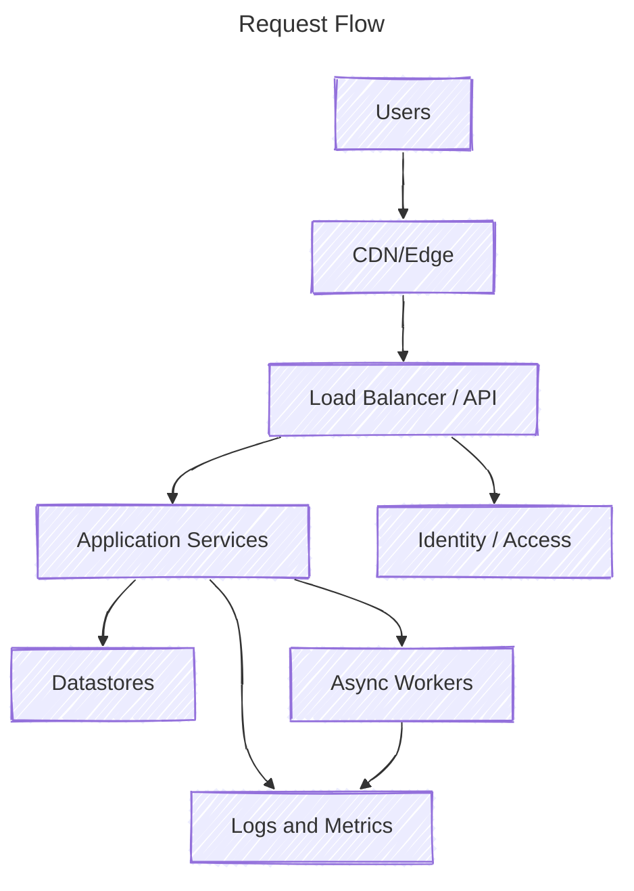

[[Introduction - HLD and LLD|High-Level Design]] HLD is an initial step in the development of applications where the overall structure of the system is planned. It mainly focuses on how different components of the system work together without knowing about internal coding and implementation

- Helps everyone involved in the project to understand the goals and ensures good communication during development.
- Crucial for developers, architects, and product managers because it allows them to make sure that all stakeholders are aligned with the project objectives. That's why it is also known as macro-level design.

- Users - Edge/Gateway: CDN/Edge handles cache, TLS, basic DDoS; LB/API Gateway routes.
- Gateway - Services: App layer runs auth/logic and fans out to deps.
- Services - Data: Read/write to SQL/NoSQL/object/storage/search; cache hot reads; persist writes.
- Services - Async: Offload emails/webhooks/reindex/heavy jobs to queues; workers update later.
- Auth & Observability: Auth at gateway/services; emit logs, metrics, traces for monitoring/alerts.
- Response - User: Reply goes back via gateway/edge; update caches for faster next hits.

## Components of an HLD

1. **System Architecture:** System architecture is an overview of the entire system that represents the structure and the relationships between various components. It helps to visually represent how different parts interact and function.
2. **Modules and Components**: High-level design breaks down the systems into modules or components, each with specific roles and responsibilities, and has a distinct function that contributes to the entire system, helping in developing an efficient system.
3. **Data Flow Diagrams (DFDs)**: Data Flow Diagrams demonstrate the data movement within the system. They help to understand how information is processed and passes from one end to another.
4. **Interface Design**: It includes the design of application programming interfaces (APIs) for system integration and user interfaces (UIs) for user interaction, ensuring seamless functionality and communication between components.
5. **Technology Stack**: The technology stack is a set of various technologies and tools that will be used in the development of the system. This includes programming languages, frameworks, and databases.
6. **Deployment Architecture**: It includes how the system will be hosted and accessed. It includes server configurations, cloud infrastructure, and network considerations.

## High-Level Design Document

The HLD document consists of data flows, flowcharts, and data structures to help developers understand and implement how the current system is being designed intentionally to function. 
- This document is responsible for explaining the connections between system components and operations, which depict the logic.
- The architecture design needed (for the system's functionality and flow) for each and every module of the system as per the functional requirements.

## Purpose and Characteristics of High-Level Design

HLD provides a structured technical view by translating functional requirements into an overall system design model, helping visualize how components interact and how data flows.

- A diagram representing each design aspect is included in the HLD (which is based on business requirements and anticipated results).
- Description of hardware, software interfaces, and also user interfaces.
- The workflow of the user's typical process is detailed, along with performance specifications.

## Difference of HLD from LLD

High-level design, or HLD, is a general system design where we do tradeoffs between different frameworks, components, and databases, and we choose the best considering what the business needs and how the system should work.

Whereas [[Introduction - HLD and LLD|LLD]] (low-level design) Translates the HLD into smaller and more specific details; it includes class diagrams, methods, data structures, and algorithms, focusing on how each part will be implemented.

## Designing Scalable High-Level Design (HLD) Systems

Now, in order to design any high-level system, certain terms are listed in a sequential manner so as to connect the dots in order to understand. Roadmaps are very important for working professionals because they help us to get a complete, binding understanding of how services in real-time are being scaled at a high level.

### Capacity Estimation
Capacity estimation in system design involves predicting the resources (such as processing power, memory, and bandwidth) required to meet the expected workload. It ensures that a system can handle current and future demands efficiently, helping in the proper allocation of resources and preventing performance bottlenecks.

> **Example**: Twitter, which is recently in the news these days, here at high-level designing, we need to make sure tweets of popular influencers are reaching out to millions of people, so how do we need to scale our system so that the service is not hampered? 

![[server_capacity.png]]

### HTTP and HTTPS

HTTP (HyperText Transfer Protocol) is used to transfer data over the web, which enables communication between clients and servers, helping users request resources like HTML pages, messages, videos, or images, while [HTTPS](https://www.geeksforgeeks.org/html/what-is-http/) (HyperText Transfer Protocol Secure) is an extension of HTTP that adds an extra layer of security through SSL/TLS encryption. Methods of HTTP include GET, PUT, and POST.

### Web Sockets

There are two ways to send data from the server to clients: WebSockets and Polling. In a client-server architecture, we are sending a request to the server, and the server sends it back, and so in this way communication takes place. But in designing the system, the biggest problem we face is whether we can implement the client-server model or a peer-to-peer model.

- WebSocket is a full-duplex protocol as it allows the application to send and receive data at the same time.
- They are more or less used in every system to be designed because we cannot let our system wait for a response.
- They are very useful in real-time web applications, gaming applications, and chat applications.

### Polling

Another way of sending and receiving data from a server, just like we do with the above case of web sockets, is polling. There are mainly 2 types of polling:

- **In short polling**, the client sends a request to the server at fixed intervals, and the server immediately sends data, whether the data is updated or not.
- **In long polling**, the server waits for the client's request to respond and responds only if some new data is available or if some data is being updated.

> **Tip:** Long polling is preferred over short polling because lesser number of requests are sent to the system.

### Server-Sent Events (SSE)

It is purposely built as one-way communication from servers to clients in specific design systems. SSE is a technology that helps to push real-time updates from the server to the clients over HTTP connections. SSE enables the server to send data automatically as it becomes available.

### Rate Limiting

A rate limiter restricts the number of events that can be done in a timeframe by restricting the number of requests a sender can send in a given period of time. Here, once the threshold limit is reached, it now further blocks the incoming requests, as can be seen below in the media as follows:

![[rate_limiting.png]]

### Resiliency

No matter how great a system we design, there is always a chance of faults and failure, which could be because of hardware issues or software issues (such as running low on memory), or there can be some human error. In such cases, we need to provide resiliency through replication, redundancy, and availability.

> System design interviews start with open-ended design of a specific system, which later is bounded by constraints at multiple levels. In order to clear up dealing with these bounds, in layman's language, it is known as resiliency via implementing common tradeoffs in the system. Hence, providing resiliency is very crucial in designing complex systems and also in clearing interviews. 

### Paging

Paging in high-level design (HLD) refers to the method of dividing large datasets or content into smaller, manageable pages. This approach improves user experience by allowing users to load data incrementally, reducing initial load times and enhancing performance.

### Logging

A log file records events in an application, including details like transactions, service actions, and system flow. Logging is essential for monitoring behavior, tracking system health and performance, and debugging issues in distributed systems.