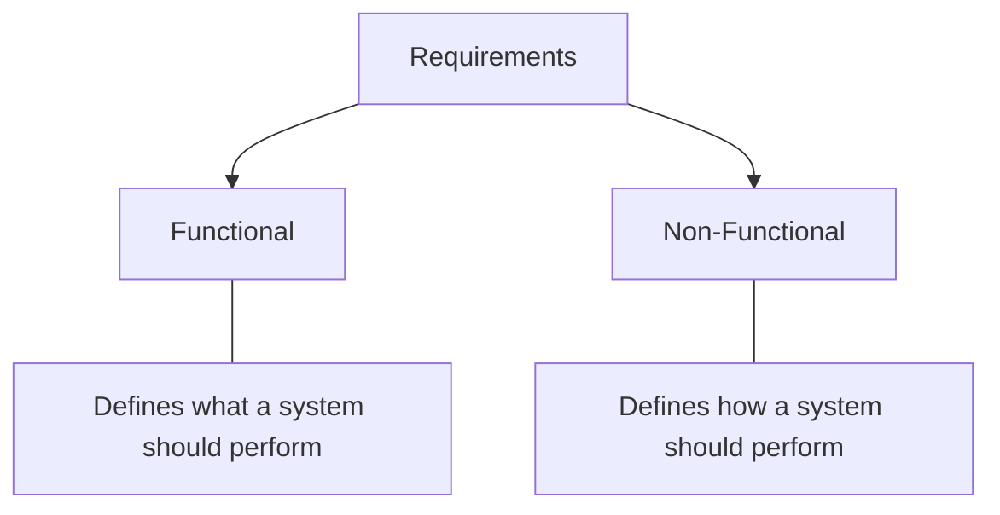

**Requirement Analysis** is a crucial phase in software development where the needs and expectations of users and stakeholders are identified and documented. It ensures that the system is built correctly and meets its intended goals. Coolio

## Functional Requirements

Functional Requirements define the specific features and operations a system must perform to meet business and user needs. They describe ***what*** the system should do and **_how_** it interacts with the business and user needs. 
- Focuses on the behavior and functionality of the system
- Represent features that can be directly observed and tested in the final product
- Eg: User Authentication, Data Processing, Search, Payment, etc

---

## Non-Functional Requirements

***Non-Functional Requirements (NFRs)*** define how a system should operate, focusing on performance, reliability, and user experience rather than specific features. They ensure the system is efficient, secure, and maintainable over time.