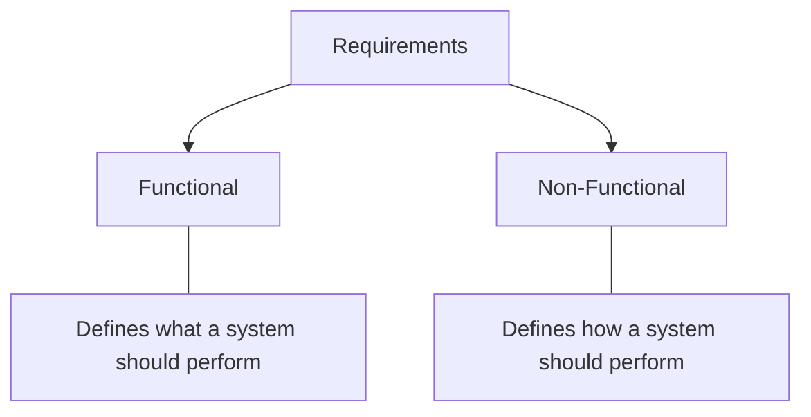

**Requirement Analysis** is a crucial phase in software development where the needs and expectations of users and stakeholders are identified and documented. It ensures that the system is built correctly and meets its intended goals.

## Functional Requirements

Functional Requirements define the specific features and operations a system must perform to meet business and user needs. They describe ***what*** the system should do and **_how_** it interacts with the business and user needs. 
- Focuses on the behavior and functionality of the system
- Represent features that can be directly observed and tested in the final product
- Eg: User Authentication, Data Processing, Search, Payment, etc

---

## Non-Functional Requirements

***Non-Functional Requirements (NFRs)*** define how a system should operate, focusing on performance, reliability, and user experience rather than specific features. They ensure the system is efficient, secure, and maintainable over time. Performance, security, usability, reliability, scalability, maintainability, and portability are some features that fall under this umbrella

## Extended Requirements
Extended requirements define additional capabilities or considerations that enhance the system but are not part of the core functional features. These requirements help improve monitoring, reliability, and future expansion of the system.

- **Logging**: recording system activities and errors for debugging and analysis
- **Monitoring & Alerting:** tracking system health, performance, and failures
- **Analytics:** collecting usage data to understand user behavior and system performance
- **Backup & Disaster Recovery:** ensuring data can be restored in case of failures
- **Rate Limiting:** controlling the number of requests to prevent system overload or abuse
- **Feature Flags / A-B Testing:** enabling controlled feature releases and experiments

## A few examples...

### 1. Online Banking System
- Functional Requirements:
	- Users should be able to log in with their username and password.
	- Users should be able to check their account balance.
	- Users should receive notifications after making a transaction.

- Non-functional Requirements:
	- The system should respond to user actions in less than 2 seconds.
	- All transactions must be encrypted and comply with industry security standards.
	- The system should be able to handle 100 million users with minimal downtime.

- Extended Requirements:
	- The system should log all transactions for auditing and fraud detection.
	- The system should have automatic backups and disaster recovery mechanisms.
	- The system should include monitoring and alerts to detect unusual activities.

### 2. Food Delivery App
- Functional Requirements:
	- Users can browse the menu and place an order.
	- Users can make payments and track their orders in real time.

- Non-functional Requirements:
	- The app should load the restaurant menu in under 1 second.
	- The system should support up to 50,000 concurrent orders during peak hours.
	- The app should be easy to use for first-time users, with an intuitive interface.

- Extended Requirements:
	- The system should collect analytics on popular dishes and order trends.
	- The system should include monitoring and logging to track errors and performance.
	- The system should support A/B testing for new features like promotions or UI changes.

## Common Challenges in Defining Requirements

Defining system requirements can be challenging because they must balance functionality, performance, and long-term system goals. Poorly defined requirements can lead to design issues, delays, or systems that fail to meet user expectations.

- ****Ambiguity in Requirements:**** Vague or incomplete requirements make it difficult to clearly define what the system should do and how it should perform.
- ****Changing Requirements:**** Business goals, market conditions, or user expectations may change over time, requiring updates to the system design.
- ****Difficulty in Prioritization:**** Functional requirements often receive more attention, while important aspects like scalability, security, or monitoring may be overlooked.
- ****Measuring Non-Functional Requirements:**** Features are easier to test, but qualities like usability, scalability, and reliability are harder to measure and validate.
- ****Overlapping or Conflicting Requirements:**** Some requirements may conflict with others, such as strong security measures potentially affecting system performance.

## Gathering Functional, Non-functional and Extended Requirements

Gathering requirements involves multiple approaches and collaboration between the development team, stakeholders, and end-users.

### 1. Functional Requirements

- ****Interviews:**** Talk to stakeholders or users to understand their needs.
- ****Surveys:**** Distribute questionnaires to gather input from a larger audience.
- ****Workshops:**** Host sessions to brainstorm features and gather feedback.

### 2. Non-functional Requirements

- ****Performance Benchmarks:**** Consult with IT teams to set expectations for performance and load.
- ****Security Standards:**** Consult with security experts to define the best practices for data protection.
- ****Usability Testing:**** Test the system to find areas where users might struggle and refine the interface.

### 3. Extended Requirements

Extended requirements are gathered to improve system monitoring, reliability, and future enhancements beyond the core functionality.

- ****Monitoring & Logging:**** Consult DevOps teams to determine how system logs, metrics, and alerts will be collected and analyzed.
- ****Analytics & Reporting:**** Work with product teams to decide what user behavior or system data should be tracked for insights.
- ****Backup & Disaster Recovery:**** Discuss with infrastructure teams to define backup strategies and recovery procedures.
- ****Rate Limiting & System Protection:**** Identify limits on API requests and traffic control to prevent abuse or overload.
- ****Feature Flags & Experiments:**** Coordinate with product teams to plan controlled feature releases and A/B testing.