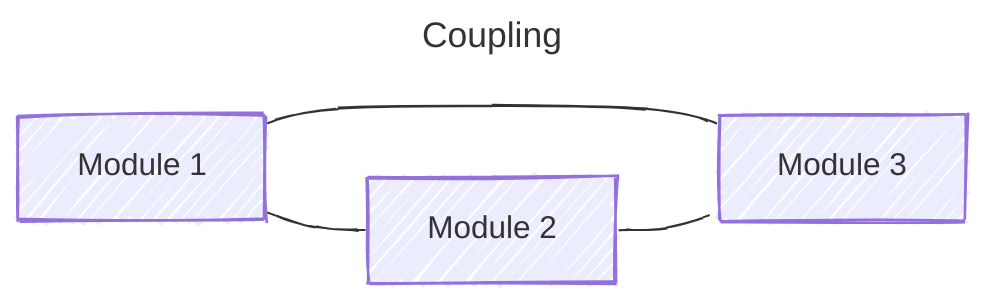
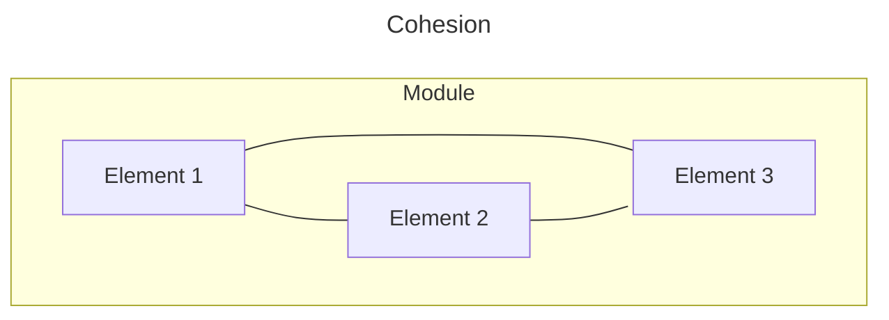

## Coupling
**Coupling** refers to the degree of interdependence between software modules. High coupling means that modules are closely connected and changes in one module may affect other modules. Low coupling means that modules are independent, and changes in one module have little impact on other modules.

### Coupling Characteristics
- **Low Coupling (Highly Desirable):** Modules are largely independent. This improves maintainability and reusability and makes testing individual parts of the code much easier.

- **High Coupling (To Be Avoided):** Modules are tightly connected. A change in one module can trigger a "ripple effect" of necessary changes throughout the system.

### Types of Coupling
- **Data Coupling:** If the dependency between the modules is based on the fact that they communicate by passing only data, then the modules are said to be data coupled. In data coupling, the components are independent of each other and communicate through data. Module communications don't contain tramp data. Example: customer billing system.
- **Stamp Coupling** In stamp coupling, the complete data structure is passed from one module to another module. Therefore, it involves tramp data. It may be necessary due to efficiency factors- this choice was made by the insightful designer, not a lazy programmer.
- **Control Coupling:** If the modules communicate by passing control information, then they are said to be control coupled. It can be bad if parameters indicate completely different behavior, and good if parameters allow factoring and reuse of functionality. Example: sort function that takes a comparison function as an argument.
- **External Coupling:** In external coupling, the modules depend on other modules, external to the software being developed or to a particular type of hardware. Ex- protocol, external file, device format, etc.
- **Common Coupling:** The modules have shared data such as global data structures. The changes in global data mean tracing back to all modules that access that data to evaluate the effect of the change. So it has got disadvantages like difficulty in reusing modules, reduced ability to control data accesses, and reduced maintainability.
- **Content Coupling:** In a content coupling, one module can modify the data of another module, or control flow is passed from one module to the other module. This is the worst form of coupling and should be avoided.
- **Temporal Coupling:** Temporal coupling occurs when two modules depend on the timing or order of events, such as one module needing to execute before another. This type of coupling can result in design issues and difficulties in testing and maintenance.
- **Sequential Coupling:** Sequential coupling occurs when the output of one module is used as the input of another module, creating a chain or sequence of dependencies. This type of coupling can be difficult to maintain and modify.
- **Communicational Coupling:** Communicational coupling occurs when two or more modules share a common communication mechanism, such as a shared message queue or database. This type of coupling can lead to performance issues and difficulty in debugging.
- **Functional Coupling:** Functional coupling occurs when two modules depend on each other's functionality, such as one module calling a function from another module. This type of coupling can result in tightly coupled code that is difficult to modify and maintain.
- **Data-Structured Coupling:** Data-structured coupling occurs when two or more modules share a common data structure, such as a database table or data file. This type of coupling can lead to difficulty in maintaining the integrity of the data structure and can result in performance issues.
- **Interaction Coupling:** Interaction coupling occurs due to the methods of a class invoking methods of other classes. Like with functions, the worst form of coupling here is if methods directly access internal parts of other methods. Coupling is lowest if methods communicate directly through parameters.
- **Component Coupling:** Component coupling refers to the interaction between two classes where a class has variables of the other class. Three clear situations exist as to how this can happen. A class C can be component coupled with another class C1, if C has an instance variable of type C1, or C has a method whose parameter is of type C1, or if C has a method that has a local variable of type C1. It should be clear that whenever there is component coupling, there is likely to be interaction coupling.

### Advantages of Low Coupling
- Improved maintainability: Low coupling reduces the impact of changes in one module on other modules, making it easier to modify or replace individual components without affecting the entire system.
- Enhanced modularity: Low coupling allows modules to be developed and tested in isolation, improving the modularity and reusability of code.
- Better scalability: Low coupling facilitates the addition of new modules and the removal of existing ones, making it easier to scale the system as needed.

### Disadvantages of High Coupling
- Increased complexity: High coupling increases the interdependence between modules, making the system more complex and difficult to understand.
- Reduced flexibility: High coupling makes it more difficult to modify or replace individual components without affecting the entire system.
- Decreased modularity: High coupling makes it more difficult to develop and test modules in isolation, reducing the modularity and reusability of code.

---

## Cohesion
Cohesion refers to the degree to which elements within a module work together to fulfill a single, well-defined purpose. High cohesion means that elements are closely related and focused on a single purpose, while low cohesion means that elements are loosely related and serve multiple purposes.

### Types of Cohesion

- **Functional Cohesion:** Every essential element for a single computation is contained in the component. A functional cohesion performs the task and functions. It is an ideal situation.
- **Sequential Cohesion:** An element outputs some data that becomes the input for another element, i.e., data flow between the parts. It occurs naturally in functional programming languages.
- **Communicational Cohesion:** Two elements operate on the same input data or contribute towards the same output data. Example: update the record in the database and send it to the printer.
- **Procedural Cohesion:** Elements of procedural cohesion ensure the order of execution. Actions are still weakly connected and unlikely to be reusable. Ex- calculate student GPA, print student record, calculate cumulative GPA, print cumulative GPA.
- **Temporal Cohesion:** The elements are related by the timing involved. A module connected with temporal cohesion all the tasks must be executed in the same time span. This cohesion contains the code for initializing all the parts of the system. Lots of different activities occur, all at the same time.
- **Logical Cohesion:** The elements are logically related and not functionally related. Ex- A component reads inputs from tape, disk, and network. All the code for these functions is in the same component. Operations are related, but the functions are significantly different.
- **Coincidental Cohesion:** The elements are not related(unrelated). The elements have no conceptual relationship other than location in source code. It is accidental and the worst form of cohesion. Ex- print next line and reverse the characters of a string in a single component.
- **Procedural Cohesion:** This type of cohesion occurs when elements or tasks are grouped together in a module based on their sequence of execution, such as a module that performs a set of related procedures in a specific order. Procedural cohesion can be found in structured programming languages.
- **Communicational Cohesion:** Communicational cohesion occurs when elements or tasks are grouped together in a module based on their interactions with each other, such as a module that handles all interactions with a specific external system or module. This type of cohesion can be found in object-oriented programming languages.
- **Temporal Cohesion:** Temporal cohesion occurs when elements or tasks are grouped together in a module based on their timing or frequency of execution, such as a module that handles all periodic or scheduled tasks in a system. Temporal cohesion is commonly used in real-time and embedded systems.
- **Informational Cohesion:** Informational cohesion occurs when elements or tasks are grouped together in a module based on their relationship to a specific data structure or object, such as a module that operates on a specific data type or object. Informational cohesion is commonly used in object-oriented programming.
- **Functional Cohesion:** This type of cohesion occurs when all elements or tasks in a module contribute to a single well-defined function or purpose, and there is little or no coupling between the elements. Functional cohesion is considered the most desirable type of cohesion as it leads to more maintainable and reusable code.
- **Layer Cohesion:** Layer cohesion occurs when elements or tasks in a module are grouped together based on their level of abstraction or responsibility, such as a module that handles only low-level hardware interactions or a module that handles only high-level business logic. Layer cohesion is commonly used in large-scale software systems to organize code into manageable layers.

### Advantages of High Cohesion
- Improved readability and understandability: High cohesion results in clear, focused modules with a single, well-defined purpose, making it easier for developers to understand the code and make changes.
- Better error isolation: High cohesion reduces the likelihood that a change in one part of a module will affect other parts, making it easier to
- Improved reliability: High cohesion leads to modules that are less prone to errors and that function more consistently, 
- leading to an overall improvement in the reliability of the system.

### Disadvantages of Low Cohesion
- Increased code duplication: Low cohesion can lead to the duplication of code, as elements that belong together are split into separate modules.
- Reduced functionality: Low cohesion can result in modules that lack a clear purpose and contain elements that don't belong together, reducing their functionality and making them harder to maintain.
- Difficulty in understanding the module: Low cohesion can make it harder for developers to understand the purpose and behavior of a module, leading to errors and a lack of clarity.

Both coupling and cohesion are important factors in determining the maintainability, scalability, and reliability of a software system. High coupling and low cohesion can make a system difficult to change and test, while low coupling and high cohesion make a system easier to maintain and improve.

