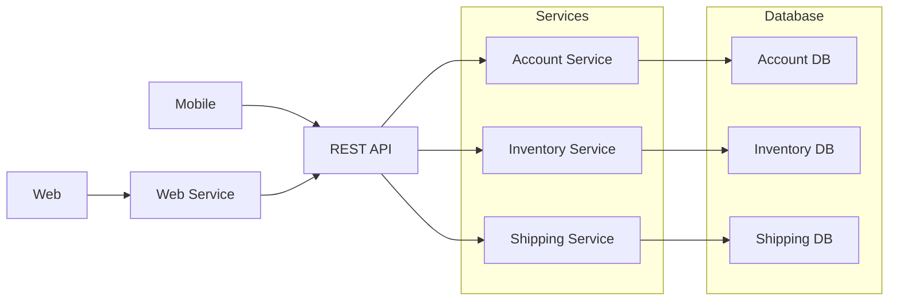

Microservices are an architecture where an application is divided into small, independent services that communicate over a network. Each service handles a specific function and can be developed and deployed separately.

- Services can be built using different programming languages and frameworks.
- Each microservice is [[Coupling and Cohesion#Coupling Characteristics|loosely coupled]] and can be developed, deployed, and scaled independently.

## Working
The working of microservices architecture focuses on dividing the application into small, independent services that collaborate to perform different business functions.

- Each microservice handles a particular business feature, like user authentication or product management, allowing for specialized development.
- Services interact via APIs, facilitating standardized information exchange and integration.
- Each service runs independently and communicates with other services through lightweight protocols such as HTTP or messaging systems.
- Requests from users are routed to the appropriate microservice, which processes the request and may interact with other services or databases to return the response.

## Components

Main components of microservices architecture include:

### 1. Microservices

Microservices are small, independent services that focus on a single business capability. Each service can be developed, deployed, and scaled separately.
- Loosely coupled and independently deployable.
- Focus on one specific business function.

### 2. API Gateway

An API Gateway acts as the single entry point for all client requests. It routes requests to the appropriate microservices and handles common concerns.
- Manages request routing and authentication
- Forwards requests to the appropriate 

### 3. Service Registry and Discovery

Service Registry and Discovery help microservices find and communicate with each other dynamically. It maintains information about available service instances.
- Stores service network addresses.
- Enables dynamic inter-service communication.

### 4. Load Balancer

A [[Load Balancing|Load Balancer]] distributes incoming traffic across multiple service instances. This ensures better performance and availability.
- Improves availability and reliability.
- Prevents service overload.

### 5. Deployment & Infrastructure (Tools/Support Layer)

Technologies like Docker (Containerization) and Kubernetes are used to package, deploy, and manage microservices efficiently.
- Docker encapsulates services consistently
- Kubernetes manages scaling and orchestration

### 6. Event Bus / Message Broker
A Message Broker enables asynchronous communication between services. Services exchange messages without being directly dependent on each other.
- Supports publish–subscribe messaging
- Decouples service interactions

### 7. Database per Microservice

In the Database per Microservice pattern, each microservice owns and manages its own dedicated database to maintain data autonomy.
- Ensures data isolation and loose coupling between services.
- Enables independent scaling and technology choices per service.

### 8. Caching

[[Caching]] stores frequently used data in memory for faster access. It improves application performance and reduces database requests.

- Reduces database load
- Decreases response latency

### 9. Fault Tolerance and Resilience

[[Fault Tolerance]] and [[Fault Tolerance|resilience]] mechanisms enable the system to continue functioning even when some components fail.
- Uses techniques such as circuit breakers, retries, and fallbacks.
- Maintains overall system stability and availability.