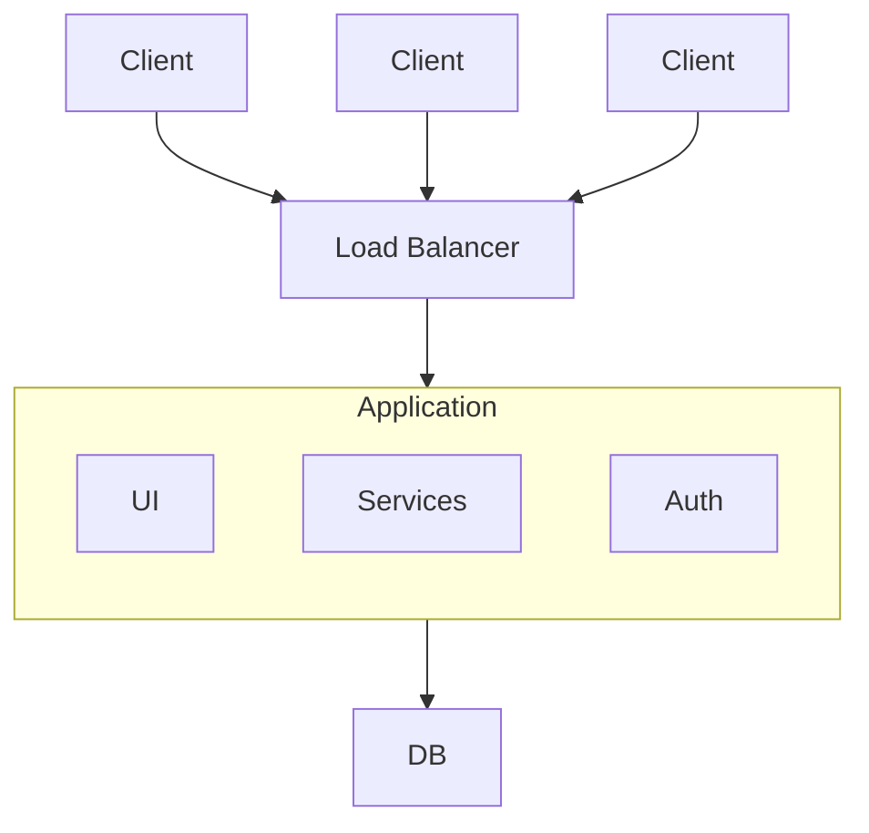

Monolithic architecture is a software design methodology that combines all of an application's components into a single, inseparable unit. Under this architecture, the user interface, business logic, and data access layers are all created, put into use, and maintained as one unified unit.

- A traditional system design approach where all application components are contained within a single codebase. It is preferred for its simplicity and ease of initial setup and deployment.
- In contrast to microservices, it may become challenging to scale and maintain as the application grows in size and complexity.

## Characteristics

Monolithic architecture exhibits several defining characteristics:

- **Single Codebase:** All components are developed and maintained in one codebase, simplifying management.
- **Shared Memory:** Components communicate efficiently using the same memory space without network overhead.
- **Centralized Database:** A single database instance handles all data storage.
- **Layered Structure:** Separate layers (data, business logic, presentation) exist but may create inter-layer dependencies.
- **Limited Scalability:** Scaling requires the whole application, often causing inefficiencies and higher resource use.
- **Simpler Development & Deployment:** Easier to build, test, and deploy since everything is in one codebase.

## Importance

Monolithic systems, despite facing increasing competition from more modern architectural styles like microservices, still hold significant importance in various contexts:

- **Simplicity:** Monolithic architectures are easier to develop, deploy, and understand since all components are together.
- **Cost-Effectiveness:** They are more economical for small to medium projects with lower infrastructure needs.
- **Performance:** Running in a single process can reduce communication overhead and improve performance.
- **Security:** Fewer inter-service points reduce the attack surface, making the system potentially more secure.
- **Legacy Support:** Many existing systems use monolithic architectures, so understanding them is crucial for maintenance.

## Components

The key components of a monolithic architecture are:

- **User Interface (UI):** Handles user interaction through buttons, forms, and other elements.
- **Application Logic:** Contains the main functionality, processes UI requests, and performs computations.
- **Data Access Layer:** Manages database interactions, enabling data querying, insertion, updating, and deletion.
- **Database:** Stores application data in relational, NoSQL, or other formats as needed.
- **External Dependencies:** Connects with third-party APIs, authentication providers, or messaging queues for added functionality.
- **Middleware:** Handles cross-cutting concerns like logging, security, performance, and inter-component communication.

## Design Principles

Monolithic system design focuses on preserving manageability, consistency, and simplicity within a single codebase. Some of the key design principles are:

- **Modularity:** Structure the code in separate modules even within a single codebase.
- **Separation of Concerns:** Keep different responsibilities (UI, business logic, data access) separate for clarity and easier debugging.
- **Scalability:** Design for [[Scaling#Horizontal Scaling|horizontal scaling]] using caching, asynchronous processing, and optimized components.
- **Encapsulation:** Expose only necessary interfaces while hiding internal implementation to reduce dependencies.
- **Consistency:** Maintain consistent coding styles, design patterns, and principles across the codebase.

## Challenges in deploying Monolithic Architecture

Monolithic architecture deployment presents a number of difficulties, such as:

### Long Deployment Cycles

When a monolithic application is deployed, the complete codebase is usually deployed as a single unit, i.e [[Coupling and Cohesion#Coupling Characteristics|tightly coupled]].
- All components must be packaged, tested, and deployed together.
- This coupling can result in longer deployment times.

### Risk of Downtime

Monolithic deployments often affect the entire system, making updates more disruptive.
- Deployments may require taking the full application offline.
- Downtime can negatively impact users and business operations.

### Limited Scalability

Scaling a monolithic application usually involves duplicating the entire application stack.
- Leads to inefficient resource usage.
- Increases infrastructure costs during high demand.

### Resource Consumption

Monolithic architectures tend to consume more system resources compared to modular designs.
- Higher memory and CPU usage
- Reduced efficiency and increased operational costs.

### Limited Flexibility

Making changes in a monolithic application can be more complex due to tightly coupled components.
- Modifications often impact multiple parts of the codebase
- Higher risk of introducing bugs or inconsistencies.

## Advantages

- Simple to develop, test, and deploy since everything is in a single codebase.
- Easier debugging because all components run within the same application.
- Better performance in small applications due to no inter-service communication overhead.
- Lower initial cost and faster development for MVPs and small teams.

## Scaling Monolithic Systems

Scaling monolithic systems can be challenging due to their inherent design, but several strategies can help alleviate these challenges:

- **Vertical scaling:** [[Scaling#Vertical Scaling|Vertical Scaling]] is also known as scale-up; this involves increasing existing server or virtual machine resources (such as CPU, memory, or storage) when running a monolithic application.
- **Performance Optimization:** Identifying and optimizing operational bottlenecks in single-function operations. This might involve profiling the application to find areas of inefficiency, optimizing database queries, improving algorithmic complexity, or reducing unnecessary resource usage
- **Caching:** Strengthen [[Caching|caching]] options to reduce the load on external services. By saving frequently accessed data or statistical results, you can reduce the strain on the application and improve response time.
- **Load Balancing:** Use [[Load Balancing|load balancing]] to distribute incoming traffic across multiple instances of a monolithic application. This can help divide the work more evenly and improve scalability.
- **Database sharding**: If the database is a bottleneck, consider sharding the database to share data across multiple database instances. Each shard stores a small portion of the data, allowing for horizontal scaling of the database.

## Strategies for Migrating from Monolithic Architecture to Microservices

The process of migration from a monolithic to a microservices architecture is complex and calls for careful planning and implementation. The following are some typical migration tactics:

- **Strangler Fig Pattern:** Gradually replace parts of the monolithic app with microservices. Old functionality is refactored while new features are implemented as microservices, enabling smooth migration without downtime.
- **Decomposition by Business Capability:** Break the monolith into microservices based on business domains or features. Each service handles a specific function, allowing teams to focus on distinct areas.
- **Database Decoupling:** Separate the database for each microservice to reduce dependencies. Each service can have its own schema, enabling independent development and deployment.
- **Event-Driven Architecture:** Use [[Event Driven Architecture|events]] for asynchronous communication between microservices. This reduces tight coupling and improves scalability and resilience.