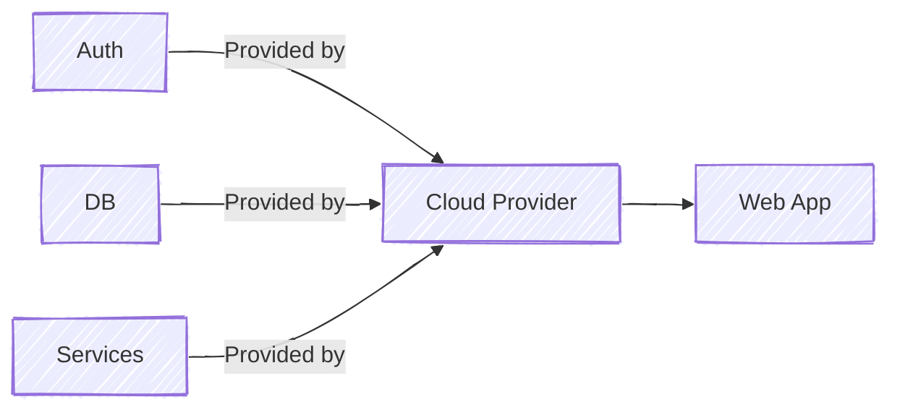

Serverless Architecture is a cloud computing model where the cloud provider manages the underlying infrastructure, including server provisioning, scaling, and maintenance. This allows developers to focus on writing and deploying application code.

- Code runs automatically in response to events or requests.
- The cloud provider handles server management, scaling, and resource allocation.

### Design Patterns in Serverless Architecture

#### API Gateway Pattern (Serverless Integration)
- A serverless function acts as a gateway to route incoming requests to backend services.
- Handles HTTP requests, performs initial processing, and forwards them to appropriate services.
- Commonly used to build lightweight API gateways.

#### Event Stream Processing
- Responding to data streams like logs, financial transactions, or social media feeds is a good fit for serverless functions.
- In this architecture, [[Event Driven Architecture|streams of events]] trigger functions that process each event separately.
- This is helpful in situations like logging, real-time data analytics, and processing data from the Internet of Things.

#### Aggregator
- A serverless function aggregates data from multiple services or functions.
- Collects and combines responses from different sources.
- Returns a unified response, often used in microservices-based systems.

#### Strangler Fig Pattern
- This pattern helps migrate legacy systems to serverless gradually.
- New features are implemented using serverless functions.
- Legacy components are slowly replaced without a full rewrite.

#### Circuit Breaker
- The circuit breaker pattern prevents cascading failures in a serverless system by stopping repeated failed function calls.
- Breaks the function invocation chain after a predefined failure threshold.
- Allows the system to continue operating in a degraded but stable state.

## Scaling and Performance Considerations

Scaling and performance are crucial in serverless architectures, enabling applications to handle varying loads automatically without manual intervention.

### 1. Scaling in Serverless Computing

Scaling in serverless computing automatically adjusts resources based on incoming workload without manual intervention.
- **Automatic Scaling:** Serverless platforms automatically scale the execution units (functions) based on the incoming request or event rate.
- **Cold Starts:** Cold starts occur when a new function instance is initialized after being idle. This can introduce latency and affect the response time of serverless applications.
- **Throttling:** Cloud providers impose limits on function invocations to prevent resource overuse. If requests exceed these limits, throttling may occur, causing delayed processing.

### 2. Performance Optimization Strategies

Performance optimization strategies focus on reducing latency and improving execution efficiency in serverless applications.
- **Optimize Function Code:** Keeping the function code lean and efficient is vital. This includes minimizing dependencies and using asynchronous programming models where appropriate.
- **Manage Dependencies:** Reduce the size of deployment packages by removing unused libraries and files. Smaller packages help decrease initialization and startup times.
- **Persistent Connections:** Use persistent connections when interacting with databases or external services. This reduces connection setup overhead and improves execution efficiency.

## Challenges

- **Cold Start Latency**: Serverless functions may experience startup delays when invoked after being idle. This can increase response time for infrequently used functions.
- **Limited Execution Environment**: Serverless platforms impose limits on memory, execution time, and available resources. These restrictions may not suit all application workloads.
- **Debugging and Monitoring Complexity**: Monitoring and debugging distributed serverless functions can be challenging. Specialized tools are often required to track and troubleshoot issues effectively.
- **State Management**: Since serverless functions are stateless, application state must be stored in external databases or storage services. This can increase design complexity.
- **Security and Compliance Challenges**: Managing access control, securing function endpoints, and meeting compliance requirements can be more complex in serverless environments.
