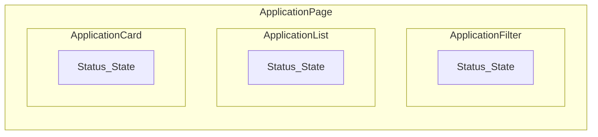
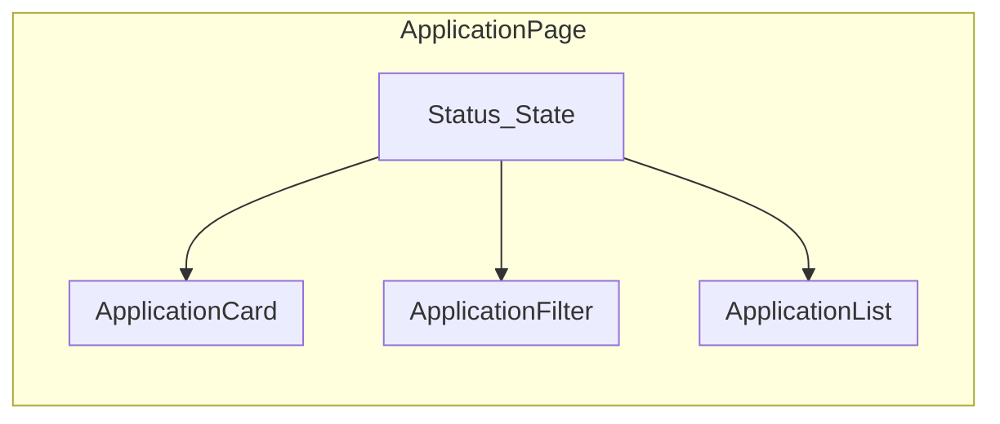

## Prop Drilling
Let us suppose our application structure is
```text
Dashboard
└── Applications
    └── ApplicationList
        └── ApplicationCard
            └── StatusButton
```
Imagine `Dashboard` knows who the current user is, and `StatusButton` needs the user's ID.

Without Context:
```tsx
function Dashboard() {
  const [user] = useState({
    id: "123",
    name: "Nikhil"
  });

  return <Applications user={user} />;
}

function Applications({ user }) {
  return <ApplicationList user={user} />;
}

function ApplicationList({ user }) {
  return <ApplicationCard user={user} />;
}

function ApplicationCard({ user }) {
  return <StatusButton user={user} />;
}
```

`Applications`, `ApplicationList`, and `ApplicationCard` might not even care about `user`. They're just forwarding it. That's **prop drilling**.

# React Context

React Context solves a specific problem:
> **How do I make some state/data available to many components without passing it through every intermediate component?**

Context wraps up the components and makes it available to every component inside the "boundary".

## Creating the context

Let's create one for the ApplyFlow user.
```tsx
// contexts/user-context.tsx

import { createContext } from "react";

type User = {
  id: string;
  firstName: string;
  lastName: string;
};

export const UserContext =
  createContext<User | null>(null);
```

The `null` is the **default value**. It doesn't mean Context always contains `null`. Once a Provider supplies something, descendants receive that value.
## Providing Context

Suppose we have:
```tsx
// app/dashboard/layout.tsx

const user = {
  id: "abc-123",
  firstName: "Nikhil",
  lastName: "Anand",
};
```

We provide it:
```tsx
// app/dashboard/layout.tsx

<UserContext.Provider value={user}>
  <Dashboard />
</UserContext.Provider>
```

Everything underneath that Provider can access the value:
```text
UserContext.Provider
│
├── Dashboard               ✓
│   ├── Sidebar             ✓
│   └── Applications        ✓
│       └── ApplicationCard ✓
│
└── Component outside       ✗
```

Like [[Components, JSX, and TSX#Props|props]] Context flows **downward** through the component tree.

## Consuming Context with `useContext`

Instead of:
```tsx
// components/application-card.tsx

function ApplicationCard({ user }) {
```

we can access Context:
```tsx
// components/application-card.tsx

import { useContext } from "react";
import { UserContext } from "@/contexts/user-context";

function ApplicationCard() {
  const user = useContext(UserContext);

  return (
    <div>
      Current user: {user?.firstName}
    </div>
  );
}
```

The important line is:
```tsx
// components/application-card.tsx

const user = useContext(UserContext);
```

React walks **up the component tree** and finds the closest corresponding Provider. If there are nested Providers, the nearest one wins.

# Context + [[State and Data Flow|State]] 
Here is where Components and Context differ in their ownership status. A State created inside a Component is [[State and Data Flow#Parent $ rightarrow$ Child Data Flow|owned by the Parent]]. But Context does not own the State it creates. It is merely a provider of that State to the components inside its boundary.

### Sharing the setter
Sometimes, the component may also need to modify the value of a State they get from a Context. Till now, we have seen a Context only giving access to the value of a State inside it. But a Context can share the setter too.

```tsx
// contexts/user-context.tsx

// Define the type
type UserContextType = {
  user: User | null;

  setUser: React.Dispatch<
    React.SetStateAction<User | null>
  >;
};

// Export the context
export const UserContext =
  createContext<UserContextType | null>(null);
```

# The Provider Pattern
In a real-world application, we do not want all Contexts to be sitting in the `App.tsx` or `Layout.tsx` file. We create a Provider to expose the context and keep all the context logic sitting inside
```tsx
// contexts/user-context.tsx

"use client";

import {
  createContext,
  useContext,
  useState,
  ReactNode,
} from "react";

type User = {
  id: string;
  firstName: string;
  lastName: string;
};

type UserContextType = {
  user: User | null;
  setUser: React.Dispatch<
    React.SetStateAction<User | null>
  >;
};

const UserContext =
  createContext<UserContextType | null>(null);

export function UserProvider({
  children,
}: {
  children: ReactNode;
}) {
  const [user, setUser] =
    useState<User | null>(null);

  return (
    <UserContext.Provider value={{ user, setUser }}>
      {children}
    </UserContext.Provider>
  );
}

// Use it
// app/layout.tsx

<UserProvider>
  <Dashboard />
</UserProvider>
```

# Context with [[Custom Hooks]]

Even though Contexts solve the pattern of Prop Drilling, they still introduce some redundant code. Every consumer of the Context would need the following line to properly use the context
```tsx
// components/navbar.tsx

// creation
const context = useContext(UserContext);

// error handling
if (!context) {
  throw new Error("...");
}
```

Instead of replicating this, we can combine Context with Custom Hooks and expose the Context via Hooks
```tsx
// contexts/user-context.tsx

export function useUser() {
  const context = useContext(UserContext);

  if (!context) {
    throw new Error(
      "useUser must be used inside UserProvider"
    );
  }

  return context;
}

// components/navbar.tsx

function Navbar() {
  const { user } = useUser();

  return <div>Hello {user?.firstName}</div>;
}

// components/logout-button.tsx

function LogoutButton() {
  const { setUser } = useUser();

  return (
    <button onClick={() => setUser(null)}>
      Logout
    </button>
  );
}
```

# Lifting States vs Context

Context is not always the solution when multiple components decide to share the same State. Assuming a structure where a `status` State is being used by three components: 


We do not need to create a Context to share the state. We can simply take the State and put it in their nearest common parent

This is called **lifting State up**. You don't need Context yet. But suppose your tree becomes:
```
ApplicationProvider
│
├── Header
│   └── ApplicationCount
│
├── Sidebar
│   └── ApplicationFilters
│
└── ApplicationsPage
    ├── ApplicationList
    │   └── ApplicationCard
    │       └── StatusSelector
    │
    └── ApplicationDetails
```

Now, many different branches need application-related state. Context becomes much more reasonable.

