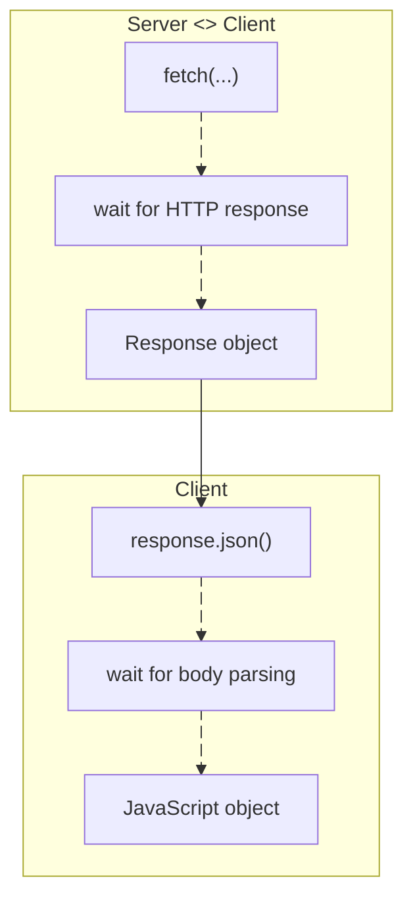
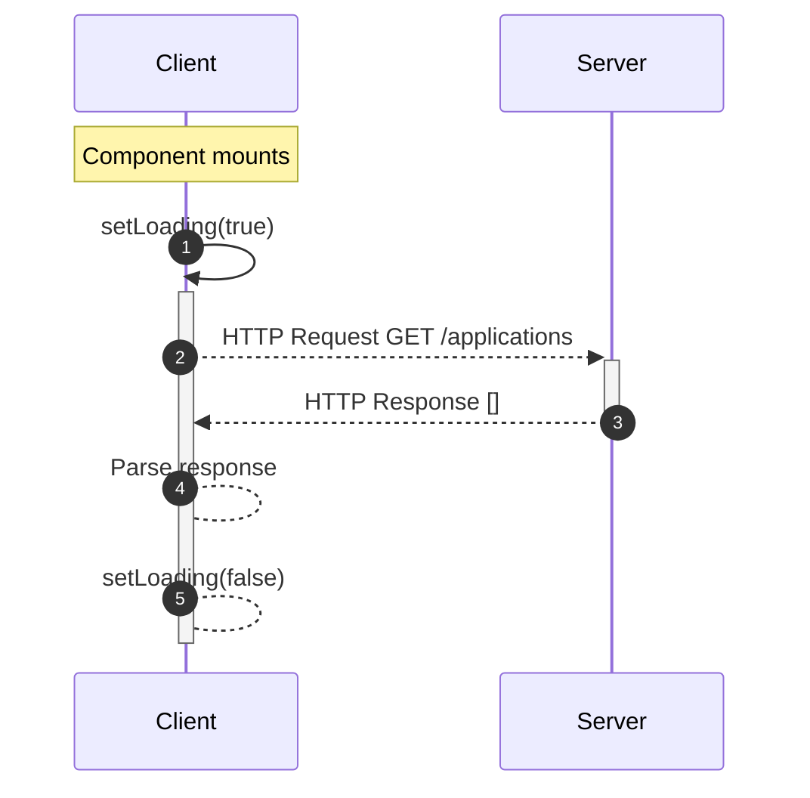
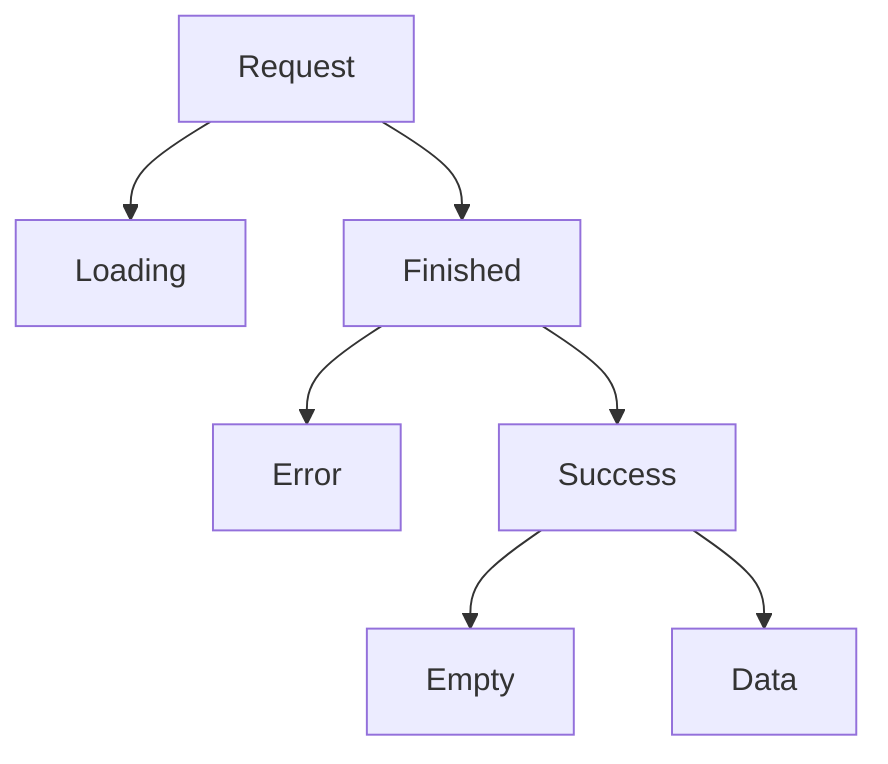
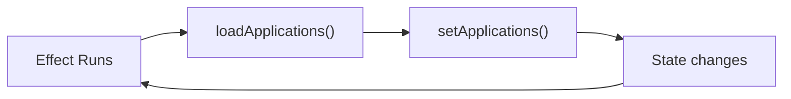

# 1. Basic `fetch()`

Suppose a server exposes `GET /applications` returning:
```json
[
  {
    "id": "1",
    "company": "Google",
    "role": "Software Engineer",
    "status": "APPLIED"
  }
]
```

In JavaScript, we can request it with:
```js
// services/application-service.ts

const response = await fetch(
  "http://localhost:8000/applications"
);

const applications = await response.json();
```

There are **two awaits** because these are two asynchronous operations:


##  `fetch()` Does Not Throw for Every HTTP Error

This is an important gotcha. If the server responds with a `404`, a `500`, or a `422`, `fetch()` usually still resolves successfully to a `Response`. So check:
```tsx
// services/application-service.ts

const response = await fetch(
  "http://localhost:8000/applications"
);

if (!response.ok) {
  throw new Error(
    `Request failed: ${response.status}`
  );
}

const applications = await response.json();
```

`response.ok` means the HTTP status is in the successful `200–299` range.

# 2. Fetching Data in a Component

Our first attempt might look like:
```tsx
// components/application-list.tsx

"use client";

import { useState } from "react";

export function ApplicationList() {
  const [applications, setApplications] =
    useState<Application[]>([]);

  async function loadApplications() {
    const response = await fetch(
      "http://localhost:8000/applications"
    );

    const data = await response.json();

    setApplications(data);
  }

  // ...
}
```

But when should `loadApplications()` run? We want to load applications when this component appears. That's a [[useEffect and Side Effects#Side Effects|side effect]].

## Fetching on Component Mount

```tsx
// components/application-list.tsx

"use client";

import { useEffect, useState } from "react";

export function ApplicationList() {
  const [applications, setApplications] = useState<Application[]>([]);
  useEffect(() => {
    async function loadApplications() {
      const response = await fetch(
        "http://localhost:8000/applications"
      );
      const data = await response.json();
      setApplications(data);
    }
    loadApplications();
  }, []); // Use an empty dep array
  return (
    <>
      {applications.map(application => (
        <div key={application.id}>
          {application.company}
        </div>
      ))}
    </>
  );
}
```

Make sure to use an [[useEffect and Side Effects#Empty array|empty dependency array]] to ensure this only runs on component mounting.

## Why Not Make `useEffect` Async?

This looks tempting:
```tsx
// ❌ Don't do this

useEffect(async () => {
  const response = await fetch(...);
}, []);
```

The reason relates to the return value of an effect. React expects the effect callback to return either nothing or a callback function. For example:
```tsx
// components/example.tsx
useEffect(() => {
  // setup
  return () => {
    // cleanup
  };
}, []);
```

But an `async` function **always returns a Promise**. Therefore, the usual pattern is:
```tsx
// components/application-list.tsx

useEffect(() => {
  // use async as a wrapper
  async function loadApplications() {
    // await...
  }
  loadApplications();
}, []);
```

## Refetching

Sometimes you want to load the data again. For example, when the user clicks refresh. The naive problem with our current code is that `loadApplications()` exists **inside** `useEffect`, so nothing outside can call it. We could move it out:
```tsx
// components/application-list.tsx

export function ApplicationList() {
	async function loadApplications() {
	  // ...
	}
	
	useEffect(() => {
	  loadApplications();
	}, []);
	
	// ...
	return (
		<button onClick={loadApplications}>
		  Refresh
		</button>
	);
}
```

But now you'll need to think carefully about dependencies if `loadApplications` uses props/state. This is one place where custom hooks can give us a cleaner abstraction.

# 3. Handling States
## Data Alone Isn't Enough

Right now we have:
```tsx
// components/application-list.tsx

const [applications, setApplications] =
  useState<Application[]>([]);
```

But what does `[]` mean? It could mean:
- We haven't loaded anything yet, or
- The request succeeded, and the user actually has zero applications.
Those are very different UI states. So asynchronous UI usually needs at least three pieces of information: data, loading, and error.

## Loading State

Add:
```tsx
// components/application-list.tsx

const [loading, setLoading] = useState(true);
```

Then:
```tsx
// components/application-list.tsx

useEffect(() => {
  async function loadApplications() {
    const response = await fetch(
      "http://localhost:8000/applications"
    );

    const data = await response.json();

    setApplications(data);
    setLoading(false);
  }

  loadApplications();
}, []);
```

Now:
```tsx
// components/application-list.tsx

if (loading) {
  return <p>Loading applications...</p>;
}
```

## Error State

Requests can fail, so add:
```tsx
// components/application-list.tsx

const [error, setError] =
  useState<string | null>(null);
```

Then use `try/catch`:
```tsx
// components/application-list.tsx

useEffect(() => {
  async function loadApplications() {
    try {
      const response = await fetch(
        "http://localhost:8000/applications"
      );
      if (!response.ok) {
        throw new Error(
          `Request failed: ${response.status}`
        );
      }
      const data = await response.json();
      setApplications(data);
    } catch (error) {
      setError("Failed to load applications");
    } finally {
      setLoading(false);
    }
  }
  loadApplications();
}, []);
```

`finally` runs whether the request succeeds or fails, which makes it perfect for cleanup operations, such as `setLoading(false)`.

## State Flow
Our state transition becomes:
```
Mount

loading = true
applications = []

        ↓

HTTP request

        ↓

Response

        ↓

applications = data
loading = false

        ↓

Render applications
```

# 4. The Classic Async State Pattern

Now our component has:
```tsx
// components/application-list.tsx

const [applications, setApplications] =
  useState<Application[]>([]);
const [loading, setLoading] =
  useState(true);
const [error, setError] =
  useState<string | null>(null);
```

You can think of the UI as having four states:



Then rendering becomes:
```tsx
// components/application-list.tsx

if (loading) {
  return <p>Loading...</p>;
}

if (error) {
  return <p>{error}</p>;
}

if (applications.length === 0) {
  return <p>No applications yet.</p>;
}

return (
  <>
    {applications.map(application => (
      <ApplicationCard
        key={application.id}
        application={application}
      />
    ))}
  </>
);
```

This pattern is everywhere in frontend development.

## Complete Version

Let's put everything together.
```tsx
// models/application.ts

export type ApplicationStatus =
  | "APPLIED"
  | "ASSESSMENT"
  | "INTERVIEW"
  | "OFFER"
  | "REJECTED";

export type Application = {
  id: string;
  company: string;
  role: string;
  status: ApplicationStatus;
};
```

And:
```tsx
// components/application-list.tsx

"use client";

import { useEffect, useState } from "react";
import { Application } from "@/models/application";

export function ApplicationList() {
  const [applications, setApplications] =
    useState<Application[]>([]);

  const [loading, setLoading] =
    useState(true);

  const [error, setError] =
    useState<string | null>(null);

  useEffect(() => {
    async function loadApplications() {
      try {
        const response = await fetch(
          "http://localhost:8000/applications"
        );

        if (!response.ok) {
          throw new Error(
            `Request failed: ${response.status}`
          );
        }

        const data: Application[] =
          await response.json();

        setApplications(data);

      } catch (error) {
        setError(
          "Failed to load applications"
        );

      } finally {
        setLoading(false);
      }
    }

    loadApplications();
  }, []);

  if (loading) {
    return <p>Loading...</p>;
  }

  if (error) {
    return <p>{error}</p>;
  }

  if (applications.length === 0) {
    return <p>No applications yet.</p>;
  }

  return (
    <>
      {applications.map(application => (
        <div key={application.id}>
          <h2>{application.company}</h2>
          <p>{application.role}</p>
          <p>{application.status}</p>
        </div>
      ))}
    </>
  );
}
```

That's a perfectly reasonable manual React data-fetching component.

# 5. `AbortController`

We already learned [[useEffect and Side Effects#AbortController|`AbortController`]] with `useEffect`, but it's especially relevant here. Imagine:
```
ApplicationList mounts
        ↓
GET /applications starts
        ↓
User navigates away
        ↓
ApplicationList unmounts
        ↓
Request is still running
```

We no longer care about that request. We can cancel it.
```tsx
// components/application-list.tsx

useEffect(() => {
  const controller = new AbortController();

  async function loadApplications() {
    try {
      const response = await fetch(
        "http://localhost:8000/applications",
        {
          signal: controller.signal,
        }
      );

      if (!response.ok) {
        throw new Error("Request failed");
      }

      const data = await response.json();

      setApplications(data);

    } catch (error) {
      if (
        error instanceof Error &&
        error.name !== "AbortError"
      ) {
        setError("Failed to load applications");
      }

    } finally {
      setLoading(false);
    }
  }

  loadApplications();

  return () => {
    controller.abort();
  };
}, []);
```

Now:
```
Component mounts
      ↓
create AbortController
      ↓
fetch(signal)
      ↓

Component unmounts
      ↓
effect cleanup
      ↓
controller.abort()
      ↓
request cancelled
```

This is exactly why `useEffect` has cleanup functions.

# 6. Service Layer

Technically, this is valid:
```tsx
// components/application-list.tsx

const response = await fetch(
  "http://localhost:8000/applications"
);
```

But as the application grows, you'll have:
- ApplicationList
- ApplicationDetails
- ApplicationForm
- Dashboard
- ApplicationCard, all making requests.
You don't want URLs and HTTP details scattered everywhere. Instead, create a **service layer**. For example:
```tsx
// services/application-service.ts

import { Application } from "@/models/application";

const API_URL = "http://localhost:8000";

export async function getApplications():
  Promise<Application[]> {

  const response = await fetch(
    `${API_URL}/applications`
  );

  if (!response.ok) {
    throw new Error(
      `Failed to fetch applications: ${response.status}`
    );
  }

  return response.json();
}
```

Now the component doesn't know about the URL, or the HTTP configuration, or how the response is parsed. It simply knows that it will get the data in either [[#3. Handling States|state]] and it has to render the data on the UI. This gives us:
```
ApplicationList
       ↓
getApplications()
       ↓
Application Service
       ↓
HTTP
       ↓
Server
```

## Component After Adding the Service

Now our component gets cleaner:
```tsx
// components/application-list.tsx

"use client";

import { useEffect, useState } from "react";

import { Application } from "@/models/application";
import { getApplications } from "@/services/application-service";

export function ApplicationList() {
  const [applications, setApplications] =
    useState<Application[]>([]);

  const [loading, setLoading] =
    useState(true);

  const [error, setError] =
    useState<string | null>(null);

  useEffect(() => {
    async function loadApplications() {
      try {
        const data = await getApplications();

        setApplications(data);

      } catch {
        setError(
          "Failed to load applications"
        );

      } finally {
        setLoading(false);
      }
    }

    loadApplications();
  }, []);

  if (loading) {
    return <p>Loading...</p>;
  }

  if (error) {
    return <p>{error}</p>;
  }

  return (
    <>
      {applications.map(application => (
        <ApplicationCard
          key={application.id}
          application={application}
        />
      ))}
    </>
  );
}
```

Much better.
# 7. `useApplications`

Our component currently handles: rendering the UI and fetching the data. You can extract the fetching logic into a **custom hook**. We can create:
```tsx
// hooks/use-applications.ts

"use client";

import { useEffect, useState } from "react";

import { Application } from "@/models/application";
import { getApplications } from "@/services/application-service";

export function useApplications() {
  const [applications, setApplications] =
    useState<Application[]>([]);

  const [loading, setLoading] =
    useState(true);

  const [error, setError] =
    useState<string | null>(null);

  useEffect(() => {
    async function loadApplications() {
      try {
        const data = await getApplications();

        setApplications(data);

      } catch {
        setError(
          "Failed to load applications"
        );

      } finally {
        setLoading(false);
      }
    }

    loadApplications();
  }, []);

  return {
    applications,
    loading,
    error,
  };
}
```

Now look at our component. Our Component Becomes Mostly UI
```tsx
// components/application-list.tsx

"use client";

import { useApplications } from "@/hooks/use-applications";

export function ApplicationList() {
  const {
    applications,
    loading,
    error,
  } = useApplications();

  if (loading) {
    return <p>Loading...</p>;
  }

  if (error) {
    return <p>{error}</p>;
  }

  if (applications.length === 0) {
    return <p>No applications yet.</p>;
  }

  return (
    <>
      {applications.map(application => (
        <ApplicationCard
          key={application.id}
          application={application}
        />
      ))}
    </>
  );
}
```

Now the responsibilities are much clearer. 
- Component handles the View,
- Custom Hooks handle the state and controller logic,
- Service handles the API interactions and configuration.
Not exact equivalents, but a useful architectural mental model.

# 8. What If a Dependency Determines the Request?

Suppose we want `GET /users/{userId}/applications`, our component receives:
```tsx
// components/application-list.tsx

function ApplicationList({
  userId,
}: {
  userId: string;
}) {
```

Then:
```tsx
// components/application-list.tsx
useEffect(() => {
  async function loadApplications() {
    const data =
      await getApplications(userId);

    setApplications(data);
  }

  loadApplications();
}, [userId]);
```

Now:

```
Component mounts
      ↓
fetch user A


userId changes
      ↓
effect dependency changed
      ↓
fetch user B
```

This is an important relationship:
```
Effect dependencies
        ↓
determine when the request
needs to run again
```

# 9. Common Mistake: Infinite Fetch Loop

Suppose you write:
```tsx
// ❌ components/application-list.tsx

useEffect(() => {
  loadApplications();
}, [applications]);
```

But `loadApplications()` does `setApplications(data)`, then:


Congratulations, you've built a tiny denial-of-service attack against your own server. 😄 Your dependencies should represent **inputs that determine what data needs to be fetched**, not the result you're setting from that fetch.

# 10. Another Problem: Race Conditions

Imagine the user changes a search query quickly:
```
Search "goo"
     ↓
Request A starts

Search "google"
     ↓
Request B starts
```

Suppose B finishes first:
```
B → Google results
```

Then the slower A finishes:
```
A → "goo" results
```

Now the older request overwrites the newer result.
```
Request A ────────────────► finishes second
Request B ───────► finishes first
                              │
                              ▼
                    correct results shown
                              │
Request A finishes ───────────┘
                              ↓
                     stale results shown
```

`AbortController` is one way to deal with this. When the dependency changes, React runs the previous effect's cleanup:
```
query changes
      ↓
old effect cleanup
      ↓
abort old request
      ↓
new effect
      ↓
start new request
```

This is why effect cleanup becomes particularly important with API calls.

# 11. Manual Data Fetching Gets Repetitive

Notice how much code we've accumulated:
```tsx
useState(data)
useState(loading)
useState(error)

useEffect
try
catch
finally

AbortController
refetch
race-condition handling
caching?
retry?
stale data?
```

Imagine doing that for:

```
Applications
Companies
Users
Application details
Statistics
Dashboard data
```

You'll repeat a lot of machinery. This is exactly why libraries such as **[[TanStack Query]]** exist. They handle concepts like:
- Loading
- Errors
- Caching
- Refetching
- Retries
- Stale data
- Mutations
- Invalidation
- Request deduplication
So. later instead of manually building all of this, you'd have an abstraction around the query. But it's useful that you're learning the manual approach first, because now you understand **what problem such a library is solving**.

# 12. One Architectural Clarification

Earlier we discussed:
```
Component → Reducer → Service
```

versus:
```
Component → Service
```

Now we can refine that architecture. For server data, a reasonable manual React architecture is:

```
             Component
                 │
                 ▼
           Custom Hook
                 │
                 ▼
              Service
                 │
                 ▼
              FastAPI
                 │
                 ▼
            PostgreSQL
```

Data comes back:
```
PostgreSQL
    ↓
FastAPI
    ↓
Service
    ↓
Custom Hook
    ↓
setApplications()
    ↓
React render
```

You **don't need a reducer** simply because you're making API calls. A reducer solves complex **client-state transitions**, not HTTP communication.