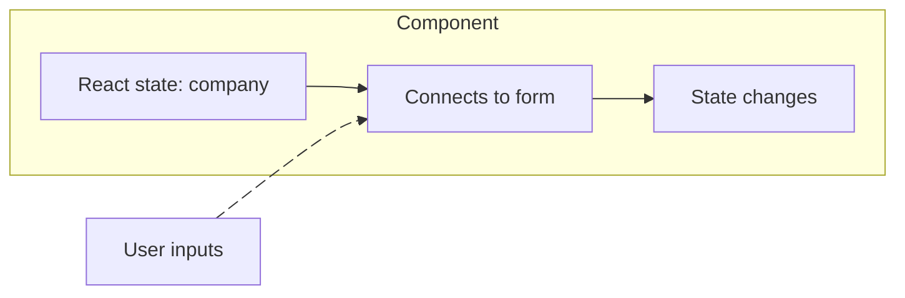
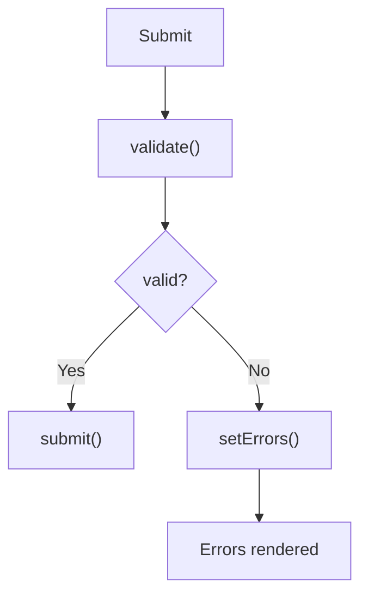

React doesn't have a built-in form framework comparable to Angular Reactive Forms. At its core, you're working with normal HTML forms plus React state.
# 1. Basic HTML Form in React

A React form can simply be HTML:
```tsx
// components/application-form.tsx

export function ApplicationForm() {
  return (
    <form>
      <input
        type="text"
        placeholder="Company"
      />

      <input
        type="text"
        placeholder="Role"
      />

      <button type="submit">
        Add Application
      </button>
    </form>
  );
}
```

At this point, React isn't managing the inputs. The browser/DOM is. If we want React to know the current values, we usually create **controlled inputs**.

# 2. Controlled Components

Suppose we have:
```tsx
// components/application-form.tsx

const [company, setCompany] = useState("");
```

Then connect it to the input:
```tsx
// components/application-form.tsx

<input
  type="text"
  value={company}
  onChange={(event) =>
    setCompany(event.target.value)
  }
/>
```

Now we have:


This is called a **controlled component** because React state controls the value displayed by the input.

## What Happens When You Type?

Suppose:
```tsx
// components/application-form.tsx

const [company, setCompany] = useState("");
```

Initially, `company = ""`, and `input = ""`. You type `G`. The browser fires:
```tsx
// Conceptual event
onChange(event)
```

where:
```tsx
event.target.value = "G"
```

Then:
```tsx
// components/application-form.tsx

setCompany(event.target.value);
```

This updates the [[State and Data Flow|state]]. React renders again, `company = "G"`, which gets passed back:
```tsx
// components/application-form.tsx

value={company}
```

So the input displays `G`. Then you type `o`:
```
event.target.value = "Go"
        ↓
setCompany("Go")
        ↓
render
        ↓
value="Go"
```

And so on. That's the core controlled-input loop.

## Why Control the Input?

Because now your React code knows the current value at any point:
```tsx
// components/application-form.tsx

console.log(company);
```

And you can easily:
- Validate it
- Disable buttons
- Conditionally render UI
- Transform it
- Submit it
- Reset it

For example:
```tsx
// components/application-form.tsx

<button disabled={company.length === 0}>
  Submit
</button>
```

# 3. Handling Form Submission

Normally, an HTML form submission causes browser navigation/reload. In React applications, we usually intercept it.
```tsx
// components/application-form.tsx

function handleSubmit(
  event: React.FormEvent<HTMLFormElement>
) {
  event.preventDefault();

  console.log(company);
}
```

Then:
```tsx
// components/application-form.tsx

<form onSubmit={handleSubmit}>
```

Complete example:
```tsx
// components/application-form.tsx

"use client";

import { useState } from "react";

export function ApplicationForm() {
  const [company, setCompany] = useState("");

  function handleSubmit(
    event: React.FormEvent<HTMLFormElement>
  ) {
    event.preventDefault();
    // .. or other business logic
    console.log(company);
  }

  return (
    <form onSubmit={handleSubmit}>
      <input
        value={company}
        onChange={(event) =>
          setCompany(event.target.value)
        }
      />

      <button type="submit">
        Add Application
      </button>
    </form>
  );
}
```

Notice that the click handler isn't on the button. We use:
```tsx
<form onSubmit={handleSubmit}>
```

This also handles things like pressing **Enter** inside the form.

# 4. Multiple Fields

Your ApplyFlow form might contain:
```
Company
Role
Location
Status
Applied On
```

You could create separate state:
```
// components/application-form.tsx

const [company, setCompany] = useState("");
const [role, setRole] = useState("");
const [location, setLocation] = useState("");
const [status, setStatus] = useState("APPLIED");
```

This is perfectly valid. For small forms, it would be better since this is explicit. But as the form grows, you may prefer one object.

# 5. Form State as an Object

Create a type:
```tsx
// models/application-form.ts

export type ApplicationFormData = {
  company: string;
  role: string;
  location: string;
  status: string;
};
```

Then:
```tsx
// components/application-form.tsx

const [form, setForm] =
  useState<ApplicationFormData>({
    company: "",
    role: "",
    location: "",
    status: "APPLIED",
  });
```

Now the form's state looks like:
```
form
├── company
├── role
├── location
└── status
```

Updating `company`:
```tsx
// components/application-form.tsx

setForm({
  ...form,
  company: event.target.value,
});
```

Remember why we use:

```
...form
```

[[State and Data Flow#States must be treated as immutable|React state should be treated as immutable.]]

Without it:
```tsx
// components/application-form.tsx

setForm({
  company: event.target.value,
});
```

you'd replace the entire object and lose the other fields.

## Prefer Functional Update

I'd generally write that as:
```tsx
// components/application-form.tsx

setForm(current => ({
  ...current,
  company: event.target.value,
}));
```

This guarantees we're updating from the [[State and Data Flow#Functional State Updates|latest state]]. Now another field:
```tsx
// components/application-form.tsx

setForm(current => ({
  ...current,
  role: event.target.value,
}));
```

You can already see the repetition. So let's improve it.

# 6. Generic Change Handler

Give your inputs a `name` matching the state property:
```tsx
// components/application-form.tsx

<input
  name="company"
  value={form.company}
  onChange={handleChange}
/>

<input
  name="role"
  value={form.role}
  onChange={handleChange}
/>
```

Then:
```tsx
// components/application-form.tsx

function handleChange(
  event: React.ChangeEvent<HTMLInputElement>
) {
  const { name, value } = event.target;

  setForm(current => ({
    ...current,
    [name]: value,
  }));
}
```

The interesting syntax is `[name]: value`. If `name = "company"`, and `value = "Google"`, JavaScript effectively creates:
```json
{
  company: "Google"
}
```

So one function can handle many inputs.

# 7. Complete Sample Form

Here's the whole thing together:
```tsx
// components/application-form.tsx

"use client";

import { useState } from "react";

type ApplicationFormData = {
  company: string;
  role: string;
  location: string;
  status: string;
};

const initialForm: ApplicationFormData = {
  company: "",
  role: "",
  location: "",
  status: "APPLIED",
};

export function ApplicationForm() {
  const [form, setForm] =
    useState<ApplicationFormData>(initialForm);

  function handleChange(
    event: React.ChangeEvent<
      HTMLInputElement | HTMLSelectElement
    >
  ) {
    const { name, value } = event.target;

    setForm(current => ({
      ...current,
      [name]: value,
    }));
  }

  function handleSubmit(
    event: React.FormEvent<HTMLFormElement>
  ) {
    event.preventDefault();

    console.log(form);
  }

  return (
    <form onSubmit={handleSubmit}>
      <input
        name="company"
        value={form.company}
        onChange={handleChange}
        placeholder="Company"
      />

      <input
        name="role"
        value={form.role}
        onChange={handleChange}
        placeholder="Role"
      />

      <input
        name="location"
        value={form.location}
        onChange={handleChange}
        placeholder="Location"
      />

      <select
        name="status"
        value={form.status}
        onChange={handleChange}
      >
        <option value="APPLIED">
          Applied
        </option>

        <option value="ASSESSMENT">
          Assessment
        </option>

        <option value="INTERVIEW">
          Interview
        </option>
      </select>

      <button type="submit">
        Add Application
      </button>
    </form>
  );
}
```

If the user enters:
```
Company:  Google
Role:     Software Engineer
Location: Boston
Status:   INTERVIEW
```

then `form` is simply:
```json
{
  company: "Google",
  role: "Software Engineer",
  location: "Boston",
  status: "INTERVIEW"
}
```

# 8. Different Input Types

### Select

A `<select>` works almost identically:
```tsx
// components/application-form.tsx

<select
  name="status"
  value={form.status}
  onChange={handleChange}
>
  <option value="APPLIED">Applied</option>
  <option value="INTERVIEW">Interview</option>
</select>
```

The selected value is `event.target.value`.
### Checkbox

Checkboxes are slightly different. You care about `event.target.checked`, rather than `event.target.value`. For example:
```tsx
// components/application-form.tsx

const [favorite, setFavorite] = useState(false);

<input
  type="checkbox"
  checked={favorite}
  onChange={(event) =>
    setFavorite(event.target.checked)
  }
/>
```

### Number

This catches people occasionally:
```tsx
// components/application-form.tsx

<input
  type="number"
  onChange={(event) => {
    console.log(event.target.value);
  }}
/>
```

`event.target.value` is still generally a **string**. If you need a number:
```tsx
const value = Number(event.target.value);
// -- or --
const value = event.target.valueAsNumber;
```

# 9. Basic Validation

Because our form lives in state, validation is straightforward.
```tsx
// components/application-form.tsx

function validateForm() {
  if (!form.company.trim()) {
    return false;
  }

  if (!form.role.trim()) {
    return false;
  }

  return true;
}
```

Then:
```tsx
// components/application-form.tsx

function handleSubmit(
  event: React.FormEvent<HTMLFormElement>
) {
  event.preventDefault();
  if (!validateForm()) {
    return;
  }
  console.log("Valid form:", form);
}
```

But usually you want to tell the user **what** is wrong.

# 10. Error State

We could maintain:
```tsx
// components/application-form.tsx

const [errors, setErrors] = useState<{
  company?: string;
  role?: string;
}>({});
```

Then:
```tsx
// components/application-form.tsx

function validateForm() {
  const errors: {
    company?: string;
    role?: string;
  } = {};
  if (!form.company.trim()) {
    errors.company = "Company is required";
  }
  if (!form.role.trim()) {
    errors.role = "Role is required";
  }
  setErrors(errors);
  return Object.keys(errors).length === 0;
}
```

And display it:
```tsx
// components/application-form.tsx

<input
  name="company"
  value={form.company}
  onChange={handleChange}
/>
{errors.company && (
  <p>{errors.company}</p>
)}
```

Now the flow becomes:


## HTML Validation Still Exists

React doesn't replace browser validation. You can still use:
```tsx
// components/application-form.tsx

<input
  required
  minLength={2}
  maxLength={255}
/>
```

or:
```tsx
// components/application-form.tsx

<input
  type="email"
  required
/>
```

For simple forms, browser validation may be enough. For complex business validation, you'll usually want application-level validation as well. And remember: **client validation is UX, not security.**

# 11. Resetting the Form

Because the entire form is state:
```tsx
// components/application-form.tsx

setForm(initialForm);
```

resets everything. So eventually:
```tsx
// components/application-form.tsx

async function handleSubmit(
  event: React.FormEvent<HTMLFormElement>
) {
  event.preventDefault();
  if (!validateForm()) {
    return;
  }
  // API call will eventually happen here
  setForm(initialForm);
}
```

# 12. Controlled vs Uncontrolled Components

So far we've used **controlled** inputs:
```tsx
// components/application-form.tsx

<input
  value={form.company}
  onChange={handleChange}
/>
```

React owns the value. An **uncontrolled** input lets the DOM own the value. For example:
```tsx
// components/application-form.tsx

const companyRef = useRef<HTMLInputElement>(null);
<input ref={companyRef} />
```

Then later:
```tsx
// components/application-form.tsx

console.log(companyRef.current?.value);
```

Now you're essentially asking the DOM:
> What's currently inside this input?

Rather than keeping every keystroke in React state.

## Controlled vs Uncontrolled

| Controlled           | Uncontrolled                         |
| -------------------- | ------------------------------------ |
| React owns value     | DOM owns value                       |
| Uses `value`         | Often uses `defaultValue`            |
| Uses `onChange`      | Often accessed through refs/FormData |
| Easy live validation | Less React state                     |
| Easy conditional UI  | Useful for simpler forms             |

Historically, React teaching heavily emphasized controlled forms. In modern React, uncontrolled forms are also completely legitimate, especially when working with libraries that are designed around them.

# 18. What about [[useReducer]] ?

You _could_ manage a large form with:
```tsx
// components/application-form.tsx

const [form, dispatch] = useReducer(
  formReducer,
  initialForm
);
```

and do:
```tsx
// components/application-form.tsx

dispatch({
  type: "FIELD_CHANGED",
  field: "company",
  value: "Google",
});
```

But don't reach for it just because you learned `useReducer`. For smaller forms, `useState` is simpler. A reducer becomes more attractive when you have complicated form transitions:
```
Multi-step form
Dependent fields
Complex validation
Reset sections
Dynamic fields
Many coordinated updates
```

And at that point, a dedicated form library may be even better.

# 19. Form Libraries

For a serious production form, manually maintaining:
- form state
- errors
- touched fields
- dirty fields
- validation
- submission state
- reset logic

gets tedious. Two names worth knowing are:
- **[[React Hook Form]]** — form state/handling.
- **[[zod]]** — schema validation.