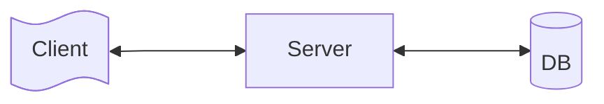
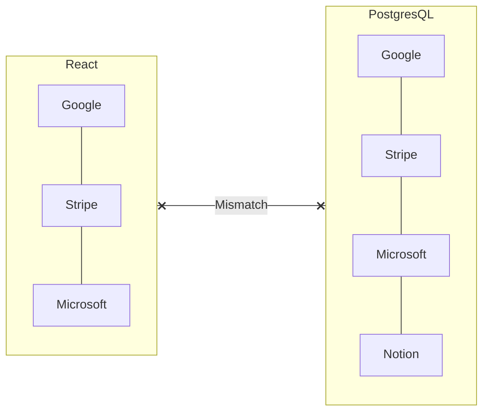
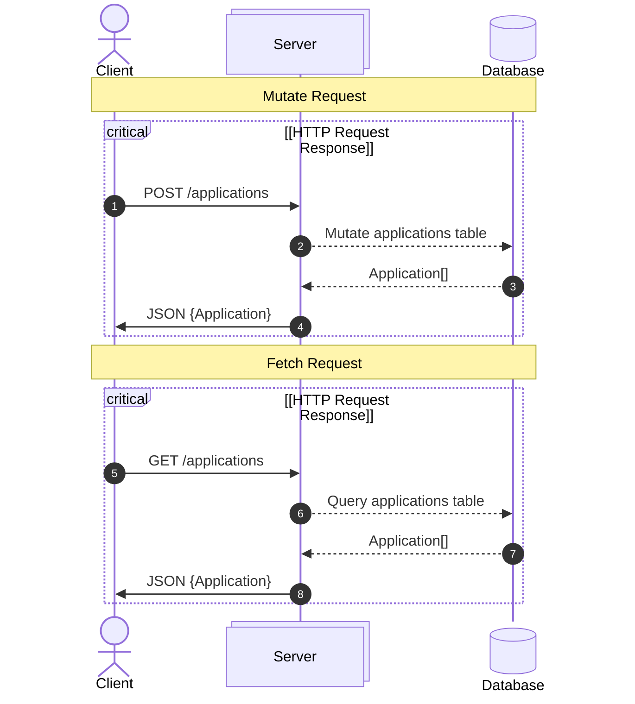
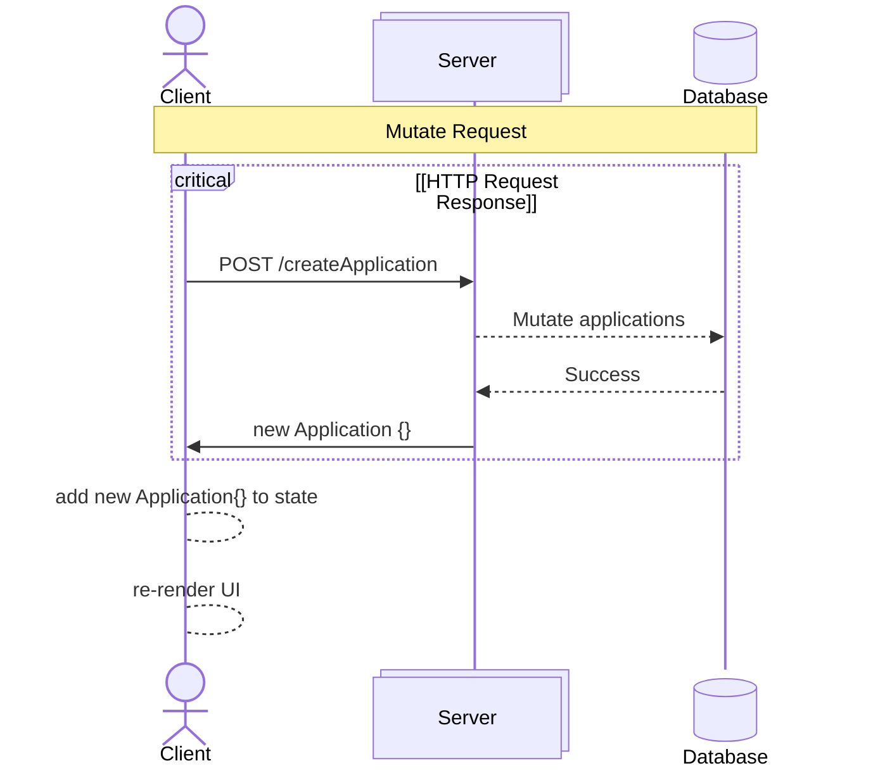

In [[Data Fetching and Async States]], the data flowed **from Server → React**:


Now we need the opposite direction too:
```
Create Application   → POST
Change Status        → PATCH
Edit Application     → PUT/PATCH
Delete Application   → DELETE
```

**Query vs Mutation**
You'll hear these terms frequently in frontend development. A **query** retrieves data `GET /applications`, where as a mutation changes data: `POST /applications`, `PATCH /applications/123`, `DELETE /applications/123`, etc


# 2. Creating an Application with `POST`

From [[Forms and User Input]] our form produced something like:
```json
{
  company: "Google",
  role: "Software Engineer",
  location: "Boston",
  status: "APPLIED"
}
```

Let's define the request type separately from the full `Application`.
```ts
// models/application.ts

export type ApplicationStatus =
  | "APPLIED"
  | "ASSESSMENT"
  | "INTERVIEW"
  | "OFFER"
  | "REJECTED";

export type Application = {
  id: string;
  company: string;
  role: string;
  location: string;
  status: ApplicationStatus;
};

export type CreateApplicationRequest = {
  company: string;
  role: string;
  location: string;
  status: ApplicationStatus;
};
```

Why separate them? Because the client sends:
```json
{
	company: "...",
	role: "...",
	location: "...",
	status: "..."
}
```

While the server generates things like:
```python
class Response:
	id: str
	createdAt: str
	applicationIndex: int
```

So the request and response aren't necessarily the same model.

# 3. Add POST to the Service

Our component shouldn't care about HTTP details.
```tsx
// services/application-service.ts

import {
  Application,
  CreateApplicationRequest,
} from "@/models/application";

const API_URL = "http://localhost:8000";

export async function createApplication(
  request: CreateApplicationRequest
): Promise<Application> {
  const response = await fetch(
    `${API_URL}/applications`,
    {
      method: "POST",

      headers: {
        "Content-Type": "application/json",
      },

      body: JSON.stringify(request),
    }
  );

  if (!response.ok) {
    throw new Error(
      `Failed to create application: ${response.status}`
    );
  }

  return response.json();
}
```

There are three important pieces here.
### HTTP method

```
method: "POST"
```

### Tell Server we're sending JSON

```
headers: {
  "Content-Type": "application/json"
}
```

### Convert JavaScript object → JSON

```
body: JSON.stringify(request)
```

## Calling the Service From Our Form

From [[Forms and User Input]],
```tsx
// components/application-form.tsx

async function handleSubmit(
  event: React.FormEvent<HTMLFormElement>
) {
  event.preventDefault();

  await createApplication(form);
}
```

Now the flow is:
```
User submits form
       ↓
handleSubmit()
       ↓
createApplication(form)
       ↓
ApplicationService
       ↓
POST /applications
       ↓
FastAPI
       ↓
PostgreSQL
```

And the server returns the newly created application.

# 4. Mutation State

There's a problem. Suppose the API takes two seconds. During those two seconds, what should the UI show? We need mutation state.

For a form:
```tsx
// components/application-form.tsx

const [submitting, setSubmitting] =
  useState(false);

const [submitError, setSubmitError] =
  useState<string | null>(null);
```

Then:
```tsx
// components/application-form.tsx

async function handleSubmit(
  event: React.FormEvent<HTMLFormElement>
) {
  event.preventDefault();

  try {
    setSubmitting(true);
    setSubmitError(null);

    await createApplication(form);

    setForm(initialForm);

  } catch {
    setSubmitError(
      "Failed to create application"
    );

  } finally {
    setSubmitting(false);
  }
}
```

This is essentially the same async pattern you learned for fetching.

## Disable the Submit Button

While the request is happening:
```tsx
// components/application-form.tsx

<button
  type="submit"
  disabled={submitting}
>
  {submitting
    ? "Adding..."
    : "Add Application"}
</button>
```

This isn't just visual polish. It prevents multiple "***clicks***" from potentially producing a series of redundant `POST`s and four Google applications appearing in your database. A tiny button with ambitions of becoming a load tester.

## Don't Reset Before the Request Succeeds

Avoid:
```tsx
// ❌ components/application-form.tsx

setForm(initialForm);
await createApplication(form);
```

Suppose the API fails. The user just lost everything they entered. Instead:
```tsx
// components/application-form.tsx

await createApplication(form);
setForm(initialForm);
```

Now the form resets only after the server confirms success.

# 5. The Bigger Problem: Our List Is Now Stale

Suppose the UI currently displays:
```
Google
Stripe
Microsoft
```

The user submits `Notion`. The server has inserted Notion into PostgreSQL successfully. But our `ApplicationList` still contains:
```
Google
Stripe
Microsoft
```

Why? Because React's state doesn't magically know the database changed.



We need to synchronize them. There are several strategies.

## Strategy 1 — Refetch

The simplest reliable approach:


So after `await createApplication(form)`, we call `await refetchApplications()`. The downside? Two HTTP requests: `POST` and `GET`
```
POST
GET
```

## Strategy 2 — Use the POST Response

There's another option. Remember our service returns `Promise<Application>`. Server could respond:
```json
{
  "id": "abc-123",
  "company": "Notion",
  "role": "Software Engineer",
  "location": "Boston",
  "status": "APPLIED"
}
```

Then:
```ts
// hooks/use-applications.ts

const application =
  await createApplication(request);

setApplications(current => [
  ...current,
  application,
]);
```

Now:


No additional GET request. This works particularly well when the mutation response contains the canonical server-created object.

## Pessimistic Updates

What we just did has an important property:
```
Send request
     ↓
WAIT
     ↓
Server says success
     ↓
Update UI
```

This is a **pessimistic update**. Example:
```tsx
// hooks/use-applications.ts

const created =
  await createApplication(request);

setApplications(current => [
  ...current,
  created,
]);
```

The UI waits for confirmation from the server. It's generally the simpler and safer approach.

## Optimistic Updates

An optimistic update does the opposite.

```
User clicks
     ↓
Update UI immediately
     ↓
Send API request
```

You're essentially saying, **"This will probably succeed, so let's make the UI feel instant"**.
> 

Suppose the user changes the status of `Google` from `APPLIED` to `INTERVIEW`. We immediately show the new status on the UI while the request happens in the background.

### Why Optimistic Updates Feel Better

Pessimistic:
```
Click Interview
      ↓
spinner...
      ↓
server responds
      ↓
INTERVIEW appears
```

Optimistic:
```
Click Interview
      ↓
INTERVIEW appears immediately
      ↓
server request happens
```

The second feels faster even if the backend takes exactly the same amount of time. But there's a catch. What if the request fails?
### Optimistic Rollback

Suppose the original status for `Google` is `APPLIED` and the user changes it to `INTERVIEW`. React immediately renders the UI to show the new status. But then, the server responds with a `500 Internal Server Error`. That's bad, and now, we must perform a rollback. 
```
Save old state
     ↓
Update UI
     ↓
API request
     ↓
    Failed
     ↓
Restore old state
```

For example:
```tsx
// hooks/use-applications.ts

async function changeStatus(
  id: string,
  status: ApplicationStatus
) {
  const previousApplications =
    applications;

  setApplications(current =>
    current.map(application =>
      application.id === id
        ? { ...application, status }
        : application
    )
  );

  try {
    await updateApplicationStatus(
      id,
      status
    );

  } catch {
    setApplications(previousApplications);
  }
}
```

This is optimistic updating manually. As you can see, it introduces more complexity.

## Pessimistic vs Optimistic

| Pessimistic                | Optimistic         |
| -------------------------- | ------------------ |
| Wait for server            | Update immediately |
| Simpler                    | More complex       |
| Server confirms first      | Assume success     |
| No rollback usually needed | Rollback required  |
| Slightly slower-feeling UI | Very responsive UI |


# 6. `PATCH`

Suppose the user changes and `APPLIED` status to `INTERVIEW`. We don't need to send the entire application. We only changed:
```json
{
  "status": "INTERVIEW"
}
```

That's a natural use case for `PATCH`.
```tsx
// services/application-service.ts

export async function updateApplicationStatus(
  id: string,
  status: ApplicationStatus
): Promise<Application> {

  const response = await fetch(
    `${API_URL}/applications/${id}`,
    {
      method: "PATCH",
      headers: {
        "Content-Type": "application/json",
      },
      body: JSON.stringify({
        status,
      }),
    }
  );
  if (!response.ok) {
    throw new Error(
      `Failed to update application: ${response.status}`
    );
  }
  return response.json();
}
```

## `PUT` vs `PATCH`

The conceptual distinction:
- **PUT** usually represents replacing the resource representation:
```json
{
  "company": "Google",
  "role": "Software Engineer",
  "location": "Boston",
  "status": "INTERVIEW"
}
```

**PATCH** represents partially updating it:
```json
{
  "status": "INTERVIEW"
}
```

For operations such as:
- Change status
- Update location
- Toggle favorite
- Edit one field
`PATCH` is usually the natural API design.

## Updating React After PATCH

Let's use the returned application.
```tsx
// hooks/use-applications.ts

async function changeStatus(
  id: string,
  status: ApplicationStatus
) {
  const updatedApplication =
    await updateApplicationStatus(
      id,
      status
    );

  setApplications(current =>
    current.map(application =>
      application.id === updatedApplication.id
        ? updatedApplication
        : application
    )
  );
}
```

Flow:
```
ApplicationCard
      ↓
changeStatus()
      ↓
PATCH
      ↓
Server
      ↓
updated application
      ↓
setApplications()
      ↓
replace matching application
      ↓
render
```

That's a **pessimistic mutation without refetching**.

# 7. DELETE

Service:
```tsx
// services/application-service.ts
export async function deleteApplication(
  id: string
): Promise<void> {

  const response = await fetch(
    `${API_URL}/applications/${id}`,
    {
      method: "DELETE",
    }
  );
  if (!response.ok) {
    throw new Error(
      `Failed to delete application: ${response.status}`
    );
  }
}
```

Then:
```tsx
// hooks/use-applications.ts

async function removeApplication(id: string) {
  await deleteApplication(id);
  setApplications(current =>
    current.filter(
      application => application.id !== id
    )
  );
}
```

Again:
1. DELETE request
2. wait for success
3. remove from React state

# 8. Putting it all together

## Service

Now our service layer might look like:
```tsx
// services/application-service.ts

import {
  Application,
  ApplicationStatus,
  CreateApplicationRequest,
} from "@/models/application";

const API_URL = "http://localhost:8000";

export async function getApplications():
  Promise<Application[]> {

  const response = await fetch(
    `${API_URL}/applications`
  );

  if (!response.ok) {
    throw new Error("Failed to fetch applications");
  }

  return response.json();
}


export async function createApplication(
  request: CreateApplicationRequest
): Promise<Application> {

  const response = await fetch(
    `${API_URL}/applications`,
    {
      method: "POST",
      headers: {
        "Content-Type": "application/json",
      },
      body: JSON.stringify(request),
    }
  );

  if (!response.ok) {
    throw new Error("Failed to create application");
  }

  return response.json();
}


export async function updateApplicationStatus(
  id: string,
  status: ApplicationStatus
): Promise<Application> {

  const response = await fetch(
    `${API_URL}/applications/${id}`,
    {
      method: "PATCH",
      headers: {
        "Content-Type": "application/json",
      },
      body: JSON.stringify({ status }),
    }
  );

  if (!response.ok) {
    throw new Error("Failed to update application");
  }

  return response.json();
}


export async function deleteApplication(
  id: string
): Promise<void> {

  const response = await fetch(
    `${API_URL}/applications/${id}`,
    {
      method: "DELETE",
    }
  );

  if (!response.ok) {
    throw new Error("Failed to delete application");
  }
}
```

Notice how this file knows about URLs, HTTP methods, headers, JSON, and status codes. Your UI doesn't need to.

## Custom Hook

Now we can centralize our application data logic.
```ts
// hooks/use-applications.ts

"use client";
import { useEffect, useState } from "react";
import {
  Application,
  ApplicationStatus,
  CreateApplicationRequest,
} from "@/models/application";
import {
  getApplications,
  createApplication,
  updateApplicationStatus,
  deleteApplication,
} from "@/services/application-service";

export function useApplications() {
  const [applications, setApplications] =
    useState<Application[]>([]);
  const [loading, setLoading] =
    useState(true);
  const [error, setError] =
    useState<string | null>(null);
  useEffect(() => {
    async function load() {
      try {
        const data = await getApplications();
        setApplications(data);

      } catch {
        setError("Failed to load applications");

      } finally {
        setLoading(false);
      }
    }

    load();
  }, []);
  async function addApplication(
    request: CreateApplicationRequest
  ) {
    const created =
      await createApplication(request);

    setApplications(current => [
      ...current,
      created,
    ]);
  }
  async function changeStatus(
    id: string,
    status: ApplicationStatus
  ) {
    const updated =
      await updateApplicationStatus(
        id,
        status
      );
    setApplications(current =>
      current.map(application =>
        application.id === updated.id
          ? updated
          : application
      )
    );
  }
  async function removeApplication(id: string) {
    await deleteApplication(id);
    setApplications(current =>
      current.filter(
        application => application.id !== id
      )
    );
  }


  return {
    applications,
    loading,
    error,
    addApplication,
    changeStatus,
    removeApplication,
  };
}
```

Now we've built a pretty nice abstraction.

## A simpler Component

An `ApplicationCard` doesn't need to understand HTTP:
```tsx
// components/application-card.tsx

type Props = {
  application: Application;
  onStatusChange: (
    id: string,
    status: ApplicationStatus
  ) => Promise<void>;
};

export function ApplicationCard({
  application,
  onStatusChange,
}: Props) {
  return (
    <div>
      <h2>{application.company}</h2>

      <p>{application.role}</p>

      <button
        onClick={() =>
          onStatusChange(
            application.id,
            "INTERVIEW"
          )
        }
      >
        Move to Interview
      </button>
    </div>
  );
}
```

The component knows how to do one and only one job: *"when clicked, tell someone that the status needs changing"*. It doesn't know anything about 
- PATCH
- FastAPI URL
- JSON.stringify
- HTTP status
- setApplications
That's good separation.

# 9. Where Should Mutation Error State Live?

There's an architectural nuance here. We currently have:
```ts
// hooks/use-applications.ts

const [error, setError] =
  useState<string | null>(null);
```

But you may want to distinguish
- Loading applications failed
- Creating application failed
- Deleting application failed
For example:
```ts
// hooks/use-applications.ts

const [loadError, setLoadError] =
  useState<string | null>(null);

const [mutationError, setMutationError] =
  useState<string | null>(null);
```

Similarly:
```ts
const [loading, setLoading] = useState(true);

const [submitting, setSubmitting] =
  useState(false);
```

These represent different operations. Don't create one giant:
```ts
const [loading, setLoading]
```

and use it for every HTTP request in the application. Otherwise, deleting one card might suddenly make your entire page display `"Loading..."`.

# 10. TanStack Query

Look at what we're manually handling:
```
applications
loading
loadError

creating
createError

updating
updateError

deleting
deleteError

refetching
optimistic updates
rollback
cache synchronization
```

This is the point where you should start thinking:
> Surely people don't manually write this for every API resource.

Correct. This is exactly the problem server-state libraries solve. Our current architecture:
```
Component
    ↓
Custom Hook
    ↓
useState + useEffect
    ↓
Service
    ↓
Server
```

With TanStack Query, much of the middle machinery becomes:
```
Component
    ↓
TanStack Query
    ↓
Service
    ↓
Server
```

TanStack Query provides concepts such as:
```
useQuery()
useMutation()
query cache
invalidation
refetching
loading states
error states
retries
optimistic updates
```

For example, after creating an application, instead of manually figuring out how every copy of the application data should update, you can conceptually say:
```
POST application
       ↓
success
       ↓
"applications data is now stale"
       ↓
invalidate applications query
       ↓
TanStack Query refetches
```

That will be worth learning after you're comfortable with this manual CRUD flow.