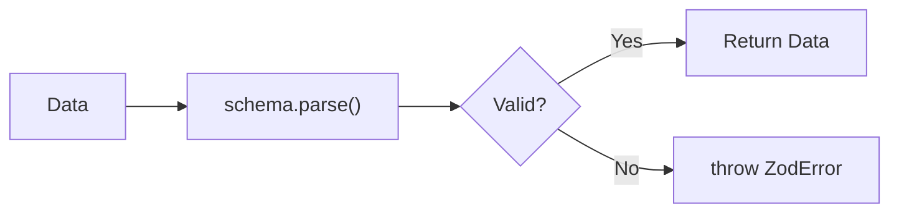
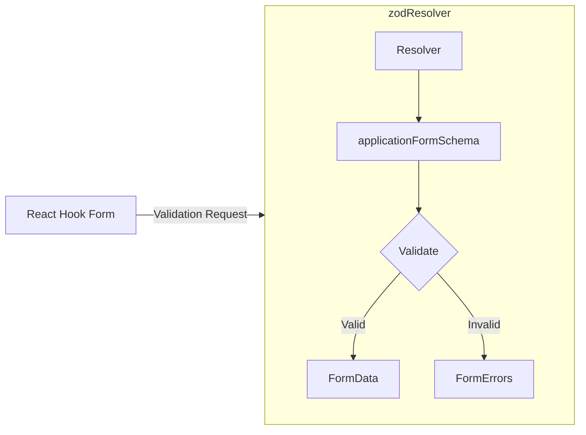
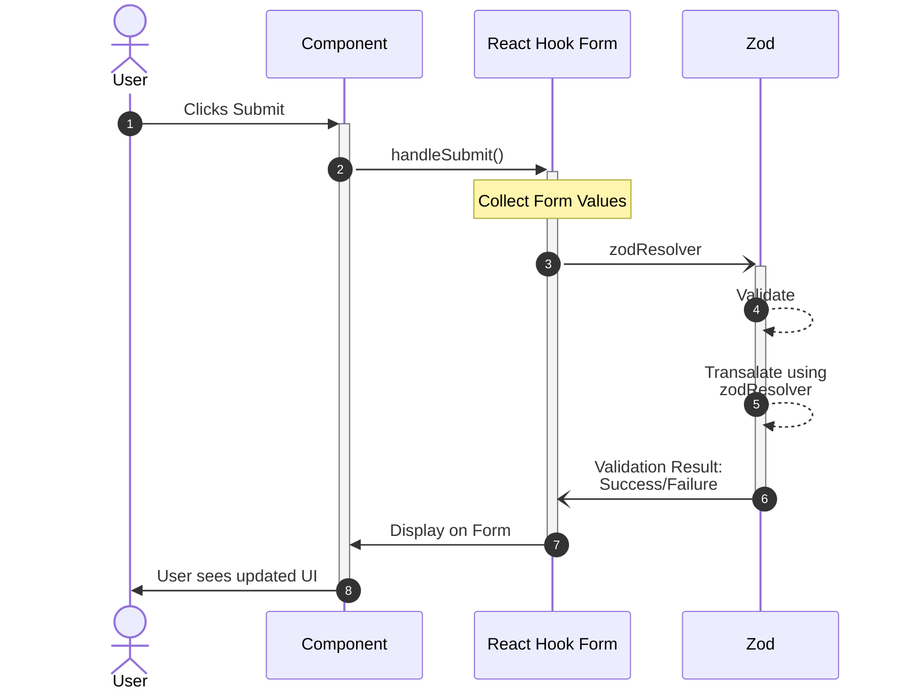

Zod is **not a React library**. It's a TypeScript-first runtime schema validation library. The problem it solves is important because TypeScript alone cannot protect you at runtime.
## 1. The Problem: TypeScript Disappears at Runtime

Suppose you have:
```ts
// models/application.ts

type Application = {
  company: string;
  role: string;
  location: string;
};
```

TypeScript can catch this while you're writing code:
```ts
// examples/application.ts

const application: Application = {
  company: 123, // TypeScript error
  role: "Engineer",
  location: "Boston",
};
```

Great. But suppose data comes from somewhere external, like:
- User input
- API
- localStorage
- JSON file
- URL parameters

At runtime, someone could give you:
```json
{
  "company": "",
  "role": 123,
  "location": null
}
```

Your TypeScript type doesn't actually inspect that data. This is where zod comes in. Zod provides runtime validation on the data. That's the fundamental reason Zod exists.

---

# 2. Installing Zod

```bash
pnpm add zod
```

Then:
```ts
// schemas/application-schema.ts

import { z } from "zod";
```

Most Zod functionality starts from `z`.

# 3. Your First Schema

Instead of only describing a TypeScript type:
```ts
// models/application.ts

type ApplicationFormData = {
  company: string;
  role: string;
  location: string;
};
```

We can create a Zod schema:
```ts
// schemas/application-form-schema.ts

import { z } from "zod";

export const applicationFormSchema = z.object({
  company: z.string(),
  role: z.string(),
  location: z.string(),
});
```

This describes the **runtime rules** for the object.
```
applicationFormSchema
│
├── company → must be string
├── role → must be string
└── location → must be string
```

---

# 4. Actually Validating Data

Creating the schema doesn't validate anything yet. We validate with:
```ts
// examples/zod-validation.ts

applicationFormSchema.parse(data);
```

For example:
```ts
// examples/zod-validation.ts

const data = {
  company: "Google",
  role: "Software Engineer",
  location: "Boston",
};

const result =
  applicationFormSchema.parse(data);
```

This succeeds. But:
```ts
// examples/zod-validation.ts

const data = {
  company: "Google",
  role: 123,
  location: "Boston",
};

applicationFormSchema.parse(data);
```

Fails because `role` was expected to be a `string`, and we got a number.

## `parse()`

`parse()` has this behavior:

 
So:
```ts
// examples/zod-validation.ts

try {
  const application =
    applicationFormSchema.parse(data);

  console.log(application);

} catch (error) {
  console.log(error);
}
```

But throwing exceptions isn't always convenient for forms. That's why Zod has another important API.

## `safeParse()`

```ts
// examples/zod-validation.ts

const result =
  applicationFormSchema.safeParse(data);
```

Instead of throwing, it returns a result. If valid:
```json
// Conceptual result

{
  success: true,
  data: {
    company: "Google",
    role: "Software Engineer",
    location: "Boston"
  }
}
```

If invalid:
```json
// Conceptual result

{
  success: false,
  error: ...
}
```

So:

```ts
// examples/zod-validation.ts

const result =
  applicationFormSchema.safeParse(data);

if (result.success) {
  console.log(result.data);
} else {
  console.log(result.error);
}
```

This is often more convenient when you want to handle validation manually.

# 5. Zod Does More Than Type Checking

So far:
```ts
// schemas/application-form-schema.ts

company: z.string()
```

only says that `company` must be a string, but `""` is also a valid string. For a form, especially for non-empty literals, we would probably attach a minimum length validator.
```ts
// schemas/application-form-schema.ts

company: z
  .string()
  .min(1, "Company is required");
```

Now:
```
"Google"   ✅
"Apple"    ✅
""         ❌
```

We could also enforce the PostgreSQL limit:
```ts
// schemas/application-form-schema.ts

company: z
  .string()
  .min(1, "Company is required")
  .max(255, "Company name is too long");
```

# 6. String Validation

Zod has many useful string validators.
```ts
// examples/zod-strings.ts

z.string().min(3);

z.string().max(255);

z.string().email();

z.string().url();

z.string().uuid();

z.string().regex(...);
```

You can chain them:
```ts
// schemas/user-schema.ts

const emailSchema = z
  .string()
  .min(1, "Email is required")
  .email("Invalid email address")
  .max(255);
```

# 7. Trimming Input

Consider:
```
"       "
```

Technically:
```
"       ".length > 0
```

So this:
```tsx
// schemas/application-form-schema.ts

z.string().min(1)
```

could accept whitespace. Instead:

```ts
// schemas/application-form-schema.ts

company: z
  .string()
  .trim()
  .min(1, "Company is required")
```

Now Zod transforms:
```
"   Google   "
      ↓
"Google"
```

and:
```
"      "
   ↓
""
   ↓
validation fails
```

Very useful for forms.

# 8. Enums

Statuses are perfect for this.
```ts
// schemas/application-form-schema.ts

const applicationStatusSchema = z.enum([
  "APPLIED",
  "RECRUITER_CONTACT",
  "ASSESSMENT",
  "INTERVIEW",
  "FINAL_INTERVIEW",
  "OFFER",
  "REJECTED",
  "WITHDRAWN",
]);
```

Now:
```
"APPLIED"       ✅
"INTERVIEW"     ✅
"banana"        ❌
```

Your application schema can use it:
```ts
// schemas/application-form-schema.ts

export const applicationFormSchema = z.object({
  company: z.string().trim().min(1),
  role: z.string().trim().min(1),
  location: z.string().trim().min(1),
  status: applicationStatusSchema,
});
```

# 9. Optional and Nullable

These mean different things.
### Optional
```ts
// schemas/application-schema.ts

website: z.string().url().optional()
```

means the field can be absent:
```json
// Valid

{}
```

or:
```json
// Valid

{
  website: "https://example.com"
}
```

### Nullable
```ts
// schemas/application-schema.ts

website: z.string().url().nullable()
```

allows:
```json
// Valid

{
  website: null
}
```

**But the property is still expected.** You can combine them:

```ts
// schemas/application-schema.ts

website: z
  .string()
  .url()
  .nullable()
  .optional();
```

# 10. Numbers

```ts
// schemas/example-schema.ts

yearsExperience: z
  .number()
  .min(0)
  .max(50);
```

But remember the HTML problem:
```ts
<input type="number">
```

can still give form libraries a string depending on how it's configured. Zod can also coerce:
```ts
// schemas/example-schema.ts

yearsExperience: z.coerce
  .number()
  .min(0);
```

So, `"5"` goes through zod and becomes `5`. That's validation **and transformation**.

# 11. Dates

Dates are another place where runtime data gets messy. HTML:
```html
<input type="date">
```

usually gives something like:
```text
"2026-09-16"
```

You might validate it as a string, or transform/coerce it depending on your API contract. For example:
```ts
// schemas/application-form-schema.ts

appliedOn: z.string().min(
  1,
  "Applied date is required"
)
```

If the server expects an ISO date string, keeping it as a string can be perfectly reasonable.

# 12. Custom Validation

Suppose you want "applied date cannot be in the future". You can use `refine()`.
```ts
// schemas/application-form-schema.ts

appliedOn: z
  .string()
  .refine(
    value => {
      const appliedDate = new Date(value);
      return appliedDate <= new Date();
    },
    {
      message:
        "Applied date cannot be in the future",
    }
  )
```

`refine()` is essentially:
> Here's my custom validation function.

# 13. Cross-Field Validation

This becomes especially useful for forms. Imagine `startDate` and `endDate`, and `endDate >= startDate`. That's not validation of one field independently. You can validate the entire object:

```ts
// schemas/example-schema.ts

const dateRangeSchema = z
  .object({
    startDate: z.string(),
    endDate: z.string(),
  })
  .refine(
    data =>
      new Date(data.endDate) >=
      new Date(data.startDate),
    {
      message:
        "End date must be after start date",
      path: ["endDate"],
    }
  );
```

The `path` parameter attaches itself to the `endDate`. That becomes very useful with RHF.

# 14. Zod Can Generate Your TypeScript Type

This is one of my favorite parts. Suppose:
```ts
// schemas/application-form-schema.ts

export const applicationFormSchema = z.object({
  company: z.string(),
  role: z.string(),
  location: z.string(),
});
```

Instead of separately writing:
```ts
// models/application-form.ts

type ApplicationFormData = {
  company: string;
  role: string;
  location: string;
};
```

You can do:
```ts
// schemas/application-form-schema.ts

export type ApplicationFormData =
  z.infer<typeof applicationFormSchema>;
```

TypeScript now infers:
```
// Conceptual inferred type

type ApplicationFormData = {
  company: string;
  role: string;
  location: string;
};
```

So you have:
```
             Zod Schema
             /        \
            /          \
Runtime Validation   TypeScript Type
```

One source of truth.

# 15. A More Realistic Schema

I'd structure something like:
```ts
// schemas/application-form-schema.ts

import { z } from "zod";

export const applicationStatusSchema = z.enum([
  "APPLIED",
  "RECRUITER_CONTACT",
  "ASSESSMENT",
  "INTERVIEW",
  "FINAL_INTERVIEW",
  "OFFER",
  "REJECTED",
  "WITHDRAWN",
]);

export const applicationFormSchema = z.object({
  company: z
    .string()
    .trim()
    .min(1, "Company is required")
    .max(255),

  role: z
    .string()
    .trim()
    .min(1, "Role is required")
    .max(255),

  location: z
    .string()
    .trim()
    .min(1, "Location is required")
    .max(255),

  status: applicationStatusSchema,

  appliedOn: z
    .string()
    .min(1, "Applied date is required"),
});

export type ApplicationFormData =
  z.infer<typeof applicationFormSchema>;
```

That's enough Zod knowledge to understand how it fits into React Hook Form.

# 16. Zod + [[React Hook Form]]

Now we combine what you've learned. Without Zod, RHF can validate like this:
```tsx
// components/application-form.tsx

<input
  {...register("company", {
    required: "Company is required",
    maxLength: {
      value: 255,
      message: "Company name is too long",
    },
  })}
/>
```

This works. But as the form grows, your validation becomes scattered throughout JSX:
```
Company input → validation here

Role input → validation here

Location input → validation here

Status input → validation here
```

With Zod:

```
                 Zod Schema
                     ↓
              All validation rules
                     ↓
              React Hook Form
                     ↓
                   Inputs
```

## Install the Resolver

RHF needs an adapter that knows how to ask Zod to validate the form.
```bash
pnpm add @hookform/resolvers
```

Then:
```tsx
// components/application-form.tsx

import { zodResolver } from "@hookform/resolvers/zod";
```

## Connect the Schema to `useForm`

This is the key line:
```tsx
// components/application-form.tsx

const form = useForm<ApplicationFormData>({
  resolver: zodResolver(
    applicationFormSchema
  ),
});
```

That's the connection.


`zodResolver` is basically the translator between the two libraries.

## Now `register()` Gets Simpler

Instead of:
```tsx
// components/application-form.tsx

register("company", {
  required: "Company is required",
  minLength: ...,
  maxLength: ...,
})
```

You simply have:
```tsx
// components/application-form.tsx

<input {...register("company")} />
```

because the rules live here:
```ts
// schemas/application-form-schema.ts

company: z
  .string()
  .trim()
  .min(1, "Company is required")
  .max(255)
```

Much cleaner separation.

## What Happens When the User Submits?

Suppose the user enters:
```
company = ""
role = "Software Engineer"
location = "Boston"
status = "APPLIED"
```

Then:


In this case, the validation results in a failure, so RHF does **NOT** run `onSubmit()`.
## Displaying Zod Errors

RHF still exposes them through:
```tsx
// components/application-form.tsx

const {
  register,
  handleSubmit,
  formState: { errors },
} = useForm<ApplicationFormData>({
  resolver: zodResolver(
    applicationFormSchema
  ),
});
```

Then:
```tsx
// components/application-form.tsx

<input {...register("company")} />

{errors.company && (
  <p>{errors.company.message}</p>
)}
```

If Zod says:
```ts
// schemas/application-form-schema.ts

.min(1, "Company is required")
```

then:
```tsx
// components/application-form.tsx

errors.company?.message
```

contains `Company is required`.

## Complete Example

Schema:
```ts
// schemas/application-form-schema.ts

import { z } from "zod";

export const applicationFormSchema = z.object({
  company: z
    .string()
    .trim()
    .min(1, "Company is required"),

  role: z
    .string()
    .trim()
    .min(1, "Role is required"),

  location: z
    .string()
    .trim()
    .min(1, "Location is required"),

  status: z.enum([
    "APPLIED",
    "ASSESSMENT",
    "INTERVIEW",
  ]),
});

export type ApplicationFormData =
  z.infer<typeof applicationFormSchema>;
```

Form:
```tsx
// components/application-form.tsx

"use client";

import { useForm } from "react-hook-form";
import { zodResolver } from "@hookform/resolvers/zod";

import {
  applicationFormSchema,
  ApplicationFormData,
} from "@/schemas/application-form-schema";

export function ApplicationForm() {
  const {
    register,
    handleSubmit,
    reset,

    formState: {
      errors,
      isSubmitting,
    },
  } = useForm<ApplicationFormData>({
    resolver: zodResolver(
      applicationFormSchema
    ),

    defaultValues: {
      company: "",
      role: "",
      location: "Remote",
      status: "APPLIED",
    },
  });

  async function onSubmit(
    data: ApplicationFormData
  ) {
    console.log(data);

    // await createApplication(data);

    reset();
  }

  return (
    <form onSubmit={handleSubmit(onSubmit)}>
      <div>
        <input
          placeholder="Company"
          {...register("company")}
        />

        {errors.company && (
          <p>{errors.company.message}</p>
        )}
      </div>

      <div>
        <input
          placeholder="Role"
          {...register("role")}
        />

        {errors.role && (
          <p>{errors.role.message}</p>
        )}
      </div>

      <div>
        <input
          placeholder="Location"
          {...register("location")}
        />

        {errors.location && (
          <p>{errors.location.message}</p>
        )}
      </div>

      <div>
        <select {...register("status")}>
          <option value="APPLIED">
            Applied
          </option>

          <option value="ASSESSMENT">
            Assessment
          </option>

          <option value="INTERVIEW">
            Interview
          </option>
        </select>
      </div>

      <button
        type="submit"
        disabled={isSubmitting}
      >
        {isSubmitting
          ? "Adding..."
          : "Add Application"}
      </button>
    </form>
  );
}
```

That's basically the full pattern.

## What Happens on a Successful Submit?

Suppose:
```
Google
Software Engineer
Boston
APPLIED
```

RHF collects:
```json
// Conceptual form data

{
  company: "Google",
  role: "Software Engineer",
  location: "Boston",
  status: "APPLIED"
}
```

Then Zod validates it. If valid, your `data` is now both:
- **runtime validated by Zod**, and
- **statically typed by TypeScript**.

Then:
```tsx
// components/application-form.tsx

async function onSubmit(
  data: ApplicationFormData
) {
  await createApplication(data);

  reset();
}
```

Connects directly to the [[Mutations & Building a CRUD Flow#Service|service layer]].

# 17. What About the Server?

This is worth emphasizing because you're using both. You might wonder:
> If Zod validates it, why does my server need validation?

Because **never trust the client**. Someone can completely bypass your React application and call `POST /applications`. So your architecture should be:
```
Browser
  │
  ▼
React Hook Form
  │
  ▼
Zod
  │
  │ client validation
  ▼
ApplicationService
  │
  ▼
HTTP
  │
  ▼
FastAPI
  │
  ▼
Pydantic
  │
  │ server validation
  ▼
Business Logic
  │
  ▼
SQLAlchemy
  │
  ▼
PostgreSQL
```

Their responsibilities are different:

|Technology|Responsibility|
|---|---|
|TypeScript|Compile-time type safety|
|React Hook Form|Form state/mechanics|
|Zod|Client runtime validation|
|Pydantic|Server runtime/API validation|
|PostgreSQL|Database constraints|

There is some intentional overlap between Zod and Pydantic. For example:
```
Zod:
company max 255

Pydantic:
company max 255

PostgreSQL:
VARCHAR(255)
```

That isn't necessarily bad duplication. They're enforcing the rule at different trust boundaries.