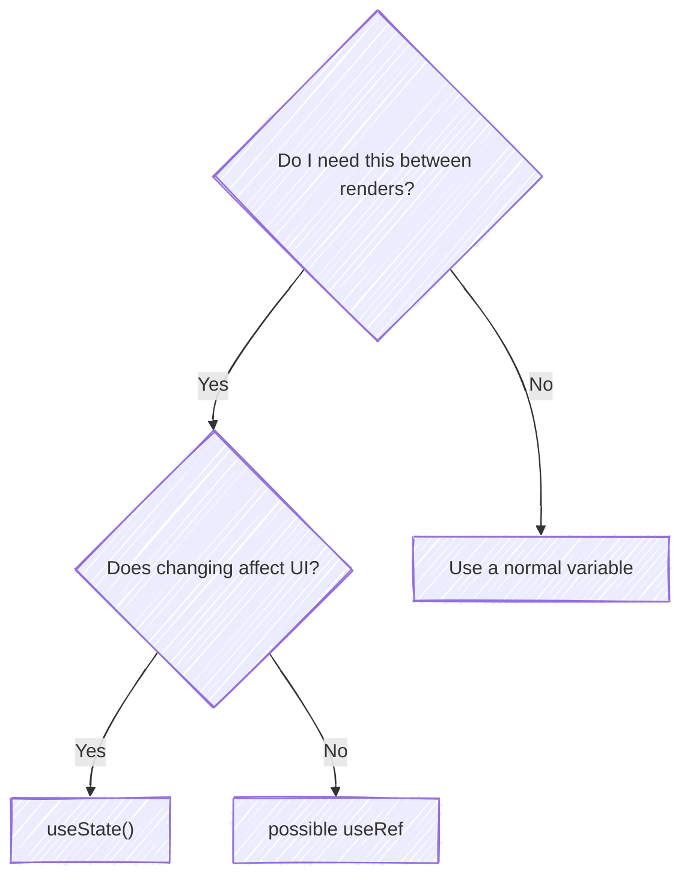
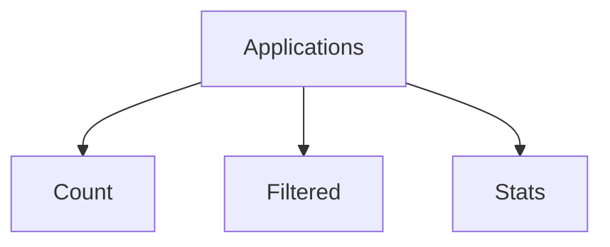
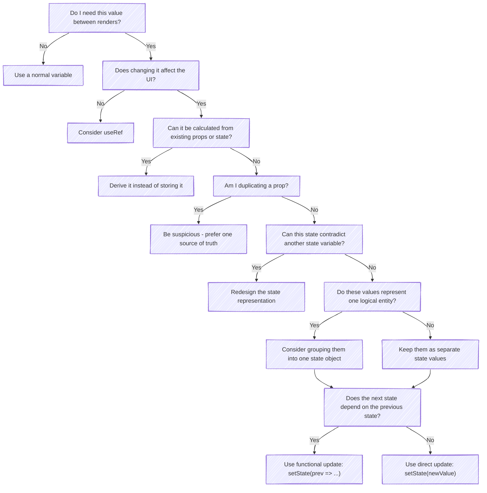

## [[State and Data Flow|State]] Design

```tsx
const [count, setCount] = useState(0);
setCount(c => c + 1);
```

So we'll focus on the decisions that actually matter in real applications: **what should be state, how should it be structured, and how should it be updated?**

---
## What Should Be State?

Before creating `useState`, ask:
> **Does this value need to persist between renders, and can changing it affect the UI?**

Good state:
```tsx
const [searchQuery, setSearchQuery] = useState("");
const [selectedStatus, setSelectedStatus] = useState("APPLIED");
const [applications, setApplications] = useState<Application[]>([]);
const [isModalOpen, setIsModalOpen] = useState(false);
```

Things that usually shouldn't be state:
```tsx
const [fullName, setFullName] = useState("");
const [filteredApplications, setFilteredApplications] = useState([]);
```

If they can simply be calculated:
```tsx
const fullName = `${firstName} ${lastName}`;
const filteredApplications = applications.filter(
  app => app.status === selectedStatus
);
```

A useful decision tree:


## Choosing between Multiple States or One State object
### When values are related - One State Object
Suppose we have:
```tsx
const [firstName, setFirstName] = useState("");
const [lastName, setLastName] = useState("");
const [email, setEmail] = useState("");
```

This can also be encapsulated as
```tsx
const [user, setUser] = useState({
  firstName: "",
  lastName: "",
  email: "",
});
```

#### Updating Object states
Given that we are considering states to be immutable, updating a state object should not be `user.email = "new@email.com"`. Copy the original state and override the value
```tsx
setUser({
	...user,
	email: "new@email.com"
});
```
This would copy the state and override the original `email`

#### Prefer Functional updates when updating object states
This would keep track of previous state updates when updating a new state. Multiple state updates will not be reflecting the same snapshot
```tsx
setUser(user => {
	...user,
	email: "new@email.com"
});
```

### When values are unrelated - Multiple States
```tsx
const [search, setSearch] = useState("");
const [status, setStatus] = useState<ApplicationStatus>("APPLIED");
const [modalOpen, setModalOpen] = useState(false);
```

> **DO NOT** create one giant state


## State Updates with Form
```tsx
type ApplicationForm = {
  company: string;
  role: string;
  location: string;
};

const [form, setForm] = useState<ApplicationForm>({
  company: "",
  role: "",
  location: "",
});

...

<input
  value={form.company}
  onChange={e =>
    setForm(form => ({
      ...form,
      company: e.target.value,
    }))
  }
/>
```

However, this would work if we know that we are updating the `company` attribute. We can modify this to infer the field name dynamically

```tsx
const handleChange = (
  e: React.ChangeEvent<HTMLInputElement>
) => {
  const { name, value } = e.target;

  setForm(form => ({
    ...form,
    [name]: value,
  }));
};

...

<input
  name="company"
  value={form.company}
  onChange={handleChange}
/>

<input
  name="role"
  value={form.role}
  onChange={handleChange}
/>
```

## DON'Ts in State Design

### Avoid Nested States
If you're constantly writing:
```tsx
{
  ...state,
  something: {
    ...state.something,
    anotherThing: {
      ...state.something.anotherThing,
      ...
    }
  }
}
```
That's often a sign your state structure could be improved.

### Avoid Derived States
Consider:
```tsx
const [applications, setApplications] =
  useState<Application[]>([]);

const [applicationCount, setApplicationCount] =
  useState(0);
```

This is dangerous because now you must ensure:
```tsx
applications.length === applicationCount
```
forever.

Someone could update:
```tsx
setApplications(...)
```

and forget:
```tsx
setApplicationCount(...)
```

Instead:
```tsx
const applicationCount = applications.length;
```

Always keep **one source of truth**

In this way, updating applications will correctly synchronize with the other changes

### Avoid Contradictory States
```tsx
const [isOpen, setIsOpen] = useState(false);
const [isClosed, setIsClosed] = useState(true);
```

These two states are dependent on each other and contradict each other; hence, a change in one will require a change in the other, and this must be implemented everywhere without fail to prevent breaking the application. 

A better design would be to keep one state and derive the other
```tsx
const [isOpen, setIsOpen] = useState(false);
const isClosed = !isOpen;
```

#### But what if we have multiple states that control one flow?
```tsx
const [isLoading, setIsLoading] = useState(false);
const [isSuccess, setIsSuccess] = useState(false);
const [isError, setIsError] = useState(false);
```
Given,
1. Only one state can be active at a time, and
2. We cannot derive other states from just one
We create a state object to ensure only one state exists at a given time
```tsx
type RequestStatus =
  | "idle"
  | "loading"
  | "success"
  | "error";

const [status, setStatus] =
  useState<RequestStatus>("idle");
```

### Avoid using Props in States
[[Components, JSX, and TSX#Props|Props]] already control rendering in React; however, **changing a prop does not guarantee a reset of the state.** Consider the following
```tsx
/* components/application.tsx */
function Application() {
	const [application, setApplication()] = useState<Application>({
		// ...
		status: "APPLIED"
	});
	
	return (
		<>
			...
			<ApplicationCard application={application} />
		</>
	);
}


/* components/application-card.tsx */
type Props = {
  application: Application;
};

function ApplicationCard({ application }: Props) {
  const [status, setStatus] =
    useState(application.status);
  return (
	  <p>Status = {status}</p>
  )
}
```

Now, when the parent updates application via 
```tsx
/* components/application.tsx */
setApplication({
	...application,
	status: "INTERVIEW"
});
```

React will
1. Re-render the parent
2. Re-render the child
	1. React sees `ApplicationCard` to be in the same place in the component tree before and after the re-render
	2. React does not reset the `status` state in `ApplicationCard`
This happens because React does not link the status to the parent
#### Corrected version
```tsx
/* components/application.tsx */
function Application() {
	const [application, setApplication()] = useState<Application>({
		// ...
		status: "APPLIED"
	});
	
	return (
		<>
			...
			<ApplicationCard application={application} />
		</>
	);
}


/* components/application-card.tsx */
type Props = {
  application: Application;
};

function ApplicationCard({ application }: Props) {
  return (
	  <p>Status = {application.status}</p>
  )
}
```

## Lazy Initialization of States
Sometimes, state initialization can be expensive
```tsx
const [applications, setApplications] = useState<Application[]>(loadApplicationsFromDB());
```

`loadApplicationsFromDB()` will be called every time the component function executes even though it is required for the initial state

Changing it to an initializer function
```tsx
const [applications, setApplications] = useState<Application[]>(() => loadApplicationsFromDB());
```
React will now use it only for initialization

## Final Flow for State Design

