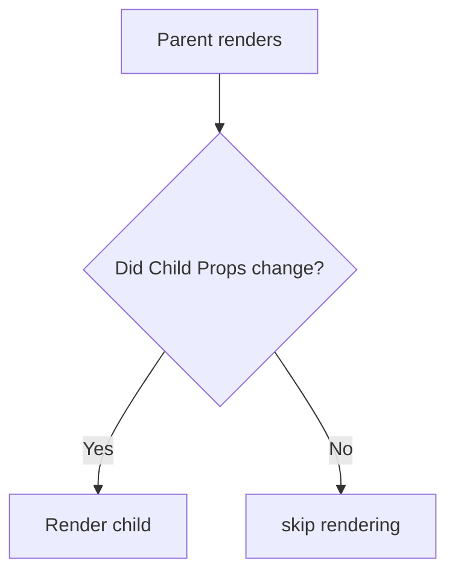
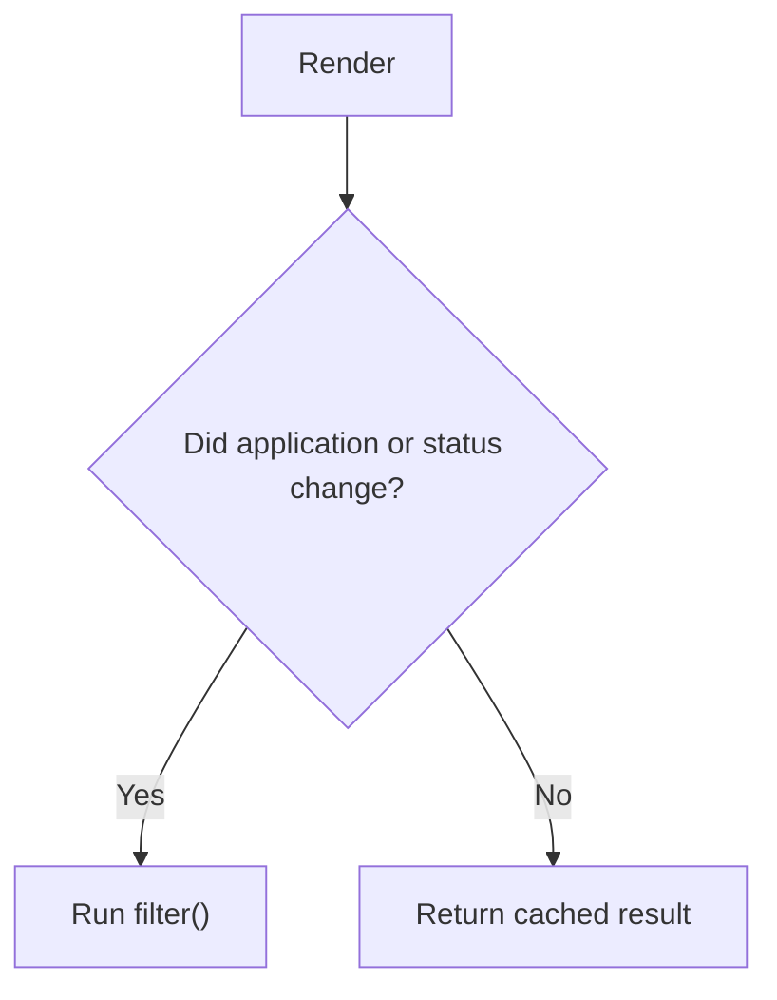

# 1. What Causes a Component to Render?

A component renders when React needs to execute that component function to determine what its UI should look like. The three situations you should know are:
1. Component mounts
2. Its state changes
3. Its parent renders

Context can also cause renders when a consumed context value changes. For example:
```tsx
// components/counter.tsx

function Counter() {
  const [count, setCount] = useState(0);

  console.log("Counter rendered");

  return (
    <button onClick={() => setCount(c => c + 1)}>
      {count}
    </button>
  );
}
```

Clicking the button:
```
setCount()
    ↓
state changes
    ↓
Counter renders
    ↓
React gets new JSX
    ↓
React reconciles it against previous output
    ↓
DOM updated where necessary
```

One important distinction:
> **Render ≠ DOM update.**

React may execute your component function without ultimately changing the DOM.

# 2. Parent Renders → Children Normally Render

This is one of the most important React behaviors to understand. Consider:
```jsx
// components/dashboard.tsx

function Dashboard() {
  const [count, setCount] = useState(0);

  return (
    <>
      <button onClick={() => setCount(c => c + 1)}>
        {count}
      </button>

      <ApplicationList />
    </>
  );
}
```

And:
```jsx
// components/application-list.tsx

function ApplicationList() {
  console.log("ApplicationList rendered");

  return <div>Applications</div>;
}
```

When `count` changes:
```
Dashboard state changes
        ↓
Dashboard renders
        ↓
ApplicationList renders
```

Even though `ApplicationList` doesn't care about `count`. By default, when a component renders, React normally renders the child components it directly invokes as part of that render. This becomes important with large component trees.

# 3. React Doesn't Just Re-render When Props Change

A common misconception is:
> "A component only re-renders if its props change."

Given:
```
Dashboard
│
├── Header
│
└── ApplicationList
    ├── ApplicationCard
    ├── ApplicationCard
    ├── ApplicationCard
    └── ...
```

If `Dashboard` renders, React may execute a substantial portion of that subtree again. Usually that's fine. React rendering is designed to be relatively cheap. But sometimes a child is expensive enough that we want to tell React:
> If its inputs haven't changed, don't bother rendering it again.

That's where `React.memo` enters.

# 4. `React.memo`

Suppose:
```tsx
// components/application-list.tsx

type Props = {
  applications: Application[];
};

function ApplicationList({ applications }: Props) {
  console.log("ApplicationList rendered");

  return (
    <>
      {applications.map(application => (
        <ApplicationCard
          key={application.id}
          application={application}
        />
      ))}
    </>
  );
}

export default React.memo(ApplicationList);
```

Now React remembers the previous props. Conceptually:


So if some unrelated state changes:
```tsx
// components/dashboard.tsx

const [sidebarOpen, setSidebarOpen] = useState(false);
```

but:
```tsx
<ApplicationList applications={applications} />
```

receives the same `applications`, React can skip rendering the memoized list.

## `memo` Uses Shallow Comparison

Here's where things get interesting. React compares props using essentially **shallow equality**, with `Object.is` semantics per prop. Primitive values are straightforward.
```tsx
// components/dashboard.tsx

<ApplicationList page={1} />
```

If the previous value was `page = 1` and the current value is `page = 2`, React will render the component. But objects, arrays, and functions introduce **referential equality**. This is the concept you really need before understanding the remaining hooks.

## Referential Equality

Consider JavaScript:
```javascript
// examples/referential-equality.ts

const a = [1, 2, 3];
const b = [1, 2, 3];
console.log(a === b); // false
```

Why? Because the contents are identical, but they're **different objects**. Compare:
```javascript
// examples/referential-equality.ts

const a = [1, 2, 3];
const b = a;

console.log(a === b); // true
```

Now, they share the same location in memory. React performance optimizations rely heavily on this concept.

## How This Can Break `React.memo`

Suppose:
```tsx
// components/dashboard.tsx

function Dashboard() {
  const [count, setCount] = useState(0);

  const applications = [
    { id: "1", company: "Google" },
    { id: "2", company: "Notion" },
  ];

  return (
    <>
      <button onClick={() => setCount(c => c + 1)}>
        {count}
      </button>

      <ApplicationList applications={applications} />
    </>
  );
}
```

Every time `Dashboard` renders, this executes again:
```tsx
// components/dashboard.tsx

const applications = [
  ...
];
```

A **new array** is created. Therefore, the old value of `applications` does not match the new value, even though they have identical contents. `React.memo` sees a changed prop and renders `ApplicationList` anyway. This is one problem `useMemo` can solve.

# 5. `useMemo`

`useMemo` caches the **result of a calculation** between renders.

```tsx
// components/dashboard.tsx

const value = useMemo(
  () => calculateSomething(),
  [dependencies]
);
```

For example:
```tsx
// components/dashboard.tsx

const visibleApplications = useMemo(() => {
  return applications.filter(
    application => application.status === status
  );
}, [applications, status]);
```

React's logic is approximately:


So the expensive calculation isn't repeated unnecessarily.

### ApplyFlow Example

Imagine 2,000 applications. You have:
```tsx
// components/application-dashboard.tsx

const filteredApplications = applications
  .filter(application => application.status === filter)
  .sort((a, b) =>
    b.appliedOn.localeCompare(a.appliedOn)
  );
```

Every render recalculates this. Even if the render was caused by something unrelated:
```tsx
// components/application-dashboard.tsx

setSidebarOpen(true);
```

You might instead use:
```tsx
// components/application-dashboard.tsx

const filteredApplications = useMemo(() => {
  return applications
    .filter(
      application => application.status === filter
    )
    .toSorted((a, b) =>
      b.appliedOn.localeCompare(a.appliedOn)
    );
}, [applications, filter]);
```

Now the calculation reruns only when the `application` or the `filter` changes. Notice I used `toSorted()` here rather than `sort()` because `sort()` mutates its array. Keeping transformations non-mutating avoids some nasty state bugs.

## `useMemo` Can Also Preserve References

There's another reason `useMemo` matters. Remember:

```
React.memo
     ↓
compares props
     ↓
objects/arrays compared by reference
```

If you calculate:
```tsx
// components/dashboard.tsx

const filteredApplications =
  applications.filter(...);
```

`filter()` creates a new array every render. So, both renders might have different memory locations even if the contents are identical. But:
```tsx
// components/dashboard.tsx

const filteredApplications = useMemo(
  () => applications.filter(...),
  [applications, filter]
);
```

React can preserve the same array reference until its dependencies change. That makes it useful alongside `React.memo`.

## `useMemo` Does NOT Mean "Memoize Everything"

Don't start writing:
```tsx
// components/profile.tsx

const fullName = useMemo(
  () => `${firstName} ${lastName}`,
  [firstName, lastName]
);
```

That's probably pointless. Just:
```tsx
// components/profile.tsx

const fullName = `${firstName} ${lastName}`;
```

is clearer. `useMemo` itself has overhead. Use it when:
- a calculation is meaningfully expensive, **or**
- preserving reference identity matters for another optimization.

# 6. Functions Have Referential Identity Too

Now consider:
```javascript
// examples/function-reference.ts

const a = () => console.log("hello");
const b = () => console.log("hello");

a === b; // false
```

Same reason as arrays. They're separate function objects. This becomes relevant when functions are passed as props.

# 7. The Function Prop Problem

Suppose:
```tsx
// components/dashboard.tsx

function Dashboard() {
  const [count, setCount] = useState(0);

  function deleteApplication(id: string) {
    // delete...
  }

  return (
    <>
      <button onClick={() => setCount(c => c + 1)}>
        {count}
      </button>

      <ApplicationList
        applications={applications}
        onDelete={deleteApplication}
      />
    </>
  );
}
```

And:
```tsx
// components/application-list.tsx

export default React.memo(ApplicationList);
```

Every time `Dashboard` executes:
```tsx
// components/dashboard.tsx

function deleteApplication(id: string) {
  ...
}
```

A new function object is created. Therefore, `React.memo` sees `deleteApplication()` as different functions on different renders. Thus, rendering the child.

# 8. `useCallback`

`useCallback` caches a **function reference**.
```tsx
// components/dashboard.tsx

const deleteApplication = useCallback(
  (id: string) => {
    // delete
  },
  []
);
```

Now React can preserve the function reference between renders.
```
Render #1 ──┐
Render #2 ──┼──► Same function
Render #3 ──┘
```

until one of its dependencies changes.

# 9. `useMemo` vs `useCallback`

These two are closely related.

### `useMemo`

Caches a **calculated value**:
```tsx
// components/dashboard.tsx

const filtered = useMemo(
  () => applications.filter(...),
  [applications]
);
```

### `useCallback`

Caches a **function**:
```tsx
// components/dashboard.tsx

const handleDelete = useCallback(
  (id: string) => {
    deleteApplication(id);
  },
  []
);
```

# 9. Dependencies Matter

Suppose:
```tsx
// components/application-list.tsx

const deleteRejected = useCallback(() => {
  setApplications(
    applications.filter(
      application =>
        application.status !== "REJECTED"
    )
  );
}, [applications]);
```

The function uses `applications`; therefore, it needs `[applications]`. When `applications` changes, React creates a new callback. Otherwise, you'd risk the function using an old value — a **stale closure**, which connects directly to what you learned with [[useEffect and Side Effects|`useEffect`]]. Sometimes functional state updates can remove that dependency:
```tsx
// components/application-list.tsx

const deleteRejected = useCallback(() => {
  setApplications(current =>
    current.filter(
      application =>
        application.status !== "REJECTED"
    )
  );
}, []);
```

Now the callback doesn't capture `applications`.

# 10. Putting `memo` + `useMemo` + `useCallback` Together

Imagine:
```tsx
// components/application-dashboard.tsx

function ApplicationDashboard() {
  const [applications, setApplications] =
    useState<Application[]>([]);

  const [filter, setFilter] =
    useState<ApplicationStatus>("APPLIED");

  const [sidebarOpen, setSidebarOpen] =
    useState(false);

  const visibleApplications = useMemo(() => {
    return applications.filter(
      application =>
        application.status === filter
    );
  }, [applications, filter]);

  const handleDelete = useCallback(
    (id: string) => {
      setApplications(current =>
        current.filter(
          application => application.id !== id
        )
      );
    },
    []
  );

  return (
    <>
      <Sidebar
        open={sidebarOpen}
        onOpenChange={setSidebarOpen}
      />

      <ApplicationList
        applications={visibleApplications}
        onDelete={handleDelete}
      />
    </>
  );
}
```

And:
```tsx
// components/application-list.tsx

type Props = {
  applications: Application[];
  onDelete: (id: string) => void;
};

function ApplicationList({
  applications,
  onDelete,
}: Props) {
  console.log("ApplicationList rendered");

  return (
    <>
      {applications.map(application => (
        <ApplicationCard
          key={application.id}
          application={application}
          onDelete={onDelete}
        />
      ))}
    </>
  );
}

export default React.memo(ApplicationList);
```

Now imagine:
```
sidebarOpen changes
        ↓
ApplicationDashboard renders
        ↓
useMemo
applications/filter unchanged
        ↓
same visibleApplications reference

useCallback
dependencies unchanged
        ↓
same handleDelete reference
        ↓
ApplicationList receives same props
        ↓
React.memo
        ↓
SKIP RENDER
```

That's how these three tools often work together.

# 11. Don't Turn This Into Optimization Soup

This is the biggest practical warning. You **do not** want every React component looking like:
```tsx
// Please don't do this blindly

const x = useMemo(...);
const y = useMemo(...);

const foo = useCallback(...);
const bar = useCallback(...);

export default memo(Component);
```

React is already pretty good at rendering UI. Overusing memoization:
- makes code harder to read,
- adds dependency management,
- has its own runtime/memory cost,
- can provide zero meaningful benefit.

And modern React tooling, including the React Compiler when enabled, can reduce the need for some manual memoization patterns. So your default should still be:
```tsx
// components/application-list.tsx

const filtered =
  applications.filter(...);
```

Then optimize when there's a reason.

# 12. When Should I Actually Optimize?

A good workflow is:
```
Build normally
     ↓
Notice / measure performance issue
     ↓
Find expensive component/calculation
     ↓
Understand WHY it's rendering
     ↓
Optimize the specific problem
```

Not:
```
Write component
     ↓
PANIC
     ↓
useMemo everything
```

# 13. One More Important Distinction

These three are often grouped together, but they optimize different things:

| Tool                    | What it memoizes                   |
| ----------------------- | ---------------------------------- |
| `React.memo(Component)` | Component rendering based on props |
| `useMemo(() => value)`  | Calculated **value**               |
| `useCallback(() => {})` | **Function reference**             |
