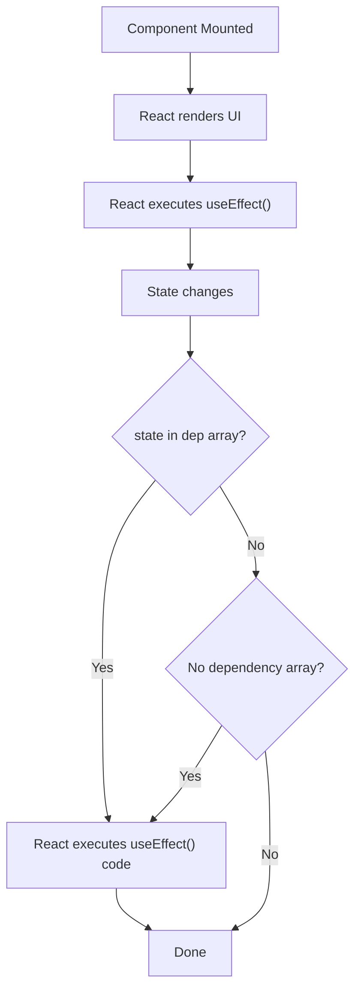
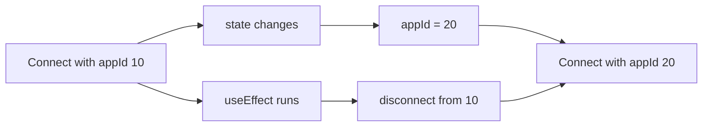
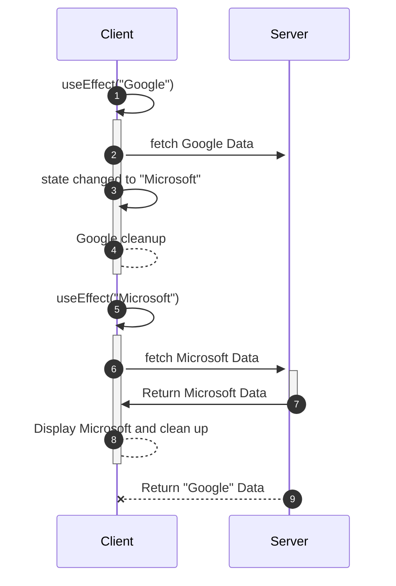

## Side Effects
Assume the following component
```tsx
function ApplicationCard({ application }: Props) {
  return (
    <div>
      <h2>{application.company}</h2>
      <p>{application.status}</p>
    </div>
  );
}
```

[[Rendering]] is mostly related to the UI and how the UI changes with changes to the [[State and Data Flow|states]]. But, in a real application, things like `applications` need to interact with external changes as well, such as DB retrieval. These interactions are called **side effects**
Some examples
For example:

```tsx
localStorage.setItem("theme", theme);
document.title = "ApplyFlow";
const timer = setInterval(...);
```

## `useEffect`
> `useEffect` lets you synchronize a React component with something outside React.

```tsx
import { useEffect } from "react";

useEffect(() => {
	// side effects
}, [dependencies]);
```

Example
```tsx
function ApplicationPage() {
  const [status, setStatus] = useState("APPLIED");

  useEffect(() => {
    document.title = `Applications - ${status}`;
  }, [status]);

  return ...
}
```


> [!NOTE] Notice the ordering
> `useEffect` does not execute while React is rendering the component. It fires up after React has committed the changes

### Why require `useEffect` when we can change it directly?

React's rendering should be pure. The rendering should only affect those parts of the UI that require the changes and not touch external factors.

## The dependency array
```tsx
useEffect(() => {
	// ...
}, [dependencies]);
```

The dependency array tells React that this effect **depends** on these variables. React compares the values of the particular variable before and after rendering, and fires the effect accordingly
### No dependency array

```tsx
useEffect(() => {
  console.log("Effect");
});
```

No dependency array implies that React will run the effect every time it renders the component.

### Empty array

```tsx
useEffect(() => {
  console.log("Effect");
}, []);
```

An empty array tells React that this effect **does not** depend on any variables, but unlike no array, React does not fire it up after every render. React only fires it when it mounts the component in the tree.

### Array with dependencies

```tsx
useEffect(() => {
  console.log("Effect");
}, [status]);
```

React fires the effect when the component is mounted in the tree and fires it again after every render when the variable changes.
#### Infinite Effect Loop
When using an array of dependencies, one **should not make changes to the dependencies inside `useEffect()`**; otherwise, it will cause an infinite loop.
```tsx
const [count, setCount] = useState(0);

useEffect(() => {
  setCount(count + 1); // DO NOT ❌
}, [count]);
```

### Final Flowchart



## Cleanup Functions
Sometimes, `useEffect` might require a certain cleanup. This is done by returning a function from the `useEffect` body
```tsx
useEffect(() => {
  const timer = setInterval(() => {
    console.log("Checking...");
  }, 1000);

  return () => {
    clearInterval(timer);
  };
}, []);
```

Cleanup happens every time the function is executed, even if it has to execute again. 
```tsx
useEffect(() => {
	const connection = connectFor(applicationId);
	return () => {
		connection.disconnect();
	};
}, [applicationId]);
```



## Fetching data with `useEffect()`

`useEffect` is perfect to use for fetching data when loading.
```tsx
function ApplicationsPage() {
  const [applications, setApplications] =
    useState<Application[]>([]);

  useEffect(() => {
    fetch("/api/applications")
      .then(response => response.json())
      .then(data => setApplications(data));
  }, []);

  return ...
}
```

Here, React proceeds as follows:
1. Mounts the component
2. Renders the empty state
3. Commits it to the tree
4. Runs the effect
5. Data is set to state; a state change is detected
6. React re-renders the component, but with a populated state variable this time

## Async `useEffect`
Every async function or promise when passed to `useEffect` should either return nothing or a cleanup function. Promise callbacks should not go to `useEffect`

```tsx
useEffect(async () => {
  const response = await fetch("/api/applications"); // returns a promise; wrong ❌
}, []);
```

```tsx
useEffect(() => {
  async function loadApplications() {
    const response =
      await fetch("/api/applications");

    const data =
      await response.json();

    setApplications(data);
  }

  loadApplications(); // promise handled by the async function; correct ✅
}, []);
```

## Race conditions

`useEffect` can be a bottleneck for requests and can lead to race conditions. Consider the example below when `company` changes from "Google" to "Microsoft".
```tsx
useEffect(() => {
  fetch(`/api/applications?company=${company}`)
    .then(res => res.json())
    .then(data => setApplications(data));
}, [company]);
```

The client will send out two requests, but they aren't guaranteed to come back in order. It could be possible that the Microsoft entry comes before the Google one, and then the Google entry overrides the data, displaying incorrect values.

### AbortController
`AbortController` is a browser API used to **cancel an ongoing asynchronous operation**, most commonly a `fetch()` request.
In React, it matters because a component can re-render, unmount, or start a newer request before an older request finishes.
```tsx
const controller = new AbortController();

fetch("/api/applications", {
  signal: controller.signal, // exposes this to fetch API
});
```

We can use `controller.signal()` to abort the operation while cleanup
```tsx
useEffect(() => {
  const controller = new AbortController();

  async function loadApplications() {
    try {
      const response = await fetch(
        `/api/applications?company=${company}`,
        {
          signal: controller.signal,
        }
      );

      const data = await response.json();

      setApplications(data);
    } catch (error) {
      if (error instanceof Error &&
          error.name !== "AbortError") {
        console.error(error);
      }
    }
  }

  loadApplications();

  return () => {
    controller.abort();
  };
}, [company]);
```


The Google data, when returned, does nothing because `useEffect()` has already called the cleanup on it. When used with `fetch`, the request is aborted, and no data comes back.

## Object Dependencies
Consider:
```tsx
const filters = {
  status,
  company,
};

useEffect(() => {
  searchApplications(filters);
}, [filters]);
```

Remember: the component function executes again on renders.
So this:
```tsx
const filters = {
  status,
  company,
};
```
creates a **new object** every time any filter is changed

Conceptually:
```
Render #1
filters → Object A

Render #2
filters → Object B
```

Even if Object A and Object B are the same, `useEffect()` checks the reference in memory, which has thus changed since the last update, making them different object references. That can cause the effect to rerun unnecessarily. Often you can simply depend on the actual values:
```tsx
useEffect(() => {
  searchApplications({
    status,
    company,
  });
}, [status, company]);
```

We'll revisit object/function identity when we learn `useMemo` and `useCallback`.

## State Closures
This is one of the harder React concepts. Consider:
```tsx
function Counter() {
  const [count, setCount] = useState(0);

  useEffect(() => {
    const timer = setInterval(() => {
      console.log(count);
    }, 1000);

    return () => clearInterval(timer);
  }, []);
}
```

Suppose initially, `count = 0`, and we click until `count = 5`. What might the interval continue logging?
```text
0
0
0
0
0
```

Why? Because [[State and Data Flow#State is a *Snapshot*|a state is a snapshot]]/ The effect was created during the render when `count` was 0, and because the dependencies are that effect isn't recreated when `count` changes. Its callback therefore retains access to that render's `count`. That's a **stale closure**.
### Fixing the Dependency

If the effect genuinely needs the latest `count`:
```tsx
useEffect(() => {
  const timer = setInterval(() => {
    console.log(count);
  }, 1000);

  return () => clearInterval(timer);
}, [count]); // Make sure useEffect depends on count
```

Now, when `count` changes:
```
count = 0
 ↓
create interval using 0

count = 1
 ↓
cleanup old interval
 ↓
create interval using 1

count = 2
 ↓
cleanup
 ↓
create interval using 2
```

> [!NOTE] Is this the best design?
> Whether this is the best design depends on what you're trying to accomplish, but the dependency relationship is now correct.

## Event Handler vs Effect

Ask:
> **"Did this happen because the user did something specific?"**

Use an event handler:
```tsx
function handleSubmit() {
  saveApplication();
}
```

> **"Does this external system need to stay synchronized while this component exists?"**

Use an effect:
```tsx
useEffect(() => {
  const connection = connect(applicationId);

  return () => connection.disconnect();
}, [applicationId]);
```

## `StrictMode` and Effects

During development, you might write:
```tsx
useEffect(() => {
  console.log("CONNECTED");

  return () => {
    console.log("DISCONNECTED");
  };
}, []);
```

and see something resembling:
```
CONNECTED
DISCONNECTED
CONNECTED
```

You might think React is broken. It's intentional development behavior under React's `StrictMode`. React can perform an extra setup → cleanup → setup cycle to expose effects that aren't implemented correctly. Your effect should be robust enough that:
```
setup
cleanup
setup
```

works correctly. Production behavior doesn't perform that development-only stress test in the same way. So **don't "fix" it by trying to prevent the second effect execution with a ref.**

## DON'Ts in `useEffect`
### Do not use it to synchronize React States

This is arguably the most important part of this lesson. Beginners frequently use effects to synchronize React state with other React state. For example:
```tsx
const [firstName, setFirstName] = useState("");
const [lastName, setLastName] = useState("");

const [fullName, setFullName] = useState("");

useEffect(() => {
  setFullName(`${firstName} ${lastName}`);
}, [firstName, lastName]);
```

Besides, **you should never** [[State Design with useState#Avoid Derived States|use derived states]]. This is unnecessary. You already have everything required:
```tsx
const fullName = `${firstName} ${lastName}`;
```

### Don't Use Effects for Filtering Either

Avoid:
```tsx
const [filteredApplications, setFilteredApplications] =
  useState<Application[]>([]);

useEffect(() => {
  setFilteredApplications(
    applications.filter(
      app => app.status === selectedStatus
    )
  );
}, [applications, selectedStatus]);
```

Just:
```tsx
const filteredApplications =
  applications.filter(
    app => app.status === selectedStatus
  );
```

Again:
> If you can calculate something during rendering, you usually don't need an effect.

---

### Don't Use Effects for User Events

Suppose you want to submit an application:
```tsx
const [submitted, setSubmitted] = useState(false);

useEffect(() => {
  if (submitted) {
    submitApplication();
  }
}, [submitted]);
```

Why? The thing that caused the action is already known:
```html
<button onClick={submitApplication}>
  Submit
</button>
```

Use event handlers for **user actions**. Use effects for **synchronization caused by the component existing/rendering with particular state**. That's an important distinction.