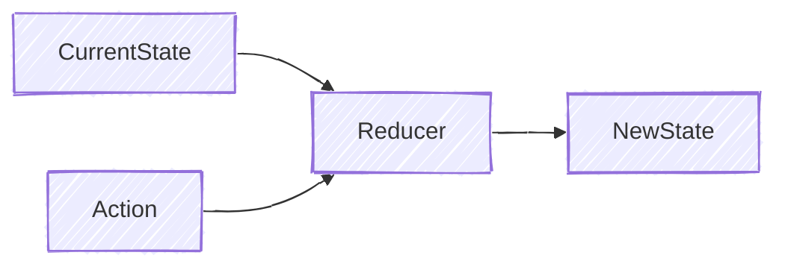
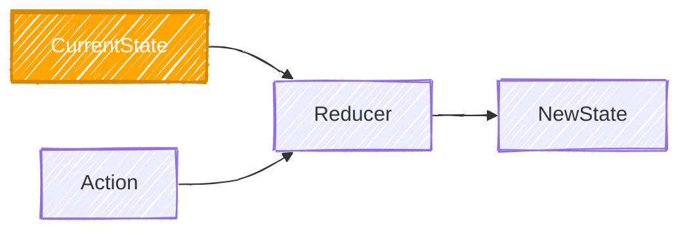
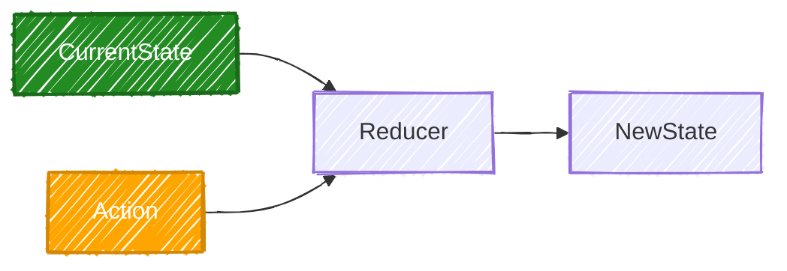
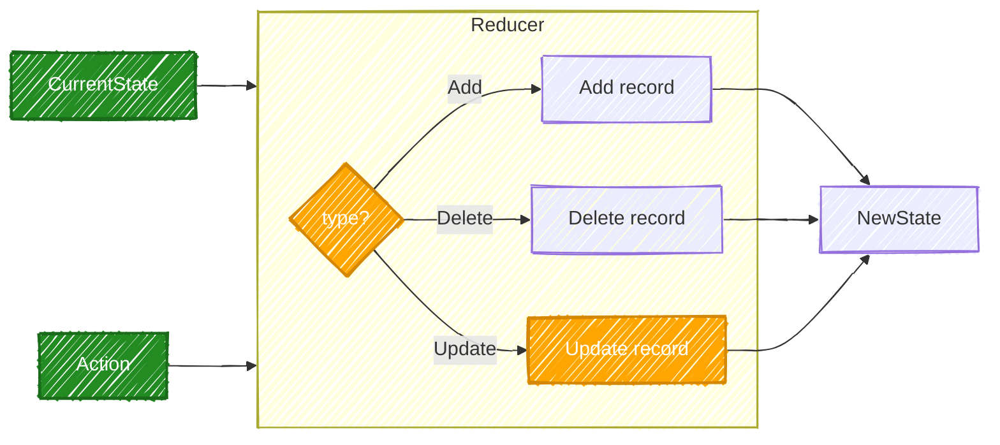
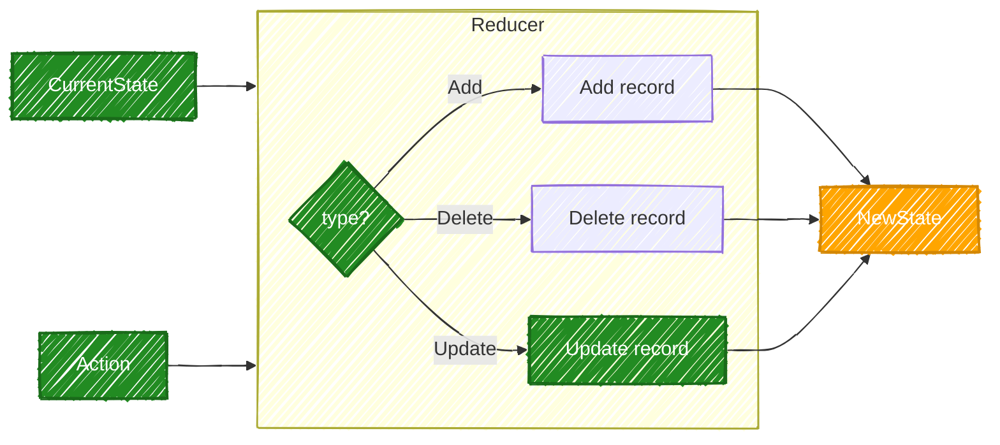
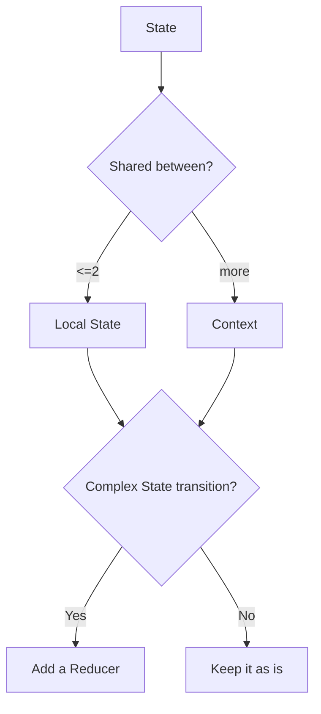

Let us assume a real-world system that manages applications. Creating a [[State and Data Flow|State]] can be something like `const [applications, setApplications] = useState<Application[]>([])`. But there are a lot of operations to be performed like:
- Add application
- Delete application
- Change status
- Edit application
- Archive application
- Restore application

The state updates start becoming complicated. Here is where a Reducer comes into the picture. Instead of a component directly changing the state, it selects a set of actions given to it by the Reducer. The Reducer then takes care of how the action is supposed to be performed.

## Creating a Reducer
```tsx
// components/application-manager.tsx

const [state, dispatch] = useReducer(
  reducer,
  initialState
);
```

## Building the Reducer
```tsx
// reducers/application-reducer.ts

type Application = {
  id: string;
  company: string;
  status: string;
};

type ApplicationAction =
   {
      type: "ADD";
      application: Application;
    }
  | {
      type: "DELETE";
      id: string;
    }
  | {
      type: "STATUS_CHANGED";
      id: string;
      status: string;
    };
    
export function applicationReducer(
  state: Application[],
  action: ApplicationAction
): Application[] {

  switch (action.type) {

    case "ADD":
      return [...state, action.application];

    case "DELETE":
      return state.filter(
        application => application.id !== action.id
      );

    case "STATUS_CHANGED":
      return state.map(application =>
        application.id === action.id
          ? {
              ...application,
              status: action.status,
            }
          : application
      );

    default:
      return state;
  }
}
```

Reducer upholds the [[State and Data Flow#States must be treated as immutable|immutability]] rules of a State. It does not modify the state it gets from the component, but rather returns a new state.

## Using the Reducer
```tsx
// components/application-manager.tsx

const [applications, dispatch] = useReducer(
  applicationReducer,
  []
);

dispatch({
  type: "STATUS_CHANGED",
  id: application.id,
  status: "INTERVIEW",
});
```

# Example of a reducer with code

### First, we create our models
```tsx
// models/application.ts

export type ApplicationStatus =
  | "APPLIED"
  | "INTERVIEW"
  | "REJECTED";

export type Application = {
  id: string;
  company: string;
  role: string;
  status: ApplicationStatus;
};
```

### Then, a Reducer that contains State Transition Logic
```tsx
// reducers/application-reducer.ts

import {
  Application,
  ApplicationStatus,
} from "@/models/application";

export type ApplicationAction =
  | {
      type: "ADD_APPLICATION";
      application: Application;
    }
  | {
      type: "DELETE_APPLICATION";
      id: string;
    }
  | {
      type: "CHANGE_STATUS";
      id: string;
      status: ApplicationStatus;
    };

export function applicationReducer(
  state: Application[],
  action: ApplicationAction
): Application[] {
  switch (action.type) {

    case "ADD_APPLICATION":
      return [
        ...state,
        action.application,
      ];

    case "DELETE_APPLICATION":
      return state.filter(
        application =>
          application.id !== action.id
      );

    case "CHANGE_STATUS":
      return state.map(application =>
        application.id === action.id
          ? {
              ...application,
              status: action.status,
            }
          : application
      );

    default:
      return state;
  }
}
```

### Finally, the Component
```tsx
// components/application-manager.tsx

"use client";

import { useReducer } from "react";

import {
  Application,
} from "@/models/application";

import {
  applicationReducer,
} from "@/reducers/application-reducer";


const initialApplications: Application[] = [
  {
    id: "1",
    company: "Google",
    role: "Software Engineer",
    status: "APPLIED",
  },
  {
    id: "2",
    company: "Stripe",
    role: "Full Stack Engineer",
    status: "APPLIED",
  },
];


export default function ApplicationManager() {

  const [applications, dispatch] = useReducer(
    applicationReducer,
    initialApplications
  );


  function addApplication() {
    const application: Application = {
      id: crypto.randomUUID(),
      company: "Notion",
      role: "Software Engineer",
      status: "APPLIED",
    };

    dispatch({
      type: "ADD_APPLICATION",
      application,
    });
  }


  function deleteApplication(id: string) {
    dispatch({
      type: "DELETE_APPLICATION",
      id,
    });
  }


  function moveToInterview(id: string) {
    dispatch({
      type: "CHANGE_STATUS",
      id,
      status: "INTERVIEW",
    });
  }


  return (
    <div>

      <button onClick={addApplication}>
        Add Application
      </button>

      {applications.map(application => (
        <div key={application.id}>

          <h2>
            {application.company}
          </h2>

          <p>
            {application.role}
          </p>

          <p>
            Status: {application.status}
          </p>

          <button
            onClick={() =>
              moveToInterview(application.id)
            }
          >
            Move to Interview
          </button>

          <button
            onClick={() =>
              deleteApplication(application.id)
            }
          >
            Delete
          </button>

        </div>
      ))}

    </div>
  );
}
```

## Step 1: Component gets the reducer
```tsx
const [applications, dispatch] = useReducer(
    applicationReducer,
    initialApplications
  );
```

This block of code in the component means that React will use `applicationReducer` to manage the state and initialize it with `initialApplications`. Just like `useState`, `useReducer` exposes the state and a function that changes the state, respectively, with `[applications, dispatch]`




## Step 2: We call an action on the reducer
```tsx
function moveToInterview(id: string) {
    dispatch({
      type: "CHANGE_STATUS",
      id,
      status: "INTERVIEW",
    });
  }
```

We use `dispatch` to call an action to the reducer. Note here that by this time, our reducer already has our state, which currently is applications. Now, we need to call the actions



## Step 3: Reducer receives the action
```tsx
switch (action.type) {
    // ...
    case "CHANGE_STATUS":
      return state.map(application =>
        application.id === action.id
          ? {
              ...application,
              status: action.status,
            }
          : application
      );
    // ...
  }
```



## Step 4: Reducer returns the new state



## Step 4: React re-renders the Component
Since there is a State change, React goes on to re-render the Component.

# [[Context and Shared State|Context]] and Reducers
Context and Reducers both provide solutions to the problems that arise from sharing state between multiple components. But they are not contradictory. Context provides a state available to all the components under it, and Reducers help with managing the state transitions. Together, they can provide for some really clean architecture.

Using a Context and a Reducer together, the Provider then owns the Reducer
```tsx
// contexts/application-context.tsx

"use client";

import {
  createContext,
  ReactNode,
  useContext,
  useReducer,
} from "react";

import {
  applicationReducer,
  ApplicationAction,
} from "@/reducers/application-reducer";

import { Application } from "@/models/application";

type ApplicationContextType = {
  applications: Application[];
  dispatch: React.Dispatch<ApplicationAction>;
};

const ApplicationContext =
  createContext<ApplicationContextType | null>(null);

export function ApplicationProvider({
  children,
}: {
  children: ReactNode;
}) {

  const [applications, dispatch] = useReducer(
    applicationReducer,
    []
  );

  return (
    <ApplicationContext.Provider
      value={{ applications, dispatch }}
    >
      {children}
    </ApplicationContext.Provider>
  );
}
```

Then, we go on to create a [[Context and Shared State#Context with Custom Hooks|custom hook]] for our components to use
```tsx
// contexts/application-context.tsx

export function useApplications() {
  const context = useContext(ApplicationContext);

  if (!context) {
    throw new Error(
      "useApplications must be used inside ApplicationProvider"
    );
  }

  return context;
}
```

And, finally, in the component
```tsx
// components/application-card.tsx

function ApplicationCard({
  application,
}: {
  application: Application;
}) {

  const { dispatch } = useApplications();

  function moveToInterview() {
    dispatch({
      type: "STATUS_CHANGED",
      id: application.id,
      status: "INTERVIEW",
    });
  }

  return (
    <button onClick={moveToInterview}>
      Move to Interview
    </button>
  );
}
```

## Local State vs Context vs Reducer



1. Local State
	1. Handles state transitions
	2. Should belong to the closest parent. Prefer [[Context and Shared State#Lifting States vs Context|Lifting]] it up
2. Context
	1. Should be used when lifting a state does not work
	2. Provides the same state to many components without having to explicitly pass it
3. Reducer
	1. Used to manage complex transitions
	2. Can be used with Local States or Context